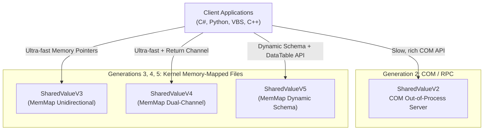

# Global Architecture: SharedValue Ecosystem

> **Scope:** This document provides a high-level architectural overview of the entire `SharedValue` ecosystem. It acts as a routing document. For deep technical details, refer to the specific architecture documents of each generation.

The **SharedValue** project has evolved through four major architectural paradigms to solve the problem of Inter-Process Communication (IPC) and data sharing on Windows. The core challenge is sharing state safely, efficiently, and across different programming languages (C++, C#, VBScript, Python) without data races.

## Architectural Generations

### 1. SharedValueV2: The COM/RPC Server
**Pattern:** Singleton Monitor Pattern via Out-of-Process COM Server (`LocalServer32`). 
**Transport:** Microsoft RPC over Local Named Pipes.

In this architecture, a centralized `ATLProjectcomserver.exe` runs as a Windows background process. All clients communicate with this server using COM Interface Pointers (`ISharedValue`, `IDatasetProxy`). Because multiple processes access the same C++ singleton, deep C++ `std::mutex` locking ensures thread-safety.

*   **Pros:** Easy to use from script languages like VBScript. Rich object-oriented API.
*   **Cons:** Very slow per-call overhead (~1-10 μs) due to RPC marshaling. Requires `regsvr32` / administrative installation.
*   **Deep Dive:** [SharedValueV2 Architecture](SharedValueV2/ARCHITECTURE.md)

### 2. SharedValueV3 (MemMap): Unidirectional FlatBuffers
**Pattern:** Zero-copy Kernel Memory Sharing. 
**Transport:** Windows Memory-Mapped Files (`Global\...`) + Named Events.

To eliminate the COM bottleneck, V3 writes direct binary data (using Google FlatBuffers) into a shared Windows kernel page. Consumers memory-map this exact same page into their own process. They receive notifications via a Windows Event Handle when new data arrives, waking their threads with 0% idle CPU overhead.

*   **Pros:** Nanosecond latency. No serialization overhead.
*   **Cons:** Unidirectional (Producer -> Consumer). Schema must be compiled into C++ and C# beforehand via `flatc`.
*   **Deep Dive:** [SharedValueV3 Architecture](SharedValueV3_MemMap/ARCHITECTURE.md)

### 3. SharedValueV4: Dual-Channel Bidirectional
**Pattern:** Symmetrical Sockets over Shared Memory. 
**Transport:** Dual Memory-Mapped Files (P2C and C2P) + Ready Events Handshake.

V4 upgrades V3 by introducing a return channel. It creates a symmetrical system where both sides can act as Producer and Consumer. It uses a robust "Ready Event" handshake algorithm to ensure no process writes to memory before the other is listening.

*   **Pros:** Real-time bidirectional IPC suitable for High-Frequency Trading (>100k msg/sec).
*   **Cons:** Schema still requires `flatc` ahead-of-time compilation.
*   **Deep Dive:** [SharedValueV4 Architecture](SharedValueV4/ARCHITECTURE.md)

### 4. SharedValueV5: Dynamic Schema "DataTable" IPC
**Pattern:** Self-describing Binary Layout + ADO.NET-style DataSets. 
**Transport:** Memory-Mapped Files with embedded dynamic schemas.

V5 solves the FlatBuffer compile-time restriction. It allows any language (even VBScript via an underlying C# COM wrapper) to dynamically define table columns at runtime (e.g., `AddColumn("Temperature", Double)`). The data structure is serialized into a self-describing binary format directly in memory. Consumers parse the header to discover the schema without needing pre-compiled code.

*   **Pros:** Completely dynamic. Excellent wrapper support for scripting languages. Backward-compatible schema evolution.
*   **Cons:** Marginally slower than V3/V4 due to runtime index lookup (~50-100ns per read).
*   **Deep Dive:** [SharedValueV5 Architecture](SharedValueV5/ARCHITECTURE.md)

## Common Architectural Principles Across V3-V5

While V2 relies on Windows COM, versions 3, 4, and 5 share a unified low-level OS primitive pipeline to achieve lock-free or mutex-guaranteed memory synchronization:

1.  **Memory-Mapped File (`CreateFileMapping` / `MapViewOfFile`)**
    This creates an allocation in the Windows Kernel paging file. Pointers within this region point to the identical physical RAM.
2.  **Named Mutex (`CreateMutex`)**
    Ensures that while the Producer is writing a continuous memory block (or FlatBuffer commit), the Consumer cannot read a torn state.
3.  **Named Event (`CreateEvent`)**
    Avoids CPU spin-locking. Consumers use `WaitForSingleObject` to block their thread entirely. The OS scheduler wakes them instantly the moment the Producer flags the Event.
