# Technische Architectuur: ATLProjectcomserverExe (V2)

> **Documentatie Scope:** Dit document beschrijft specifiek de architectuur van **SharedValueV2**, de COM/RPC-gebaseerde Out-of-Process Server. 
> Voor de architectuur van de nieuwere Memory-Mapped generaties, zie:
> - [SharedValueV3 MemMap Architectuur](SharedValueV3_MemMap/ARCHITECTURE.md) (Unidirectioneel FlatBuffers)
> - [SharedValueV4 Architectuur](SharedValueV4/ARCHITECTURE_NL.md) (Bidirectioneel FlatBuffers)
> - [SharedValueV5 Architectuur](SharedValueV5/ARCHITECTURE_NL.md) (Dynamic Schema IPC)
## Inhoudsopgave

1. [Systeemoverzicht](#1-systeemoverzicht)
2. [Lagenarchitectuur](#2-lagenarchitectuur)
3. [COM Server Lifecycle](#3-com-server-lifecycle)
4. [Componentenmodel](#4-componentenmodel)
5. [SharedValueV2 — De C++ Engine](#5-sharedvaluev2--de-c-engine)
6. [COM-naar-C++ Bruglaag](#6-com-naar-c-bruglaag)
7. [Cross-Process Communicatie (RPC Marshaling)](#7-cross-process-communicatie-rpc-marshaling)
8. [Observer & Event Architectuur](#8-observer--event-architectuur)
9. [Thread-Safety & Synchronisatie](#9-thread-safety--synchronisatie)
10. [Error Handling Pipeline](#10-error-handling-pipeline)
11. [.NET Interop & Late Binding](#11-net-interop--late-binding)
12. [Singleton & Lifetime Management](#12-singleton--lifetime-management)
13. [Design Patterns Overzicht](#13-design-patterns-overzicht)

---

## 1. Systeemoverzicht

Het project implementeert een **Out-of-Process COM Server** (EXE, `LocalServer32`) die als centraal singleton-proces fungeert voor cross-process data-sharing op Windows. Meerdere onafhankelijke clients communiceren gelijktijdig met dezelfde server via Windows RPC marshaling.

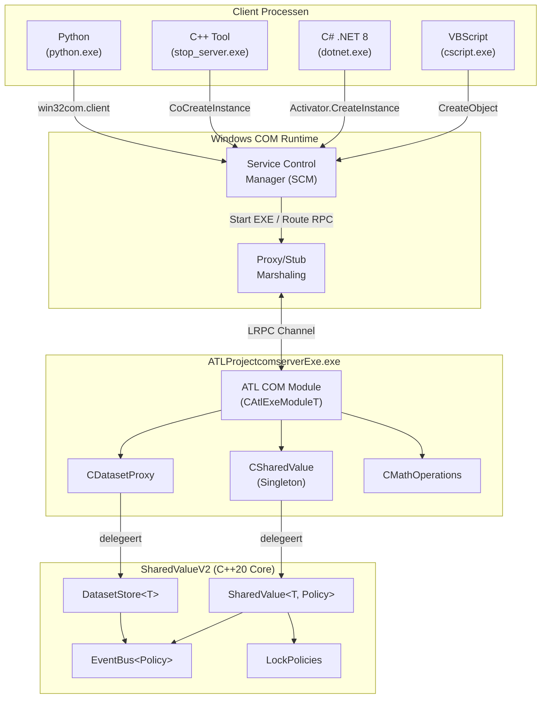

---

## 2. Lagenarchitectuur

Het systeem kent vier distinct gescheiden lagen. Elke laag heeft een duidelijke verantwoordelijkheid en communiceert uitsluitend met de direct aangrenzende laag.


| Laag | Verantwoordelijkheid | Technologie |
|---|---|---|
| **Client Applications** | Consumeren van COM interfaces | VBScript, C#, Python, C++ |
| **COM/RPC Transport** | Interface definitie, marshaling, registratie | IDL/MIDL, Windows Registry, LRPC |
| **ATL COM Wrapper** | Type-conversie, error-vertaling, lifetime management | ATL, `CComVariant`, `CComBSTR`, `SAFEARRAY` |
| **C++20 Engine** | Business-logica, thread-safety, event handling | C++20 templates, `std::mutex`, `std::atomic` |

---

## 3. COM Server Lifecycle

De EXE server doorloopt een specifiek lifecycle-model dat verschilt van de traditionele DLL-variant.

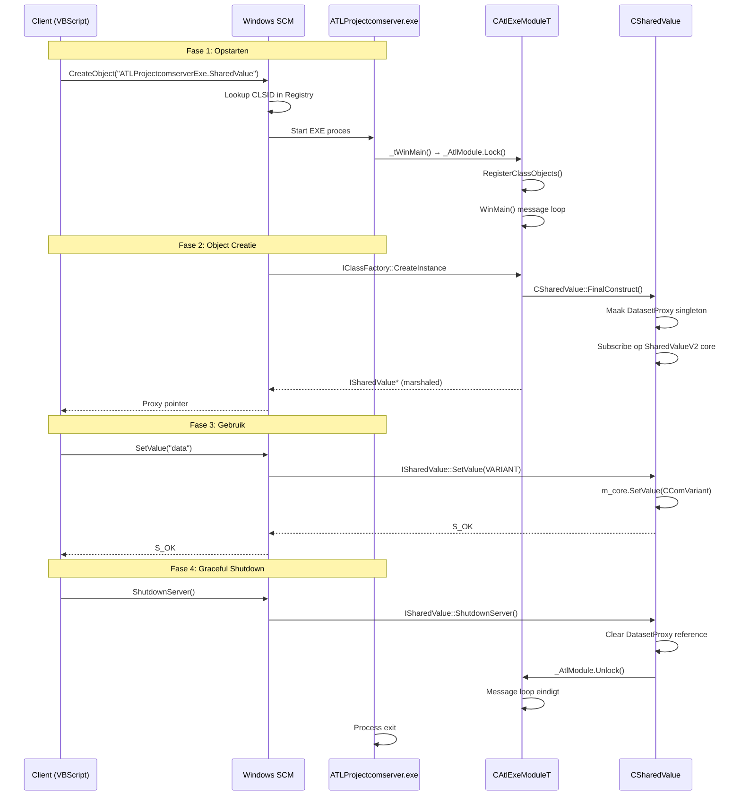

### Kritieke Shutdown Details

De EXE server sluit **niet** af wanneer de laatste client disconneert (ATL standaardgedrag), omdat `_AtlModule.Lock()` in `_tWinMain` een extra reference count vasthoudt. Dit voorkomt voortijdig afsluiten. Pas bij een expliciete `ShutdownServer()` aanroep wordt:

1. De globale `DatasetProxy` reference vrijgegeven (`m_core.SetValue(CComVariant())`)
2. De module lock verwijderd (`_AtlModule.Unlock()`)
3. De Win32 message loop beëindigd

---

## 4. Componentenmodel

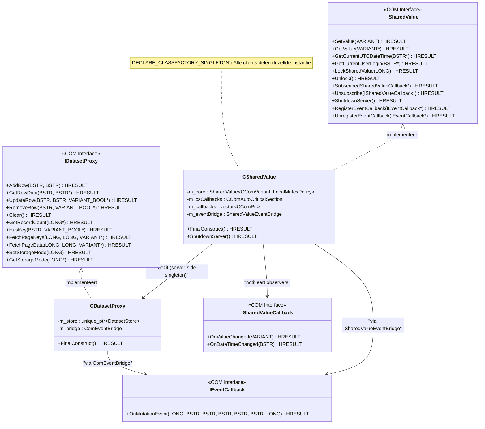

---

## 5. SharedValueV2 — De C++ Engine

De engine is een header-only C++20 library met template-gebaseerde architectuur. Ze is volledig onafhankelijk van COM en ATL.

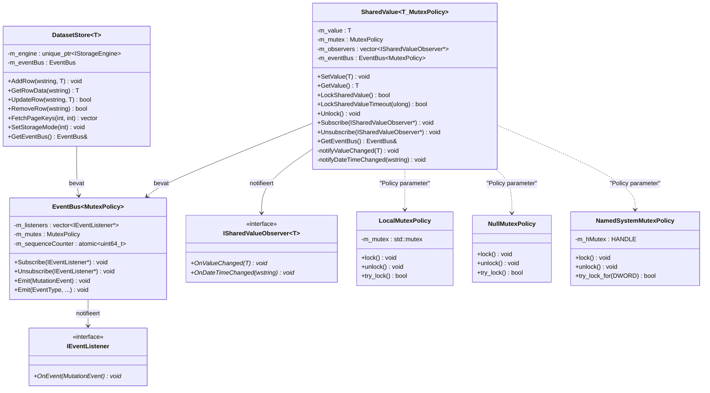

### Template Instantiaties in de COM Server

```cpp
// In CSharedValue — thread-safe met local mutex
SharedValueV2::SharedValue<CComVariant, SharedValueV2::LocalMutexPolicy> m_core;

// In CDatasetProxy — thread-safe dataset store
std::unique_ptr<SharedValueV2::DatasetStore<std::wstring>> m_store;
```

---

## 6. COM-naar-C++ Bruglaag

De bruglaag vertaalt tussen COM-typen en C++ native types. Er zijn twee bridge-klassen die als adapters fungeren.

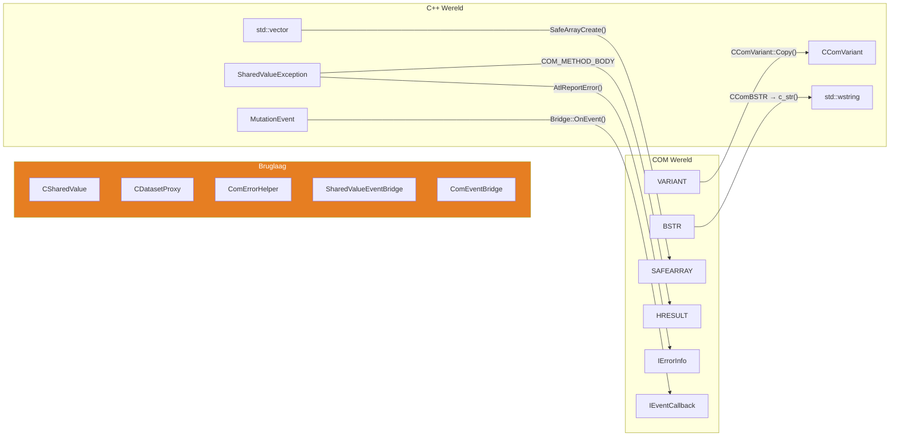

### ComErrorHelper — Exception Vertaling

De `COM_METHOD_BODY` macro vangt C++ exceptions en vertaalt ze naar COM-compatibele `HRESULT` + `IErrorInfo`:

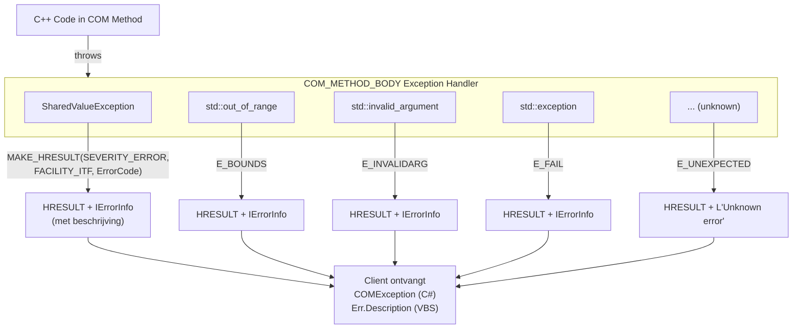

---

## 7. Cross-Process Communicatie (RPC Marshaling)

Als Out-of-Process server vinden alle method calls plaats via **LRPC** (Local Remote Procedure Call) over Windows Named Pipes.

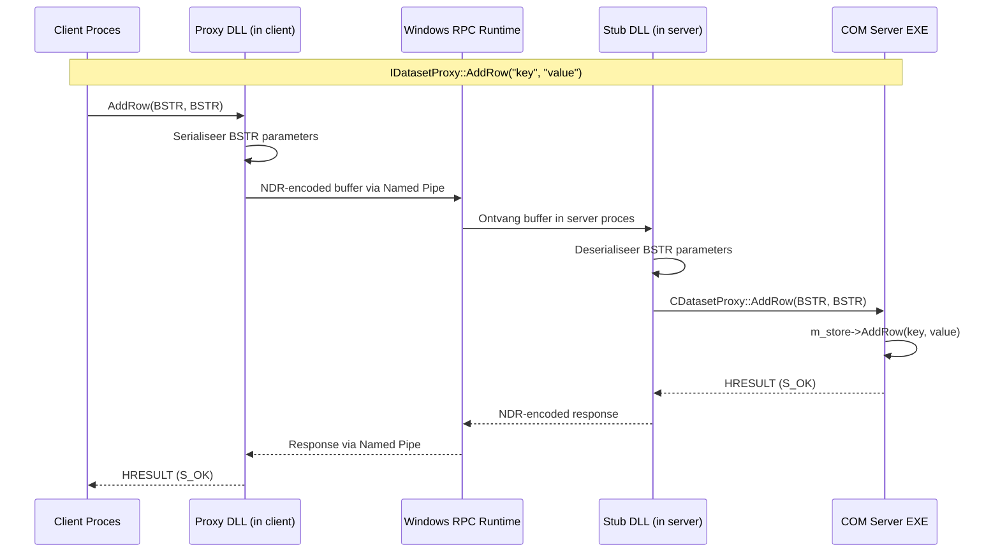

### Hoe Proxy/Stub Marshaling Werkt

De MIDL compiler genereert automatisch proxy/stub code uit de `.idl` bestanden:

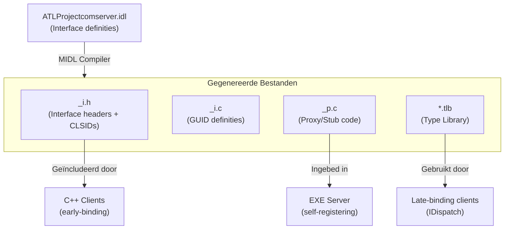

---

## 8. Observer & Event Architectuur

Het systeem kent twee parallelle observer-mechanismen: het **legacy SharedValueCallback** systeem en het moderne **EventBus** systeem.

```mermaid
graph TB
    subgraph Legacy["Legacy Observer (ISharedValueCallback)"]
        SV_OBS["CSharedValue<br/>implementeert ISharedValueObserver"]
        V2_CORE["SharedValueV2::SharedValue<br/>→ notifyValueChanged()"]
        CB_LIST["m_callbacks vector<br/>(CComAutoCriticalSection)"]
        ISVCB["Client's ISharedValueCallback<br/>→ OnValueChanged()"]

        V2_CORE -->|"kopieer observer-lijst<br/>buiten lock"| SV_OBS
        SV_OBS --> CB_LIST
        CB_LIST -->|"itereer kopie"| ISVCB
    end

    subgraph Modern["Modern EventBus (IEventCallback)"]
        EB_CORE["EventBus::Emit()"]
        SVB_BRIDGE["SharedValueEventBridge<br/>ComEventBridge"]
        IECB["Client's IEventCallback<br/>→ OnMutationEvent()"]

        EB_CORE -->|"kopieer listener-lijst<br/>buiten lock"| SVB_BRIDGE
        SVB_BRIDGE -->|"converteer MutationEvent<br/>→ COM BSTR parameters"| IECB
    end

    style Legacy fill:#3498db,color:#fff
    style Modern fill:#2ecc71,color:#fff
```

### Deadlock-Free Notificatie (Kritiek Patroon)

Het notificatie-mechanisme is expliciet ontworpen om deadlocks te voorkomen bij trage of vastlopende clients:

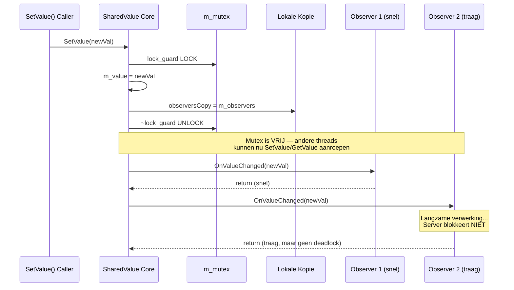

---

## 9. Thread-Safety & Synchronisatie

### Policy-Based Design voor Lock Strategieën

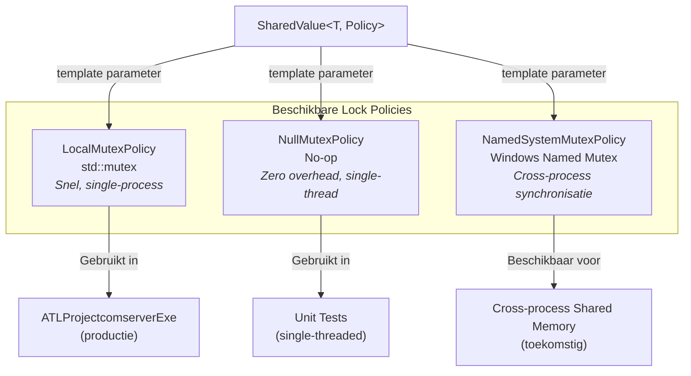

### Monitor Pattern — Gecombineerde Data + Lock

Data is nooit toegankelijk zonder een actieve lock. De `SharedValue<T, Policy>` klasse dwingt dit af:

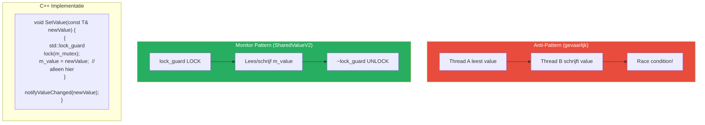

### Synchronisatieoverzicht per Component

| Component | Lock Type | Scope | Beschermt |
|---|---|---|---|
| `SharedValue::m_mutex` | `LocalMutexPolicy` | `m_value`, `m_observers` | Gedeelde state en observer-lijst |
| `EventBus::m_mutex` | `LocalMutexPolicy` | `m_listeners` | Event listener registratie |
| `CSharedValue::m_csCallbacks` | `CComAutoCriticalSection` | `m_callbacks` | COM callback pointer-lijst |
| `DatasetStore` (intern) | `LocalMutexPolicy` | Store data | CRUD operaties op de dataset |
| `EventBus::m_sequenceCounter` | `std::atomic<uint64_t>` | Counter | Lock-vrije sequence nummering |

---

## 10. Error Handling Pipeline

Fouten stromen van de C++ engine door de COM-laag naar de client in hun eigen taal-specifieke formaat.

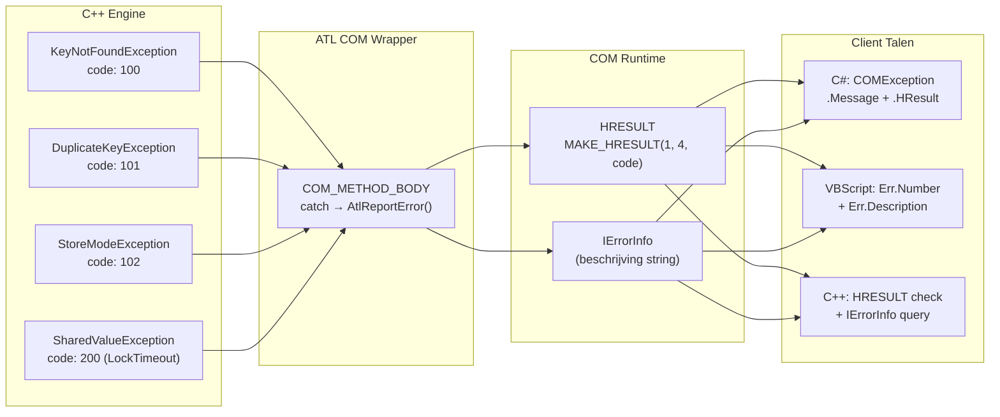

### Exception Hiërarchie

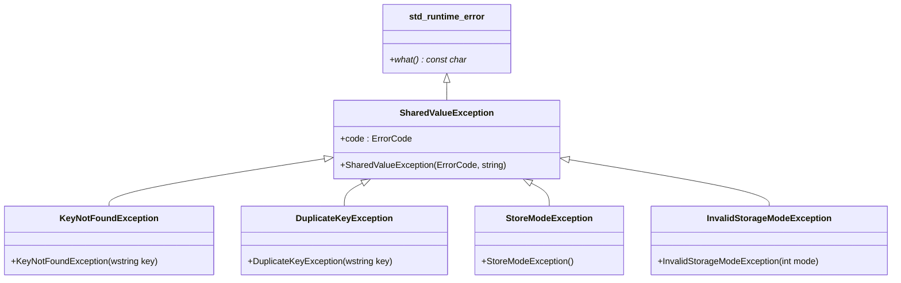

---

## 11. .NET Interop & Late Binding

C# clients gebruiken **late binding** via `IDispatch` om de COM server aan te spreken zonder compilatie-afhankelijkheid.

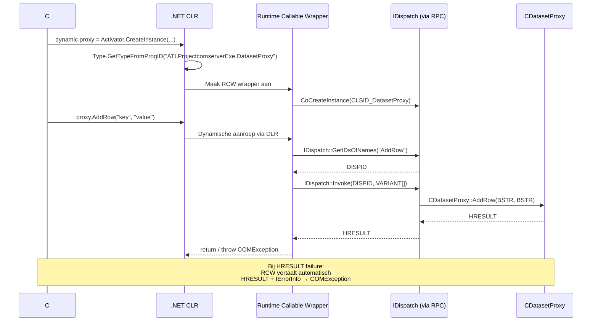

### Type Mapping: COM ↔ .NET

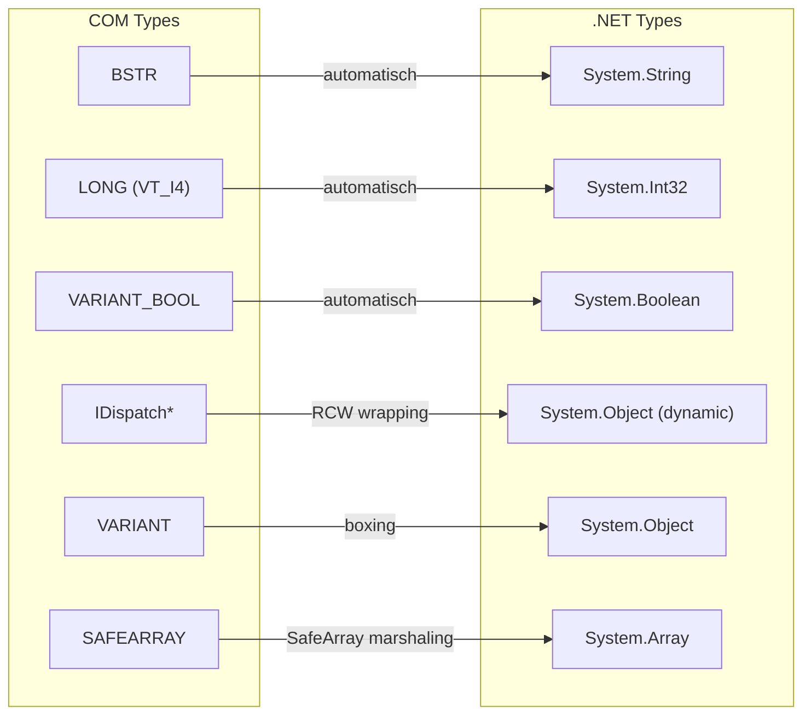

---

## 12. Singleton & Lifetime Management

`CSharedValue` is gedeclareerd als singleton via `DECLARE_CLASSFACTORY_SINGLETON`. Dit betekent dat alle clients — ongeacht proces — dezelfde instantie delen.

```mermaid
graph TB
    subgraph Server["EXE Server Proces"]
        CF["CComClassFactorySingleton"]
        SV["CSharedValue<br/>(1 instantie)"]
        DP["CDatasetProxy<br/>(eigendom van SV)"]

        CF -->|"CreateInstance() → altijd dezelfde"| SV
        SV -->|"FinalConstruct() maakt"| DP
    end

    subgraph Client1["Client Proces 1"]
        P1["Proxy → ISharedValue*"]
    end

    subgraph Client2["Client Proces 2"]
        P2["Proxy → ISharedValue*"]
    end

    subgraph Client3["Client Proces 3"]
        P3["Proxy → ISharedValue*"]
    end

    P1 -->|RPC| SV
    P2 -->|RPC| SV
    P3 -->|RPC| SV

    Note over Server: Alle proxies verwijzen naar<br/>exact dezelfde CSharedValue
```

### ATL Lifetime Referenties

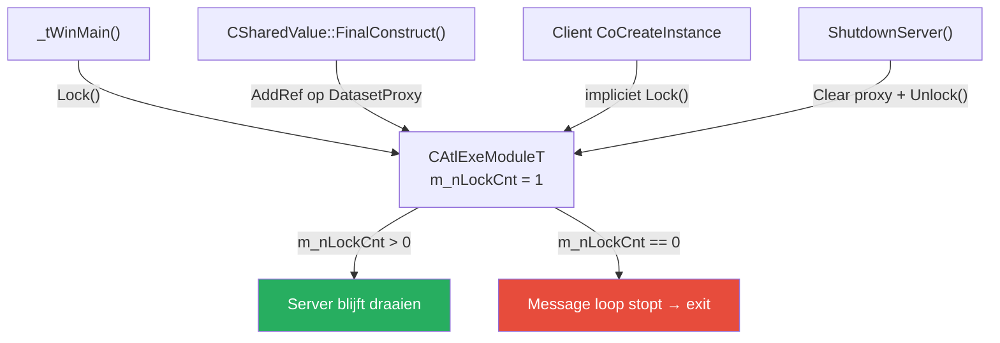

---

## 13. Design Patterns Overzicht

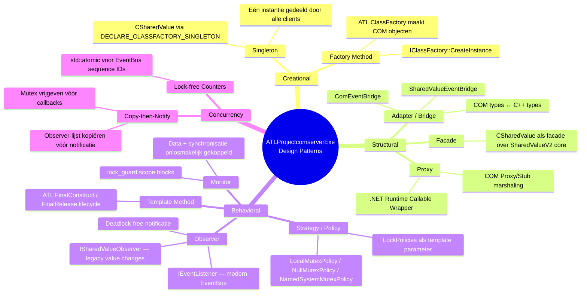

| Pattern | Waar Toegepast | Waarom |
|---|---|---|
| **Singleton** | `CSharedValue` | Alle clients moeten dezelfde state delen |
| **Observer** | `ISharedValueObserver`, `EventBus` | Losgekoppelde notificaties bij state-wijzigingen |
| **Strategy / Policy** | `SharedValue<T, MutexPolicy>` | Verwisselbare lock-strategieën zonder code-wijziging |
| **Monitor** | `SharedValue`, `DatasetStore` | Data is ontoegankelijk buiten een locked scope |
| **Adapter** | `SharedValueEventBridge`, `ComEventBridge` | Vertaling tussen C++ events en COM callbacks |
| **Facade** | `CSharedValue`, `CDatasetProxy` | Simpele COM interface over complexe C++ engine |
| **Proxy** | COM Proxy/Stub, .NET RCW | Transparante cross-process communicatie |
| **Template Method** | ATL `FinalConstruct` / `FinalRelease` | Framework-gestuurde object lifecycle |
| **Copy-then-Notify** | `notifyValueChanged()`, `EventBus::Emit()` | Deadlock-preventie bij observer notificaties |


## Gerelateerde Documentatie

- [CHANGELOG.md](CHANGELOG.md) — Overzicht van alle wijzigingen en release notes.
- [README.md](README.md) — Hoofddocumentatie en startpunt van het gehele project.
- [INSTALL.md](INSTALL.md) — Globale bouw- en installatie-instructies.
- [README.md](ATLProjectcomserverExe/README.md) — Gebruikershandleiding en overzicht van de EXE COM Server variant.
- [README.md](SharedValueV2/README.md) — Introductie en overzicht van de SharedValueV2 C++20 engine.
