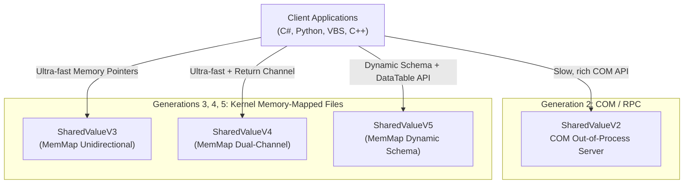
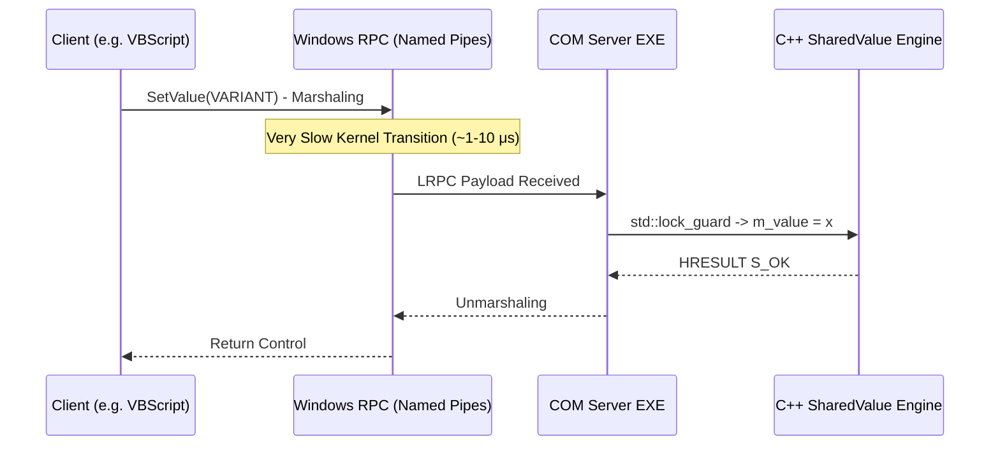
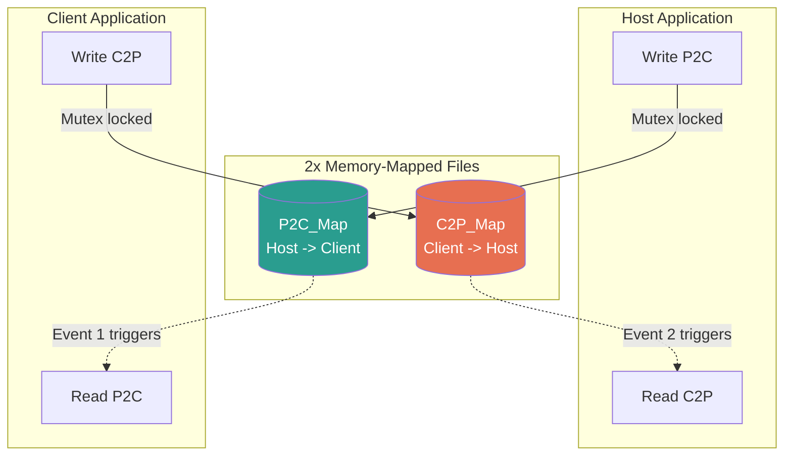
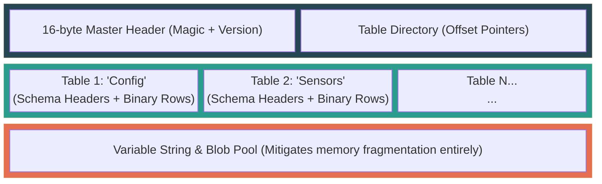

# Global Architecture: SharedValue Ecosystem

> **Scope:** This document provides a high-level architectural overview of the entire `SharedValue` ecosystem. It acts as a routing document. For deep technical details, refer to the specific architecture documents of each generation.

The **SharedValue** project has evolved through four major architectural paradigms to solve the problem of Inter-Process Communication (IPC) and data sharing on Windows. The core challenge is sharing state safely, efficiently, and across different programming languages (C++, C#, VBScript, Python) without data races.

## Architectural Generations



### 1. SharedValueV2: The COM/RPC Server
**Pattern:** Singleton Monitor Pattern via Out-of-Process COM Server (`LocalServer32`).<br>
**Transport:** Microsoft RPC over Local Named Pipes.

In this architecture, a centralized `ATLProjectcomserver.exe` runs as a Windows background process. All clients communicate with this server using COM Interface Pointers (`ISharedValue`, `IDatasetProxy`). Because multiple processes access the same C++ singleton, deep C++ `std::mutex` locking ensures thread-safety.



*   **The Difference:** V2 uses **marshaling**. Data is serialized, pushed through an IPC channel, and deserialized on the other side. This is comparatively slow but incredibly stable and effortlessly invoked from scripting languages via simple object orientation.
*   **Pros:** Easy to use from script languages like VBScript. Rich object-oriented API and robust error translation (exceptions mapped to HRESULTs).
*   **Cons:** Very slow per-call overhead due to RPC marshaling. Requires `regsvr32` / administrative installation (Registry pollution).
*   **Deep Dive:** [SharedValueV2 Architecture](SharedValueV2/ARCHITECTURE.md)

### 2. SharedValueV3 (MemMap): Unidirectional FlatBuffers
**Pattern:** Zero-copy Kernel Memory Sharing.<br>
**Transport:** Windows Memory-Mapped Files (`Global\...`) + Named Events.

To eliminate the COM bottleneck, V3 writes direct binary data (using Google FlatBuffers) into a shared Windows kernel page. Consumers memory-map this exact same page into their own process. They receive notifications via a Windows Event Handle when new data arrives, waking their threads with 0% idle CPU overhead.

```mermaid
flowchart LR
    subgraph Producer [Producer Process (C++)]
        FB[Build FlatBuffer] --> L1(Lock Named Mutex)
        L1 --> W[MemCpy into MMF]
        W --> U1(Unlock Mutex)
        U1 --> E(Set Named Event)
    end
    
    subgraph Shared [Windows OS Kernel]
        MMF[(Memory-Mapped File<br/>10 MB)]
    end
    
    subgraph Consumer [Consumer Process (C#)]
        E -.->|Wakes Sleeping Thread!| R1(WaitOne Event)
        R1 --> C2(Lock Named Mutex)
        MMF -.->|Memory Pointer| R2[ReadArray from MMF]
        C2 --> R2
        R2 --> C3(Unlock Mutex)
        C3 --> R3[Parse FlatBuffer]
    end
    
    W -.-> MMF
    style MMF fill:#1b4332,color:#fff
```

*   **The Difference:** There is **no data transmission over a channel**. Both the producer and consumer inspect the exact same electron states in physical RAM (via virtual paging). The event mechanism simply triggers the evaluation. Consequently, latency plummets to nanoseconds.
*   **Pros:** Nanosecond latency (~50 ns). No string/object serialization overhead heavily leveraging Google FlatBuffers zero-copy traits.
*   **Cons:** Unidirectional (Producer -> Consumer strictly). Schema is absolutely frozen due to compile-time code generation (`flatc`).
*   **Deep Dive:** [SharedValueV3 Architecture](SharedValueV3_MemMap/ARCHITECTURE.md)

### 3. SharedValueV4: Dual-Channel Bidirectional
**Pattern:** Symmetrical Sockets over Shared Memory.<br>
**Transport:** Dual Memory-Mapped Files (P2C and C2P) + Ready Events Handshake.

V4 upgrades V3 by introducing a return channel. It creates a symmetrical system where both sides can act as Producer and Consumer. It uses a robust "Ready Event" handshake algorithm to ensure no process writes to memory before the other is listening.



*   **The Difference:** Where V3 mimics a simple 'fire & forget' hose, V4 behaves akin to a blisteringly fast full-duplex TCP socket (but implemented purely across physical RAM limits). This yields absolute perfection governing logic loops requiring rapid High-Frequency responses.
*   **Pros:** Real-time bidirectional IPC uniquely suitable for High-Frequency Trading and closed-loop control systems.
*   **Cons:** Architecture demands mapping twin memory channels concurrently (raising structural complexity slightly). Schemas still demand pre-compilation via `flatc`.
*   **Deep Dive:** [SharedValueV4 Architecture](SharedValueV4/ARCHITECTURE.md)

### 4. SharedValueV5: Dynamic Schema "DataTable" IPC
**Pattern:** Self-describing Binary Layout + ADO.NET-style DataSets.<br>
**Transport:** Memory-Mapped Files with embedded dynamic schemas.

V5 solves the FlatBuffer compile-time restriction. It allows any language (even VBScript via an underlying C# COM wrapper) to dynamically define table columns at runtime (e.g., `AddColumn("Temperature", Double)`). The data structure is serialized into a self-describing binary format directly in memory. Consumers parse the header to discover the schema without needing pre-compiled code.



*   **The Difference:** V3 and V4 thrust raw bitstreams assuming the recipient inherently grasps the shape (`flatc` guarantees this contract). V5 inextricably packages the **table schema blueprint** alongside the values. It practically bridges an ultra-fast in-memory database engine mirroring .NET DataSets.
*   **Pros:** Radically dynamic structures. Exceptional interoperability leveraging VBScript, Python, and VBA environments. Graceful backward compatible schema evolutions traversing live systems.
*   **Cons:** Executing index lookup sequences evaluating columns slightly increases processing burdens versus rigid V4 static arrays.
*   **Deep Dive:** [SharedValueV5 Architecture](SharedValueV5/ARCHITECTURE.md)

## Common Architectural Principles Across V3-V5

While V2 relies on Windows COM, versions 3, 4, and 5 share a unified low-level OS primitive pipeline to achieve lock-free or mutex-guaranteed memory synchronization:

1.  **Memory-Mapped File (`CreateFileMapping` / `MapViewOfFile`)**
    This creates an allocation in the Windows Kernel paging file. Pointers within this region point to the identical physical RAM.
2.  **Named Mutex (`CreateMutex`)**
    Ensures that while the Producer is writing a continuous memory block (or FlatBuffer commit), the Consumer cannot read a torn state.
3.  **Named Event (`CreateEvent`)**
    Avoids CPU spin-locking. Consumers use `WaitForSingleObject` to block their thread entirely. The OS scheduler wakes them instantly the moment the Producer flags the Event.
