# Technical Architecture: ATLProjectcomserverExe

## Table of Contents

1. [System Overview](#1-system-overview)
2. [Layer Architecture](#2-layer-architecture)
3. [COM Server Lifecycle](#3-com-server-lifecycle)
4. [Component Model](#4-component-model)
5. [SharedValueV2 — The C++ Engine](#5-sharedvaluev2--the-c-engine)
6. [COM-to-C++ Bridge Layer](#6-com-to-c-bridge-layer)
7. [Cross-Process Communication (RPC Marshaling)](#7-cross-process-communication-rpc-marshaling)
8. [Observer & Event Architecture](#8-observer--event-architecture)
9. [Thread-Safety & Synchronization](#9-thread-safety--synchronization)
10. [Error Handling Pipeline](#10-error-handling-pipeline)
11. [.NET Interop & Late Binding](#11-net-interop--late-binding)
12. [Singleton & Lifetime Management](#12-singleton--lifetime-management)
13. [Design Patterns Overview](#13-design-patterns-overview)

---

## 1. System Overview

The project implements an **Out-of-Process COM Server** (EXE, `LocalServer32`) acting as a central singleton process for cross-process data sharing on Windows. Multiple independent clients communicate simultaneously with the same server via Windows RPC marshaling.

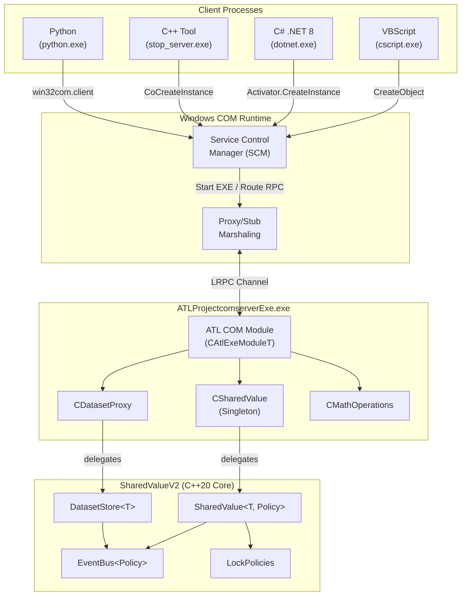

---

## 2. Layer Architecture

The system possesses four distinctly separated layers. Each layer has a clear responsibility and communicates exclusively with the directly adjacent layer.


| Layer | Responsibility | Technology |
|---|---|---|
| **Client Applications** | Consuming COM interfaces | VBScript, C#, Python, C++ |
| **COM/RPC Transport** | Interface definition, marshaling, registration | IDL/MIDL, Windows Registry, LRPC |
| **ATL COM Wrapper** | Type conversion, error translation, lifetime management | ATL, `CComVariant`, `CComBSTR`, `SAFEARRAY` |
| **C++20 Engine** | Business logic, thread safety, event handling | C++20 templates, `std::mutex`, `std::atomic` |

---

## 3. COM Server Lifecycle

The EXE server undergoes a specific lifecycle model that differs from the traditional DLL variant.

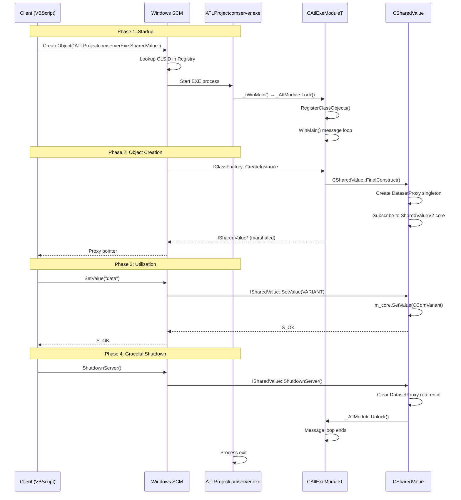

### Critical Shutdown Details

The EXE server does **not** terminate when the final client disconnects (ATL default behavior), because `_AtlModule.Lock()` inside `_tWinMain` retains an extra reference count. This prevents premature termination. Only upon an explicit `ShutdownServer()` call is:

1. The global `DatasetProxy` reference released (`m_core.SetValue(CComVariant())`)
2. The module lock removed (`_AtlModule.Unlock()`)
3. The Win32 message loop terminated

---

## 4. Component Model

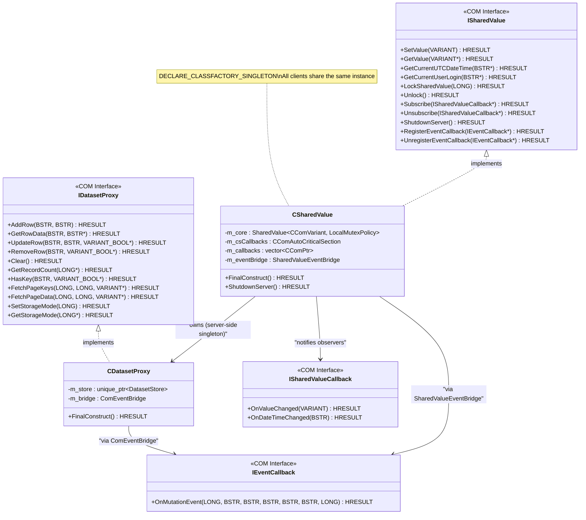

---

## 5. SharedValueV2 — The C++ Engine

The engine is a header-only C++20 library featuring a template-based architecture. It is entirely independent of COM and ATL.

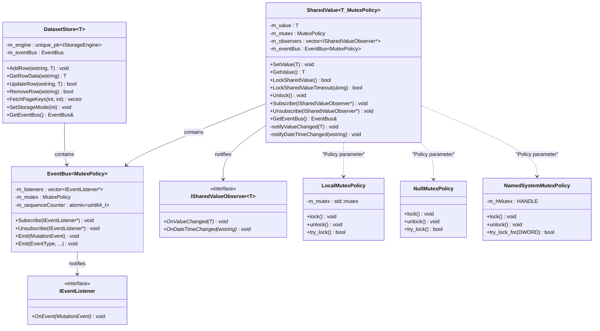

### Template Instantiations in the COM Server

```cpp
// Within CSharedValue — thread-safe with local mutex
SharedValueV2::SharedValue<CComVariant, SharedValueV2::LocalMutexPolicy> m_core;

// Within CDatasetProxy — thread-safe dataset store
std::unique_ptr<SharedValueV2::DatasetStore<std::wstring>> m_store;
```

---

## 6. COM-to-C++ Bridge Layer

The bridge layer translates between COM types and C++ native types. There are two bridge classes acting as adapters.

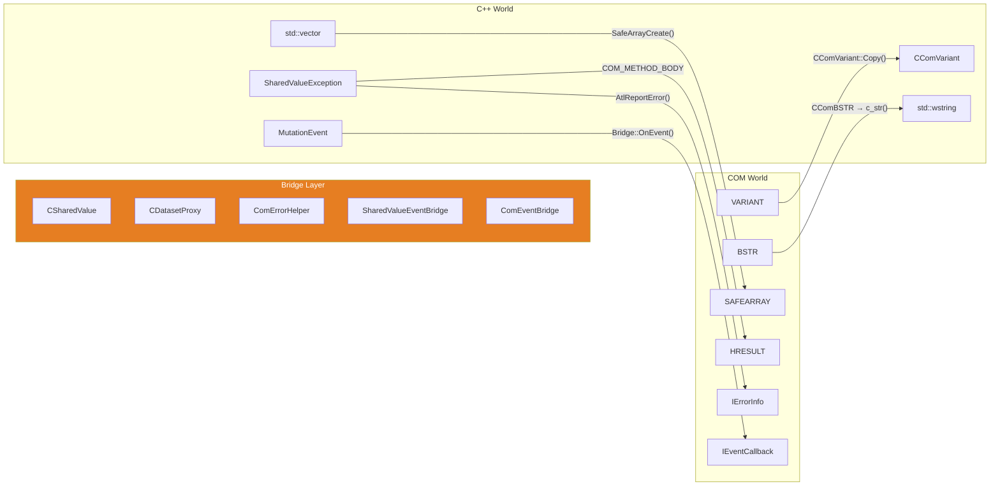

### ComErrorHelper — Exception Translation

The `COM_METHOD_BODY` macro catches C++ exceptions and translates them to COM-compatible `HRESULT` + `IErrorInfo`:

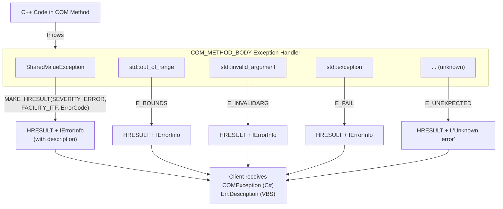

---

## 7. Cross-Process Communication (RPC Marshaling)

As an Out-of-Process server, all method calls occur via **LRPC** (Local Remote Procedure Call) over Windows Named Pipes.

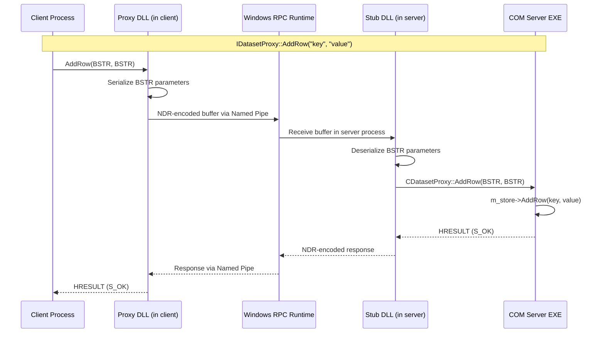

### How Proxy/Stub Marshaling Works

The MIDL compiler automatically generates proxy/stub code from the `.idl` files:

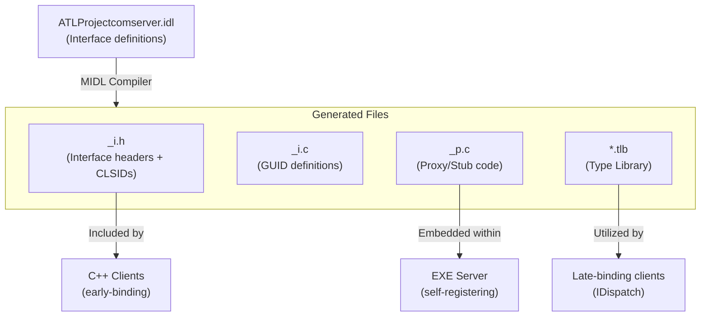

---

## 8. Observer & Event Architecture

The system features two parallel observer mechanisms: the **legacy SharedValueCallback** system and the modern **EventBus** system.

```mermaid
graph TB
    subgraph Legacy["Legacy Observer (ISharedValueCallback)"]
        SV_OBS["CSharedValue<br/>implements ISharedValueObserver"]
        V2_CORE["SharedValueV2::SharedValue<br/>→ notifyValueChanged()"]
        CB_LIST["m_callbacks vector<br/>(CComAutoCriticalSection)"]
        ISVCB["Client's ISharedValueCallback<br/>→ OnValueChanged()"]

        V2_CORE -->|"copy observer list<br/>outside local lock"| SV_OBS
        SV_OBS --> CB_LIST
        CB_LIST -->|"iterate copy"| ISVCB
    end

    subgraph Modern["Modern EventBus (IEventCallback)"]
        EB_CORE["EventBus::Emit()"]
        SVB_BRIDGE["SharedValueEventBridge<br/>ComEventBridge"]
        IECB["Client's IEventCallback<br/>→ OnMutationEvent()"]

        EB_CORE -->|"copy listener list<br/>outside local lock"| SVB_BRIDGE
        SVB_BRIDGE -->|"convert MutationEvent<br/>→ COM BSTR parameters"| IECB
    end

    style Legacy fill:#3498db,color:#fff
    style Modern fill:#2ecc71,color:#fff
```

### Deadlock-Free Notification (Critical Pattern)

The notification mechanism has been explicitly designed to prevent deadlocks with slow or stalling clients:

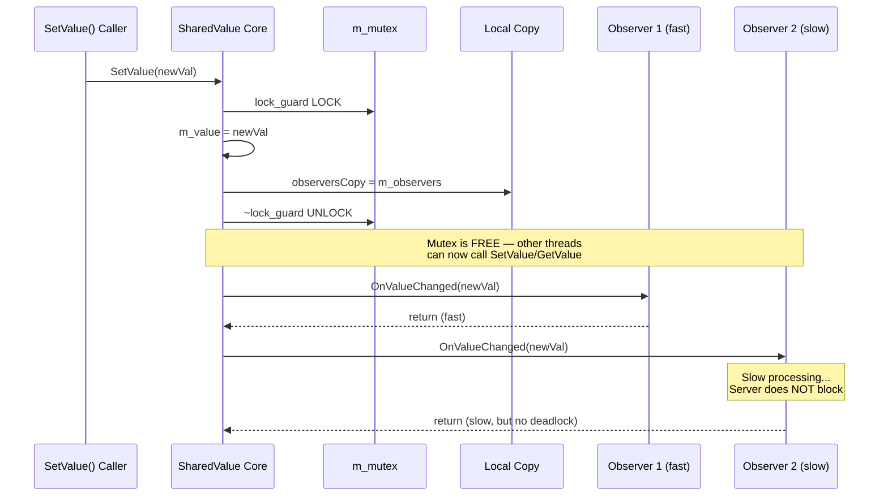

---

## 9. Thread-Safety & Synchronization

### Policy-Based Design for Lock Strategies

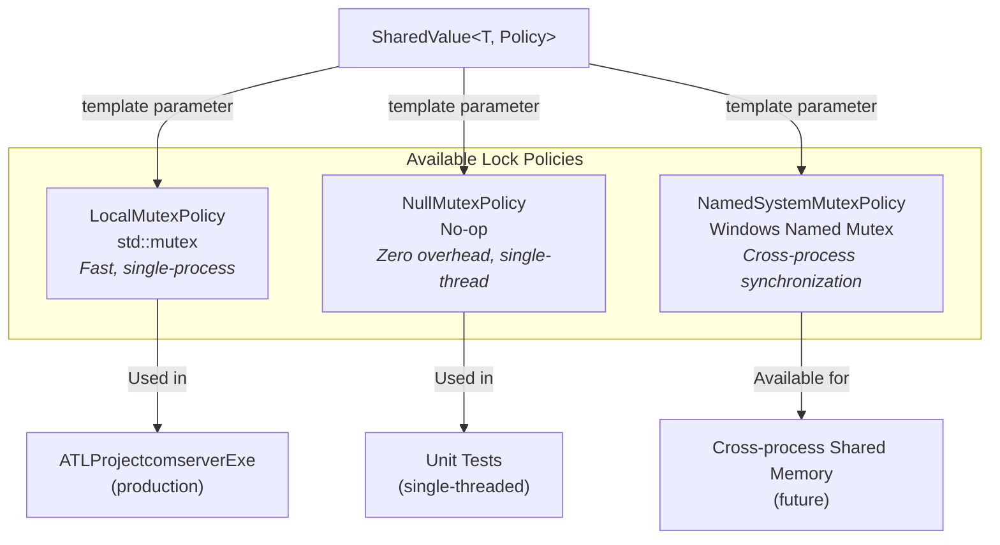

### Monitor Pattern — Combined Data + Lock

Data is never accessible without an active lock. The `SharedValue<T, Policy>` class enforces this:

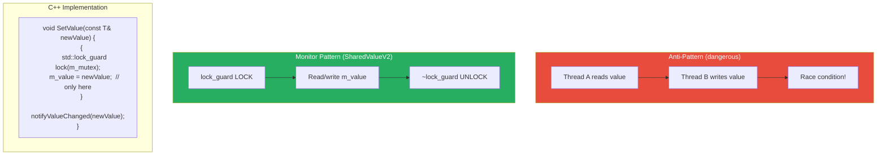

### Synchronization Overview per Component

| Component | Lock Type | Scope | Protects |
|---|---|---|---|
| `SharedValue::m_mutex` | `LocalMutexPolicy` | `m_value`, `m_observers` | Shared state and observer list |
| `EventBus::m_mutex` | `LocalMutexPolicy` | `m_listeners` | Event listener registrations |
| `CSharedValue::m_csCallbacks` | `CComAutoCriticalSection` | `m_callbacks` | COM callback pointer list |
| `DatasetStore` (internal) | `LocalMutexPolicy` | Store data | CRUD operations on the dataset |
| `EventBus::m_sequenceCounter` | `std::atomic<uint64_t>` | Counter | Lock-free sequence numbering |

---

## 10. Error Handling Pipeline

Errors flow from the C++ engine through the COM layer to the client in their own language-specific formatting.

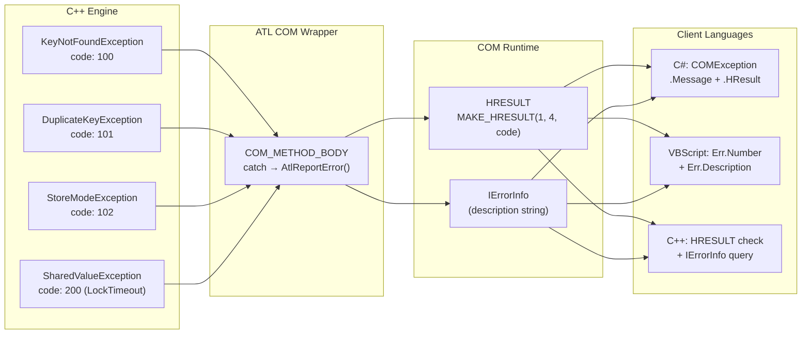

### Exception Hierarchy

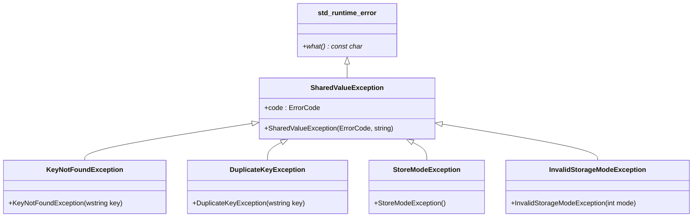

---

## 11. .NET Interop & Late Binding

C# clients leverage **late binding** via `IDispatch` to interact with the COM server without requiring compiler dependencies.

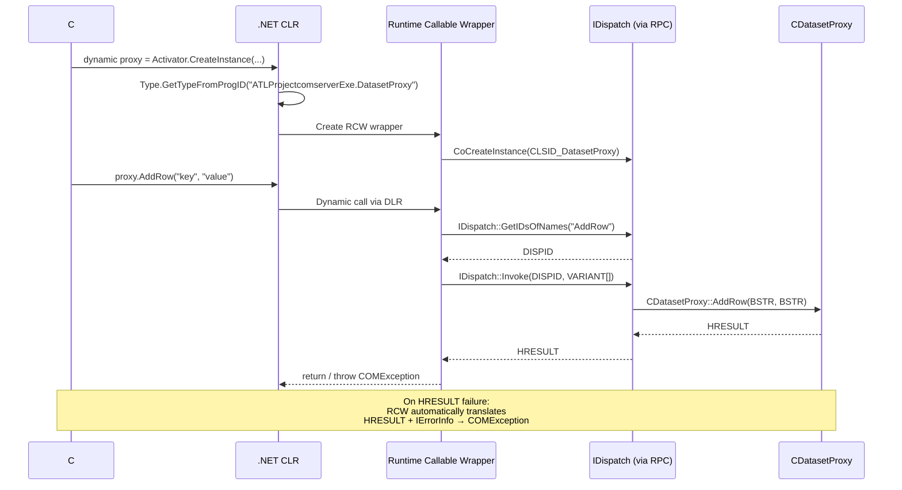

### Type Mapping: COM ↔ .NET

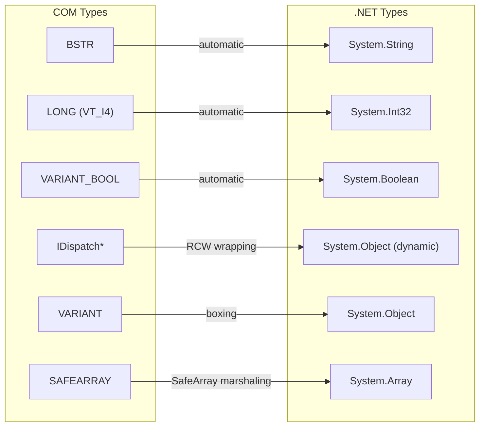

---

## 12. Singleton & Lifetime Management

`CSharedValue` is declared as a singleton via `DECLARE_CLASSFACTORY_SINGLETON`. This signifies that all clients — irrespective of their process — share the same instance.

```mermaid
graph TB
    subgraph Server["EXE Server Process"]
        CF["CComClassFactorySingleton"]
        SV["CSharedValue<br/>(1 instance)"]
        DP["CDatasetProxy<br/>(owned by SV)"]

        CF -->|"CreateInstance() → always the same"| SV
        SV -->|"FinalConstruct() makes"| DP
    end

    subgraph Client1["Client Process 1"]
        P1["Proxy → ISharedValue*"]
    end

    subgraph Client2["Client Process 2"]
        P2["Proxy → ISharedValue*"]
    end

    subgraph Client3["Client Process 3"]
        P3["Proxy → ISharedValue*"]
    end

    P1 -->|RPC| SV
    P2 -->|RPC| SV
    P3 -->|RPC| SV

    Note over Server: All proxies refer to<br/>the exact same CSharedValue
```

### ATL Lifetime References

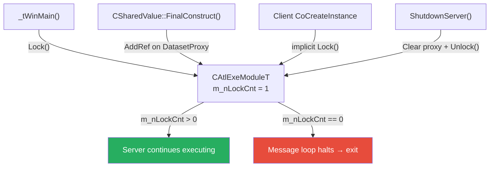

---

## 13. Design Patterns Overview

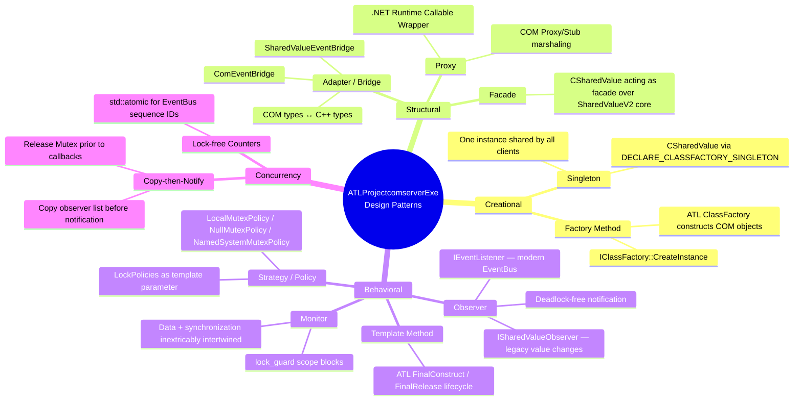

| Pattern | Where Applied | Why |
|---|---|---|
| **Singleton** | `CSharedValue` | All clients must share the identical state |
| **Observer** | `ISharedValueObserver`, `EventBus` | Decoupled notifications upon state changes |
| **Strategy / Policy** | `SharedValue<T, MutexPolicy>` | Interchangeable lock strategies without code alterations |
| **Monitor** | `SharedValue`, `DatasetStore` | Data is inaccessible outside a locked scope |
| **Adapter** | `SharedValueEventBridge`, `ComEventBridge` | Translation between C++ events and COM callbacks |
| **Facade** | `CSharedValue`, `CDatasetProxy` | Streamlined COM interface atop a complex C++ engine |
| **Proxy** | COM Proxy/Stub, .NET RCW | Transparent cross-process communication |
| **Template Method** | ATL `FinalConstruct` / `FinalRelease` | Framework-driven object lifecycle |
| **Copy-then-Notify** | `notifyValueChanged()`, `EventBus::Emit()` | Deadlock prevention during observer notifications |

## Related Documentation

- [CHANGELOG_EN.md](CHANGELOG_EN.md) — Overview of all modifications and release notes.
- [README_EN.md](README_EN.md) — Primary documentation and genesis of the entire project.
- [INSTALL_EN.md](INSTALL_EN.md) — Global compilation and installation instructions.
- [README_EN.md](ATLProjectcomserverExe/README_EN.md) — User guide and overview for the EXE COM Server variant.
- [README_EN.md](SharedValueV2/README_EN.md) — Introduction and overview of the SharedValueV2 C++20 engine.
