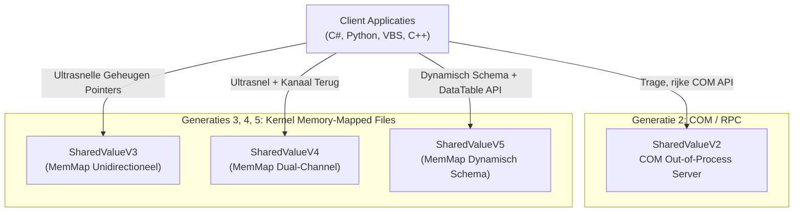

# Globale Architectuur: SharedValue Ecosysteem

> **Scope:** Dit document biedt een high-level architectonisch overzicht van het volledige `SharedValue` ecosysteem. Het fungeert als een routeringsdocument. Voor diepgaande technische details, zie de specifieke architectuurdocumenten van elke afzonderlijke generatie.

Het **SharedValue** project is geëvolueerd door vier belangrijke architectonische paradigma's om het probleem van Inter-Process Communication (IPC) en het delen van data op Windows op te lossen. De kernuitdaging is het delen van status (state) op een veilige, efficiënte manier tussen verschillende programmeertalen (C++, C#, VBScript, Python) zonder data races.

## Architectonische Generaties

### 1. SharedValueV2: De COM/RPC Server
**Patroon:** Singleton Monitor Pattern via Out-of-Process COM Server (`LocalServer32`). 
**Transport:** Microsoft RPC via Local Named Pipes.

In deze architectuur draait een gecentraliseerde `ATLProjectcomserver.exe` als Windows achtergrondproces. Alle clients communiceren met deze server via COM Interface Pointers (`ISharedValue`, `IDatasetProxy`). Omdat meerdere processen dezelfde C++ singleton aanspreken, garandeert native C++ `std::mutex` locking de thread-safety.

*   **Voordelen:** Makkelijk aan te roepen vanuit scripttalen zoals VBScript. Rijke objectgeoriënteerde API.
*   **Nadelen:** Hoge latency (overhead) per call (~1-10 μs) door RPC marshaling. Vereist `regsvr32` / installatie met beheerdersrechten.
*   **Deep Dive:** [SharedValueV2 Architectuur](SharedValueV2/ARCHITECTURE_NL.md)

### 2. SharedValueV3 (MemMap): Unidirectionele FlatBuffers
**Patroon:** Zero-copy Kernel Memory Sharing. 
**Transport:** Windows Memory-Mapped Files (`Global\...`) + Named Events.

Om de COM bottleneck te omzeilen, schrijft V3 directe binaire data (via Google FlatBuffers) in een gedeelde Windows kernel pagina. Consumenten mappen precies dezelfde pagina in hun eigen geheugenruimte. Ze krijgen meldingen via een Windows Event Handle wanneer nieuwe data arriveert, waardoor hun threads ontwaken met 0% CPU-belasting tijdens rust.

*   **Voordelen:** Nanoseconde latency. Geen serialisatie overhead.
*   **Nadelen:** Unidirectioneel (Producent -> Consument). Schema moet vooraf gecompileerd worden in C++ en C# via `flatc`.
*   **Deep Dive:** [SharedValueV3 Architectuur](SharedValueV3_MemMap/ARCHITECTURE_NL.md)

### 3. SharedValueV4: Dual-Channel Bidirectioneel
**Patroon:** Symmetrische Sockets over Gedeeld Geheugen. 
**Transport:** Dubbele Memory-Mapped Files (P2C en C2P) + Ready Events Handshake.

V4 bouwt voort op V3 door een retourkanaal te introduceren. Het creëert een symmetrisch systeem waarbij beide partijen kunnen fungeren als Producent en Consument. Er is een robuust "Ready Event" handshake-algoritme ingebouwd om te voorkomen dat een proces in het geheugen schrijft voordat de andere partij luistert.

*   **Voordelen:** Biedirectionele realtime IPC geschikt voor High-Frequency Trading (>100.000 berichten/sec).
*   **Nadelen:** Schema vereist nog steeds pre-compilatie via `flatc`.
*   **Deep Dive:** [SharedValueV4 Architectuur](SharedValueV4/ARCHITECTURE_NL.md)

### 4. SharedValueV5: Dynamisch Schema "DataTable" IPC
**Patroon:** Self-describing Binaire Layout + ADO.NET-stijl DataSets. 
**Transport:** Memory-Mapped Files met ingebedde dynamische schema's.

V5 lost de compile-time belemmering van FlatBuffers op. Elke taal (zelfs VBScript via een C# COM-wrapperlaag) kan nu dynamisch tabelkolommen definiëren tijdens programmatijd (bijv. `AddColumn("Temperatuur", Double)`). De datastructuur wordt direct in het geheugen in een zelfbeschrijvend binair formaat opgeslagen. Consumenten verwerken eenvoudigweg de map-header om het schema te doorgronden, zonder gecompileerde code te hoeven genereren.

*   **Voordelen:** Volledig dynamisch. Uitstekende wrapper ondersteuning voor scripttalen. Achterwaarts compatibele schema-evolutie.
*   **Nadelen:** Fractie trager dan V3/V4 vanwege de runtime index-lookup in het dynamische geheugen (~50-100ns per read).
*   **Deep Dive:** [SharedValueV5 Architectuur](SharedValueV5/ARCHITECTURE_NL.md)

## Gemeenschappelijke Architectonische Principes (V3-V5)

Terwijl V2 steunt op Windows COM, delen versies 3, 4 en 5 een fundamenteel onderliggende set OS logica om lock-vrije geheugensynchronisatie of snelle mutexen af te dwingen:

1.  **Memory-Mapped File (`CreateFileMapping` / `MapViewOfFile`)**
    Creëert een allokatie in de Windows Kernel paging file. Pointers binnen deze regio wijzen naar fysiek exact hetzelfde RAM geheugen.
2.  **Named Mutex (`CreateMutex`)**
    Verzekert dat wanneer de Producent grote, continue geheugenblokken of FlatBuffer bomen schrijft, een Consument de buffer pas na ontgrendeling kan evalueren.
3.  **Named Event (`CreateEvent`)**
    Voorkomt CPU spin-locking perrons. Consumenten roepen een blokkerende `WaitForSingleObject` op. De Windows context-scheduler maakt ze letterlijk per microseconde wakker wanneer de Event-flag wordt getriggerd gezet.
