# Technische Architectuur: ATLProjectcomserverExe

## Inhoudsopgave

1. [Systeemoverzicht](#1-systeemoverzicht)
2. [Lagenarchitectuur](#2-lagenarchitectuur)
3. [COM Fundamentals](#3-com-fundamentals)
4. [ATL Framework Internals](#4-atl-framework-internals)
5. [EXE Server Lifecycle](#5-exe-server-lifecycle)
6. [COM Object Model](#6-com-object-model)
7. [RPC Marshaling & Proxy/Stub](#7-rpc-marshaling--proxystub)
8. [Singleton Architectuur](#8-singleton-architectuur)
9. [Observer & Event Architectuur](#9-observer--event-architectuur)
10. [Error Handling Pipeline](#10-error-handling-pipeline)
11. [Type Conversie — COM ↔ C++](#11-type-conversie--com--c)
12. [Client Interop Strategieën](#12-client-interop-strategieën)
13. [SharedValueV2 Engine Integration](#13-sharedvaluev2-engine-integration)
14. [Windows Registry Model](#14-windows-registry-model)
15. [Design Patterns Samenvatting](#15-design-patterns-samenvatting)

---

## 1. Systeemoverzicht

De ATLProjectcomserverExe is een **Out-of-Process COM Server** (LocalServer32) die als een zelfstandig Windows-proces draait. Clients communiceren via **LRPC** (Lightweight Remote Procedure Call) over Named Pipes — dezelfde techniek als DCOM, maar lokaal.

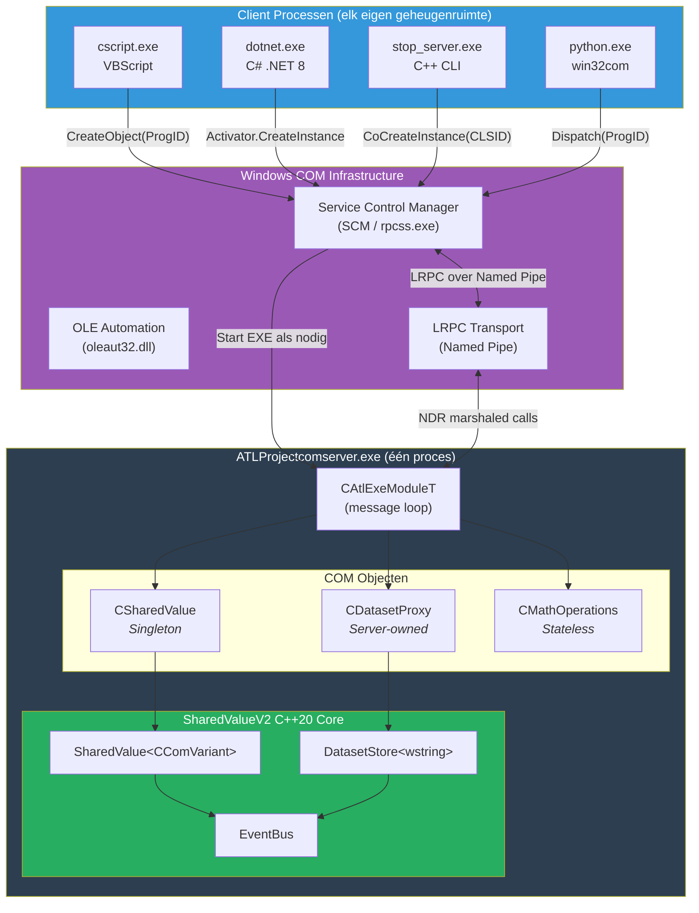

---

## 2. Lagenarchitectuur

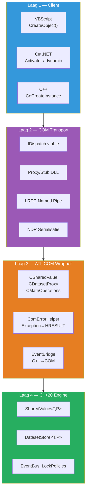

| Laag | Verantwoordelijkheid | Technologie | Bestanden |
|---|---|---|---|
| **Client** | Interface consumeren | VBScript, C#, Python, C++ | *(extern)* |
| **COM Transport** | Interface definitie, marshaling, registratie, lifetime | IDL/MIDL, Windows Registry, LRPC | `*.idl`, `*_p.c`, `*.rgs` |
| **ATL COM Wrapper** | Type-conversie, error vertaling, observer bridging | ATL 14, `CComVariant`, `CComBSTR` | `SharedValue.h/cpp`, `DatasetProxy.h/cpp` |
| **C++20 Engine** | Business logica, thread-safety, event handling | C++20 templates, `std::mutex` | `SharedValueV2/include/*.hpp` |

---

## 3. COM Fundamentals

### Wat is COM?

**Component Object Model** is een binaire interface standaard van Microsoft (1993) die taal-onafhankelijke object-communicatie mogelijk maakt. Kernprincipes:

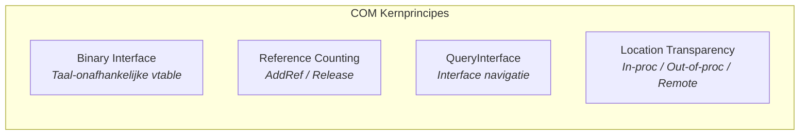

### IUnknown — De Basis van Alles

Elk COM object implementeert `IUnknown`:

```cpp
interface IUnknown {
    HRESULT QueryInterface(REFIID riid, void** ppvObject);  // "Ondersteun je interface X?"
    ULONG AddRef();     // Reference count +1
    ULONG Release();    // Reference count -1, delete bij 0
};
```

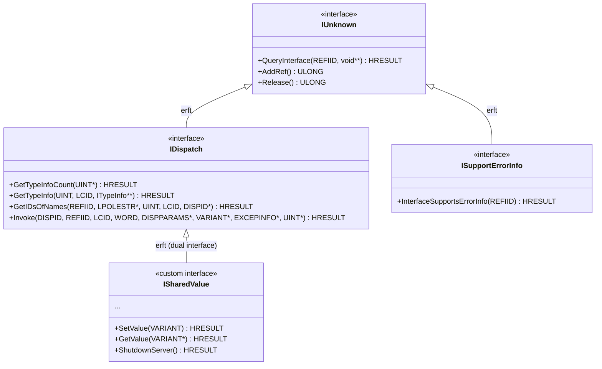

### IDispatch — Late Binding

Alle interfaces in dit project zijn **dual interfaces**: ze ondersteunen zowel vtable calls (snel, C++) als `IDispatch` (late binding, VBScript/C#/Python).

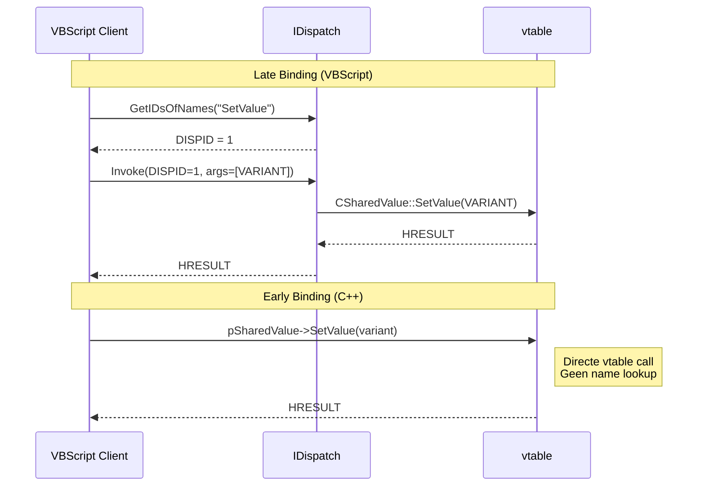

### HRESULT — De Universele Foutcode

```
 31  30  29  28             16  15                    0
┌───┬───┬───┬────────────────┬──────────────────────────┐
│ S │ R │ C │   Facility     │        Code              │
│ e │   │   │   (4 = ITF)    │   (ErrorCode enum)       │
│ v │   │   │                │                          │
└───┴───┴───┴────────────────┴──────────────────────────┘

S = 0: Success, 1: Error
Facility ITF = Interface-specifieke fout
Code = SharedValueV2::ErrorCode waarde
```

| HRESULT | Hex | Betekenis |
|---|---|---|
| `S_OK` | `0x00000000` | Succes |
| `E_POINTER` | `0x80004003` | Null pointer argument |
| `E_FAIL` | `0x80004005` | Generieke fout |
| `E_INVALIDARG` | `0x80070057` | Ongeldig argument |
| `MAKE_HRESULT(1, 4, 100)` | `0x80040064` | `KeyNotFound` |
| `MAKE_HRESULT(1, 4, 101)` | `0x80040065` | `DuplicateKey` |
| `MAKE_HRESULT(1, 4, 102)` | `0x80040066` | `StoreModeNotEmpty` |

---

## 4. ATL Framework Internals

**ATL** (Active Template Library) is een Microsoft C++ template library die de boilerplate reduceert voor het schrijven van COM objecten.

### ATL Class Hiërarchie per COM Object

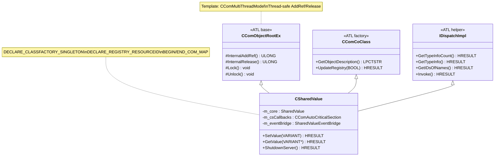

### ATL Macro's Uitgelegd

| Macro | Wat het doet |
|---|---|
| `CComObjectRootEx<CComMultiThreadModel>` | Thread-safe reference counting via `InterlockedIncrement/Decrement`. |
| `CComCoClass<CSharedValue, &CLSID_SharedValue>` | Koppelt de class aan zijn CLSID en biedt fabrieksmethoden. |
| `IDispatchImpl<ISharedValue, &IID_ISharedValue>` | Auto-implementeert `IDispatch` op basis van de TypeLib. |
| `DECLARE_CLASSFACTORY_SINGLETON` | Vervangt de standaard class factory door `CComClassFactorySingleton`. Alle `CreateInstance()` calls retourneren hetzelfde object. |
| `DECLARE_REGISTRY_RESOURCEID(IDR_SHAREDVALUE)` | Koppelt het `.rgs` bestand aan het COM object voor automatische registratie. |
| `DECLARE_PROTECT_FINAL_CONSTRUCT` | Voorkomt `Release()` tijdens `FinalConstruct()` door tijdelijk de refcount te verhogen. |
| `BEGIN_COM_MAP / END_COM_MAP` | Bouwt de `QueryInterface` tabel — welke interfaces dit object ondersteunt. |
| `COM_INTERFACE_ENTRY(ISharedValue)` | Voegt `ISharedValue` toe aan de QI-map met correcte pointer offset. |
| `OBJECT_ENTRY_AUTO(__uuidof(SharedValue), CSharedValue)` | Registreert het COM object bij de ATL module zodat de class factory het kan instantiëren. |

### COM_MAP in Detail

```cpp
BEGIN_COM_MAP(CSharedValue)
    COM_INTERFACE_ENTRY(ISharedValue)     // QueryInterface voor ISharedValue
    COM_INTERFACE_ENTRY(IDispatch)        // QueryInterface voor IDispatch
    COM_INTERFACE_ENTRY(ISupportErrorInfo) // QueryInterface voor ISupportErrorInfo
END_COM_MAP()
```

Dit vertaalt naar een statische tabel die `QueryInterface` gebruikt:

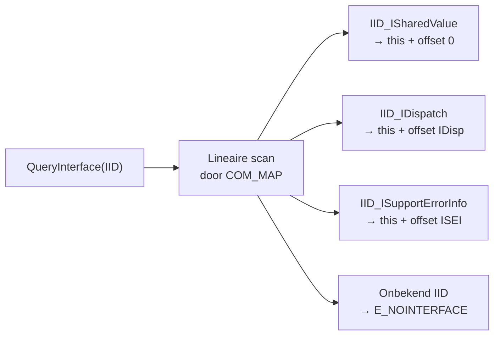

---

## 5. EXE Server Lifecycle

### Volledige Lifecycle van Start tot Shutdown

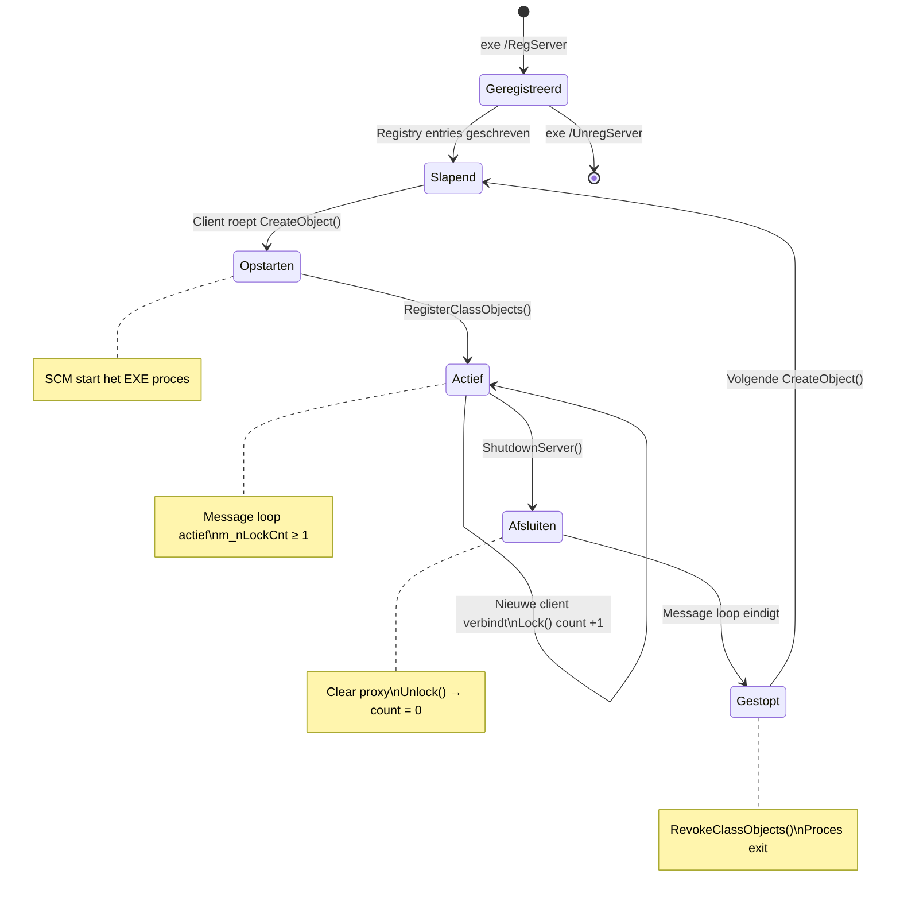

### _tWinMain Entry Point — Stap voor Stap

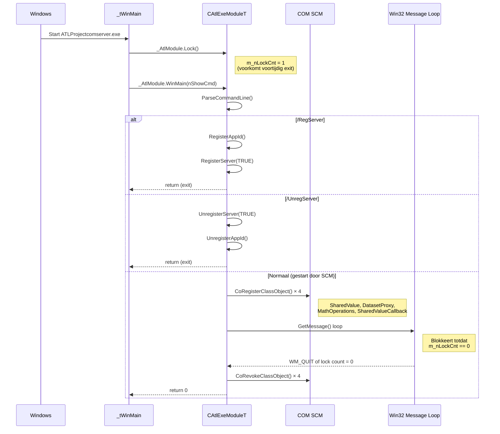

### Lock Count Mechanisme

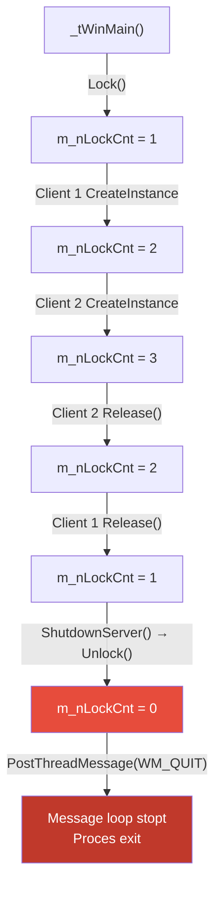

---

## 6. COM Object Model

### Interface Hiërarchie

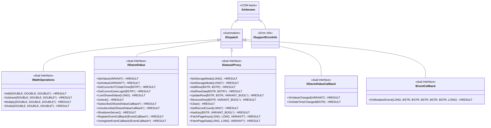

### GUID Tabel

| Entiteit | Type | GUID |
|---|---|---|
| **AppID / TypeLib** | Library | `{B0A0188F-59B6-42A5-AD3A-9D3CBE079253}` |
| SharedValue | CLSID | `{A5B21149-FB8C-4E50-8C52-65F3DC4AFEBF}` |
| DatasetProxy | CLSID | `{1D85075B-6ECB-4BE4-8317-9DDA91292ED8}` |
| MathOperations | CLSID | `{1CE8C512-FB0A-4C47-B3CD-44219BDC8DDF}` |
| SharedValueCallback | CLSID | `{6818DD57-F9E6-45BE-AA20-EA4B5B658AF3}` |
| ISharedValue | IID | `{8D55631F-1994-4F36-A3A3-D5B40EB0E0DB}` |
| IDatasetProxy | IID | `{50D4D0DB-6D9E-455F-8D6C-749CDBCF1949}` |
| IMathOperations | IID | `{488E9F3C-299B-4FE1-8B25-A2B9C2A23506}` |
| ISharedValueCallback | IID | `{E7639719-258C-46A3-B349-C3C96AC4B46C}` |
| IEventCallback | IID | `{DEC06BDB-7655-4E71-9937-110B78FCC576}` |

---

## 7. RPC Marshaling & Proxy/Stub

### Hoe Cross-Process Calls Werken

Omdat client en server in **aparte processen** leven, kan een interface-pointer niet simpel worden doorgegeven. Windows COM lost dit op met **proxy/stub marshaling**:

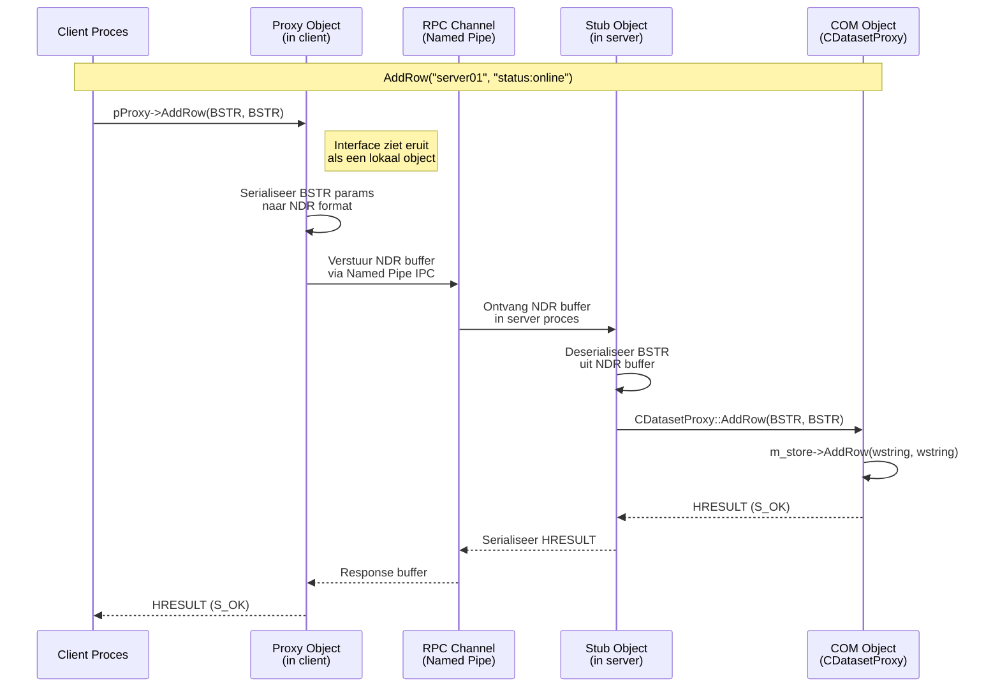

### MIDL Code Generatie Pipeline

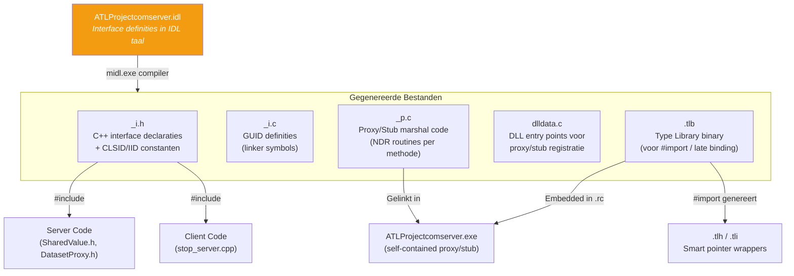

### NDR (Network Data Representation)

Elke parameter wordt geserialiseerd volgens het NDR protocol:

| COM Type | NDR Wire Format | Grootte |
|---|---|---|
| `LONG` | 4 bytes, little-endian | 4 bytes |
| `DOUBLE` | IEEE 754, 8 bytes | 8 bytes |
| `VARIANT_BOOL` | 2 bytes (0x0000 of 0xFFFF) | 2 bytes |
| `BSTR` | 4-byte length prefix + UTF-16 data + null | variabel |
| `VARIANT` | 2-byte vt + padding + waarde | variabel |
| `SAFEARRAY` | dimensies + bounds + element data | variabel |

---

## 8. Singleton Architectuur

### CSharedValue als Singleton

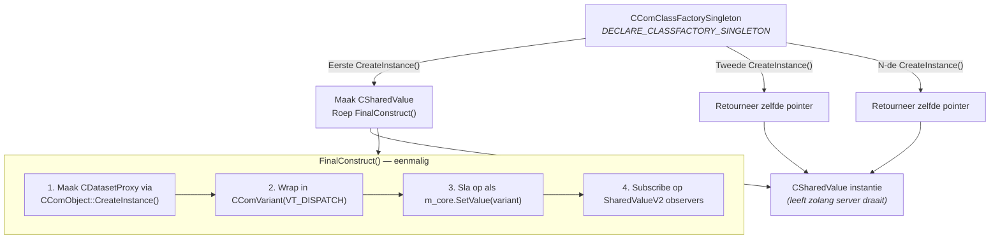

### Waarom Singleton?

| Eigenschap | Zonder Singleton | Met Singleton |
|---|---|---|
| Client A schrijft `SetValue("X")` | Alleen zichtbaar voor A | Zichtbaar voor A, B, C |
| Client B leest `GetValue()` | Eigen lege instantie | Ziet "X" van Client A |
| `DatasetProxy` rijen | Per-client kopie | Eén gedeelde dataset |
| Geheugengebruik | N × instantie | 1 instantie |

---

## 9. Observer & Event Architectuur

### Twee Parallelle Systemen

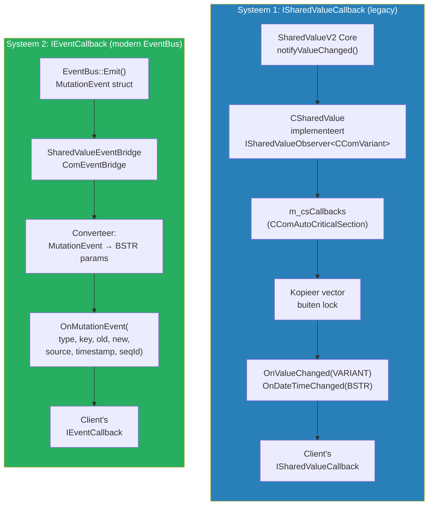

### Deadlock-Free Notificatie

Het kritieke patroon dat deadlocks voorkomt bij trage of crashende clients:

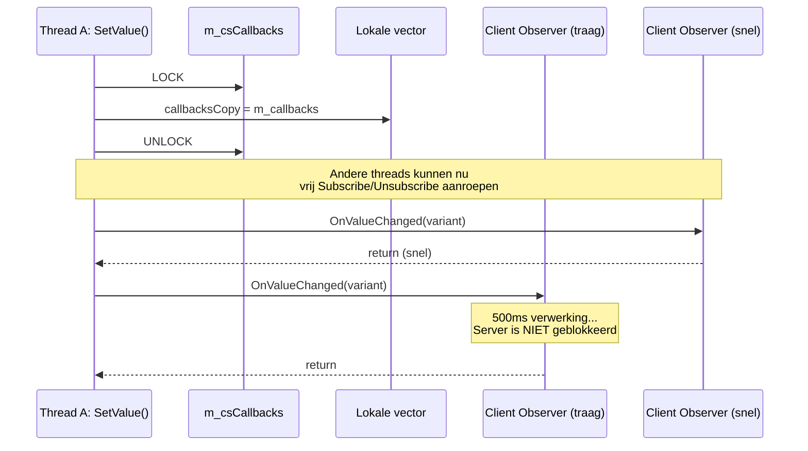

---

## 10. Error Handling Pipeline

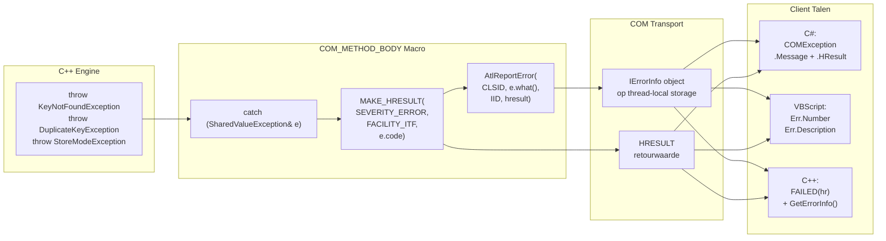

### ISupportErrorInfo

`CSharedValue` en `CDatasetProxy` implementeren `ISupportErrorInfo`. Dit vertelt de COM runtime dat deze objecten rijke foutinformatie leveren via `IErrorInfo`:

```cpp
STDMETHOD(InterfaceSupportsErrorInfo)(REFIID riid) {
    if (InlineIsEqualGUID(riid, IID_ISharedValue)) return S_OK;
    return S_FALSE;
}
```

---

## 11. Type Conversie — COM ↔ C++

### Inkomende Conversies (Client → Server)

| COM Parameter | C++ Intern | Conversie Code |
|---|---|---|
| `BSTR key` | `std::wstring` | `std::wstring(key)` |
| `VARIANT value` | `CComVariant` | `CComVariant::Copy(&value)` |
| `LONG mode` | `StorageMode` enum | `static_cast<StorageMode>(mode)` |
| `ISharedValueCallback*` | `CComPtr<ISharedValueCallback>` | `push_back(callback)` |

### Uitgaande Conversies (Server → Client)

| C++ Intern | COM Parameter | Conversie Code |
|---|---|---|
| `std::wstring` | `BSTR*` | `CComBSTR(str.c_str()).Detach()` |
| `CComVariant` | `VARIANT*` | `varValue.Detach(value)` |
| `bool` | `VARIANT_BOOL*` | `VARIANT_TRUE / VARIANT_FALSE` |
| `size_t` | `LONG*` | `static_cast<LONG>(count)` |
| `vector<wstring>` | `VARIANT* (SAFEARRAY)` | `CComSafeArray<VARIANT>` builder |
| `vector<pair<wstring,wstring>>` | `VARIANT* (2D SAFEARRAY)` | `SafeArrayCreate(VT_VARIANT, 2, bounds)` |

### SAFEARRAY Constructie (FetchPageKeys)

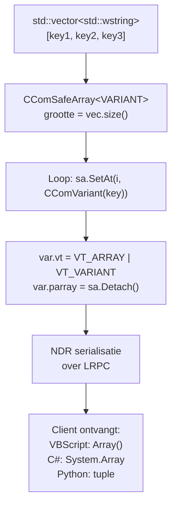

---

## 12. Client Interop Strategieën

### VBScript (IDispatch Late Binding)


### C# .NET (RCW + Dynamic Language Runtime)

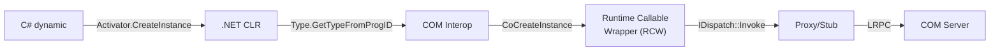

De RCW (Runtime Callable Wrapper) is een .NET object dat de COM interface wrapt:
- `AddRef/Release` → automatisch beheerd door .NET GC + `Marshal.ReleaseComObject`
- `QueryInterface` → transparant via `dynamic` casting
- `HRESULT` failure → `COMException` met IErrorInfo beschrijving

### C++ (#import Smart Pointers)

```mermaid
graph LR
    CPP["C++ Code"] -->|"#import exe"| TLHTLI[".tlh/.tli generatie"]
    TLHTLI -->|"ISharedValuePtr"| SMART["_com_ptr_t<br/>smart pointer"]
    SMART -->|"CreateInstance(CLSID)"| COM["CoCreateInstance"]
    COM -->|"Direct vtable call"| PROXY["Proxy/Stub"]
    PROXY -->|"LRPC"| SERVER["COM Server"]
```

---

## 13. SharedValueV2 Engine Integration

Hoe de C++20 engine wordt ingezet binnen de ATL wrapper:

```mermaid
graph TB
    subgraph ATL["ATL COM Layer"]
        CSV["CSharedValue"]
        CDP["CDatasetProxy"]
        SVB["SharedValueEventBridge<br/><i>IEventListener impl</i>"]
        CEB["ComEventBridge<br/><i>IEventListener impl</i>"]
    end

    subgraph V2["SharedValueV2 Core"]
        SV["SharedValue&lt;CComVariant, LocalMutexPolicy&gt;"]
        DS["DatasetStore&lt;std::wstring, LocalMutexPolicy&gt;"]
        EB1["EventBus (SharedValue)"]
        EB2["EventBus (DatasetStore)"]
    end

    CSV -->|"m_core"| SV
    CSV -->|"m_eventBridge"| SVB
    CDP -->|"m_store (unique_ptr)"| DS

    SV -->|"GetEventBus()"| EB1
    DS -->|"GetEventBus()"| EB2

    EB1 -->|"Subscribe(&bridge)"| SVB
    EB2 -->|"Subscribe(&bridge)"| CEB

    SVB -->|"OnEvent() →<br/>converteer naar BSTR<br/>→ IEventCallback"| EC1["Client IEventCallback"]
    CEB -->|"OnEvent() →<br/>converteer naar BSTR<br/>→ IEventCallback"| EC2["Client IEventCallback"]

    CSV -.->|"implementeert<br/>ISharedValueObserver"| SV
    SV -.->|"OnValueChanged()<br/>OnDateTimeChanged()"| CSV

    style ATL fill:#e67e22,color:#fff
    style V2 fill:#27ae60,color:#fff
```

### Template Instantiaties

```cpp
// In CSharedValue — de gedeelde waarde is een VARIANT
SharedValueV2::SharedValue<CComVariant, SharedValueV2::LocalMutexPolicy> m_core;

// In CDatasetProxy — key-value pairs van wide strings
std::unique_ptr<SharedValueV2::DatasetStore<std::wstring>> m_store;
```

De keuze voor `CComVariant` als template parameter T maakt het mogelijk om **elk COM-compatibel type** op te slaan: strings, getallen, objecten (`IDispatch*`), en zelfs geneste `DatasetProxy` instanties.

---

## 14. Windows Registry Model

Na `ATLProjectcomserver.exe /RegServer` worden de volgende registry entries geschreven:

```mermaid
graph TD
    subgraph HKCR["HKEY_LOCAL_MACHINE\\SOFTWARE\\Classes"]
        subgraph ProgIDs["ProgIDs"]
            P1["ATLProjectcomserverExe.SharedValue<br/>→ CLSID = {A5B21149...}"]
            P2["ATLProjectcomserverExe.DatasetProxy<br/>→ CLSID = {1D85075B...}"]
            P3["ATLProjectcomserverExe.MathOperations<br/>→ CLSID = {1CE8C512...}"]
        end

        subgraph CLSIDs["CLSID"]
            C1["{A5B21149...}<br/>LocalServer32 = pad\\naar\\exe"]
            C2["{1D85075B...}<br/>LocalServer32 = pad\\naar\\exe"]
            C3["{1CE8C512...}<br/>LocalServer32 = pad\\naar\\exe"]
        end

        subgraph AppID["AppID"]
            AI["{B0A0188F...}<br/>= ATLProjectcomserverExe"]
        end

        subgraph TypeLib["TypeLib"]
            TL["{B0A0188F...}\\1.0<br/>win64 = pad\\naar\\exe"]
        end

        subgraph Interfaces["Interface"]
            I1["{8D55631F...} ISharedValue<br/>ProxyStubClsid32"]
            I2["{50D4D0DB...} IDatasetProxy<br/>ProxyStubClsid32"]
        end
    end

    P1 --> C1
    P2 --> C2
    P3 --> C3
    C1 --> AI
    C2 --> AI
    C3 --> AI
```

### Registry Lookup Flow

```
Client: CreateObject("ATLProjectcomserverExe.SharedValue")
  ↓
HKCR\ATLProjectcomserverExe.SharedValue\CLSID → {A5B21149...}
  ↓
HKCR\CLSID\{A5B21149...}\LocalServer32 → "C:\...\ATLProjectcomserver.exe"
  ↓
SCM start EXE → CoRegisterClassObject → IClassFactory beschikbaar
  ↓
IClassFactory::CreateInstance() → pSharedValue (marshaled proxy)
```

---

## 15. Design Patterns Samenvatting

```mermaid
mindmap
  root((Design Patterns))
    Creational
      Singleton
        CSharedValue
        DECLARE_CLASSFACTORY_SINGLETON
      Factory Method
        ATL IClassFactory
        CreateStorageEngine()
      Abstract Factory
        CComClassFactory per coclass
    Structural
      Adapter
        SharedValueEventBridge
        ComEventBridge
        COM ↔ C++ conversie
      Proxy
        COM Proxy/Stub
        .NET RCW
        IDispatch wrapper
      Facade
        CSharedValue over SharedValueV2
        CDatasetProxy over DatasetStore
      Bridge
        IStorageEngine abstractie
        Map vs UnorderedMap
    Behavioral
      Observer
        ISharedValueObserver
        IDatasetObserver
        IEventListener
      Strategy
        LockPolicies als template
        StorageEngine runtime swap
      Monitor
        Data + lock onlosmakelijk
        lock_guard scope blocks
      Template Method
        ATL FinalConstruct / FinalRelease
      Command
        COM_METHOD_BODY macro
    Concurrency
      Copy then Notify
        Observer-lijst kopiëren
        Mutex vrij vóór callbacks
      Lock free Counter
        atomic sequence ID
```

| Pattern | Locatie | Doel |
|---|---|---|
| **Singleton** | `CSharedValue` | Gedeelde state voor alle clients |
| **Factory Method** | `CreateStorageEngine<T>()` | Runtime keuze: map vs unordered_map |
| **Adapter** | `SharedValueEventBridge`, `ComEventBridge` | C++ `MutationEvent` → COM `BSTR` parameters |
| **Proxy** | COM Proxy/Stub, .NET RCW | Transparante cross-process communicatie |
| **Facade** | `CSharedValue`, `CDatasetProxy` | Simpele COM API over complexe C++ core |
| **Bridge** | `IStorageEngine<T>` | Ontkoppeling van API en data-structuur |
| **Observer** | `ISharedValueObserver`, `IEventListener` | Losgekoppelde notificaties |
| **Strategy** | `SharedValue<T, MutexPolicy>` | Verwisselbare lock-strategie |
| **Monitor** | `SharedValue`, `DatasetStore` | Data ontoegankelijk buiten locked scope |
| **Template Method** | ATL `FinalConstruct` / `FinalRelease` | Framework-gestuurde object lifecycle |
| **Copy-then-Notify** | Alle observer notificaties | Deadlock-preventie |


## Gerelateerde Documentatie

- [README.md](README.md) — Gebruikershandleiding en overzicht van de EXE COM Server variant.
- [INSTALL.md](INSTALL.md) — Installatie-, registratie- en configuratiegids voor de EXE server.
- [README.md](../README.md) — Hoofddocumentatie en startpunt van het gehele project.
- [ARCHITECTURE.md](../ARCHITECTURE.md) — Hoofd architectuurdocument voor het gehele COM Server project.
- [README.md](../SharedValueV2/README.md) — Introductie en overzicht van de SharedValueV2 C++20 engine.
