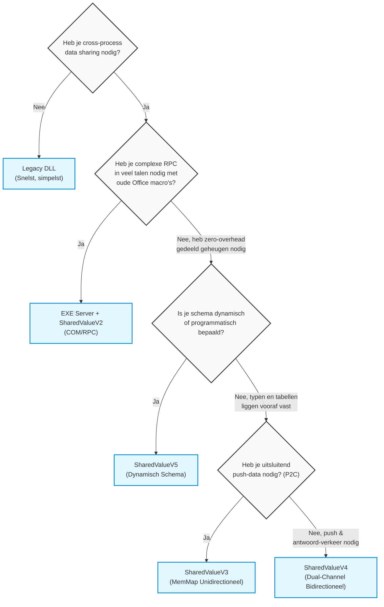

# ATL COM Server & SharedValue — Monorepo

**Versie:** 0.3.0

Een Windows C++ project voor het veilig uitwisselen en persistent bewaren van gedeelde variabelen tussen onafhankelijke processen. Het project biedt vier generaties:

- **SharedValueV2** — COM/RPC-gebaseerde engine met ATL Out-of-Process EXE Server.
- **SharedValueV3 (MemMap)** — Ultra-fast Memory-Mapped Files engine met FlatBuffers, zonder COM-afhankelijkheid.
- **SharedValueV4** — Dual-Channel (bidirectionele) Memory-Mapped Engine met compile-time schema's.
- **SharedValueV5** — Dynamic Schema IPC Engine met multi-table support, runtime schema lock en COM-interoperabiliteit.

## Projectoverzicht

### COM Server (V2)

Dit project levert **twee varianten** van dezelfde COM Server:

| Variant | Type | Registratie | Locatie |
|---|---|---|---|
| **Legacy DLL** (InprocServer32) | In-Process DLL | `regsvr32` | [`ATLProjectcomserverLegacy/`](ATLProjectcomserverLegacy/) |
| **EXE Server** (LocalServer32) | Out-of-Process EXE | Zelf-registrerend | [`ATLProjectcomserverExe/`](ATLProjectcomserverExe/) |

De EXE-variant is het **primaire productiemodel**: het draait als een zelfstandig Windows-proces waarmee meerdere onafhankelijke clients (C#, VBScript, Python) tegelijkertijd data delen via COM/RPC marshaling.

### Memory-Mapped IPC Engines (V3, V4, V5)

| Component | Taal | Doel | Locatie |
|---|---|---|---|
| **C++ Producer** | C++20 | Schrijft FlatBuffer-datasets naar shared memory | [`SharedValueV3_MemMap/cpp_core/`](SharedValueV3_MemMap/cpp_core/) |
| **C# Consumer** | .NET 9 | Luistert via Named Events en ontvangt callbacks | [`SharedValueV3_MemMap/csharp_core/`](SharedValueV3_MemMap/csharp_core/) |

De V3-engine omzeilt COM volledig. Data wordt gedeeld via een Windows Memory-Mapped File (10 MB kernel page), gesynchroniseerd met Named Mutexes, en gesignaleerd via Named Events — met **nanoseconde-latency** en **0% CPU bij idle**.

## COM Interfaces

Beide varianten exposeren dezelfde drie interfaces:

1. **`IMathOperations`** — Stateless rekenkundige bewerkingen (Add, Subtract, Multiply, Divide).
2. **`ISharedValue`** — Singleton in-memory state: `GetValue`, `SetValue`, `LockSharedValue`, observer-subscripties, en `ShutdownServer` (alleen EXE).
3. **`IDatasetProxy`** — Pagineerbare key-value dataset: `AddRow`, `GetRowData`, `UpdateRow`, `RemoveRow`, `FetchPageKeys`, `FetchPageData`, met configureerbare `StorageMode`.
4. **`ISharedValueCallback`** — Observer-interface voor live event-notificaties bij state-wijzigingen.

## Directorystructuur

```
cursor_com_test/
├── ATLProjectcomserver.sln          # Centrale Visual Studio Solution (alle projecten)
├── ATLProjectcomserverLegacy/       # Legacy In-Process DLL COM Server
├── ATLProjectcomserverExe/          # Out-of-Process EXE COM Server (productie)
├── SharedValueV2/                   # C++20 header-only core library (COM engine)
├── SharedValueV3_MemMap/            # Memory-Mapped FlatBuffers engine (V3)
│   ├── schema/                      #   FlatBuffers schema definitie
│   ├── cpp_core/                    #   C++ native producer
│   ├── csharp_core/                 #   C# managed consumer
│   ├── ARCHITECTURE.md              #   Uitgebreide architectuur met Mermaid diagrammen
│   └── build_schema.ps1             #   Automatische flatc download & codegen
├── SharedValueV4/                   # SharedValue Bidirectionele FlatBuffers engine (V4)
├── SharedValueV5/                   # SharedValue Dynamic Schema IPC Engine (V5)
├── scripts/                         # PowerShell diagnostische tools
├── docs/                            # Ontwerp- en architectuurdocumentatie
├── tests/                           # Cross-language integratietests
├── ARCHITECTURE.md                  # Technische architectuur & Design Patterns
├── CHANGELOG.md                     # Wijzigingshistorie
└── INSTALL.md                       # Compilatie- en installatie-instructies
```

## Vergelijking van de Varianten

Dit project bevat meerdere architectureel verschillende benaderingen voor cross-process data sharing. Elk heeft zijn eigen sterktes, beperkingen en ideale toepassingsgebieden.

### Overzichtstabel

| Eigenschap | EXE Server + SharedValueV2 | SharedValueV3 (MemMap) | SharedValueV4 (Bidirectioneel) | SharedValueV5 (Dynamic Schema) |
|---|---|---|---|---|
| **Procesmodel** | Out-of-process (eigen EXE) | Geen server nodig | Geen server nodig | Geen server nodig |
| **Transport** | RPC over Named Pipes | Direct shared memory | Direct shared memory | Direct shared memory |
| **Serialisatie** | VARIANT / BSTR / SAFEARRAY | FlatBuffers (zero-copy) | FlatBuffers (zero-copy) | Eigen cross-language binair formaat |
| **Latency per call**| ~1-10 μs (RPC marshaling) | ~10-100 ns (pointer read) | ~10-100 ns | ~10-100 ns |
| **Richtingsverkeer**| Bidirectioneel | Unidirectioneel (P2C) | Bidirectioneel (Dual-Channel) | Bidirectioneel (Dual-Channel) |
| **Multi-client** | ✅ Ja (singleton server) | ✅ Ja (kernel object sharing) | ✅ Ja | ✅ Ja |
| **Callbacks/Events**| COM IEventCallback (RPC) | Named Events (0% CPU) | Named Events (0% CPU) | Named Events (0% CPU) |
| **Schema evolutie** | COM IDL / TypeLib | FlatBuffers `.fbs` (compile) | FlatBuffers `.fbs` (compile) | Runtime (programmatisch, `DataSet`) |
| **Registratie vereist**| Ja (`/RegServer`) | ❌ Nee | ❌ Nee | ❌ Nee (behalve de COM-wrapper voor VBS) |
| **COM-afh.** | Volledig | ❌ Geen | ❌ Geen | ❌ Geen (optionele COM wrapper meegeleverd) |

> \* De `Global\` namespace voor Named Kernel Objects vereist standaard `SeCreateGlobalPrivilege`, wat beschikbaar is voor Administrators en services.

---

### 1. Legacy DLL — InprocServer32

De oorspronkelijke COM DLL wordt direct in de adresruimte van het aanroepende proces geladen.

**✅ Voordelen:**
- Snelste mogelijke aanroep (~1 ns): geen marshaling, geen context switch.
- Eenvoudigste debugging — breakpoints werken direct in het client-proces.
- Geen aparte server te starten of te beheren.

**❌ Nadelen:**
- **Geen cross-process sharing**: elke client krijgt een eigen kopie van de DLL in zijn eigen geheugen.
- Crasht de DLL → crasht het hele client-proces.
- Bitness-restrictie: een 64-bit client kan geen 32-bit DLL laden (en andersom).
- Vereist `regsvr32`-registratie met admin-rechten.

**🎯 Wanneer gebruiken:**
- Prototyping en snelle experimenten op één machine, binnen één proces.
- Legacy compatibiliteit met bestaande VBScript of Office VBA macro's die een in-process COM object verwachten.

---

### 2. EXE Server + SharedValueV2 — LocalServer32

Een zelfstandig Windows-proces dat als COM Server optreedt. Alle communicatie verloopt via RPC marshaling.

**✅ Voordelen:**
- **Echte cross-process sharing**: meerdere clients (C#, VBScript, Python) delen dezelfde singleton state.
- Proces-isolatie: crash van de server raakt de client niet direct.
- Volledige COM-infrastructuur: interfaces, TypeLibs, Connection Points, proxy/stub-registratie.
- Breed taalondersteuning — alles dat COM spreekt, kan meedoen.
- Dataset-batching via `SAFEARRAY` beperkt het aantal RPC calls bij bulk reads.

**❌ Nadelen:**
- RPC overhead (~1-10 μs per call) maakt per-record toegang tot grote datasets traag.
- COM-registratie vereist admin-rechten en strakke setup.
- Complexe levenscyclus: server lifecycle, reference counting, graceful shutdown moeten allen correct beheerd worden.
- Schema-wijzigingen vereisen IDL-aanpassingen, hercompilatie van proxy/stubs, en re-registratie.

**🎯 Wanneer gebruiken:**
- Wanneer **meerdere clients in verschillende talen** (C#, VBScript, Python) dezelfde live state moeten delen.
- Wanneer je bestaande COM-infrastructuur hebt en hierop wilt voortbouwen.
- Wanneer de data-uitwisselingsfrequentie laag tot matig is (< 1000 calls/sec) en je profiteert van batching.
- Wanneer je een **rijke interface** nodig hebt met methods, properties en events in één framework.

---

### 3. SharedValueV3 MemMap — Memory-Mapped Files + FlatBuffers

Directe geheugenuitwisseling via de Windows kernel, zonder tussenkomst van COM of RPC.

**✅ Voordelen:**
- **Nanoseconde-latency**: data is letterlijk hetzelfde geheugenblok in twee processen.
- **Zero-copy deserialisatie**: FlatBuffers hoeft niet geparsed te worden — veldtoegang is een pointer offset.
- **0% CPU bij idle**: de consumer-thread slaapt in de kernel tot een Named Event afgaat.
- Geen COM-registratie, geen admin-rechten (tenzij `Global\` namespace), geen TypeLibs.
- **Schema evolutie**: FlatBuffers ondersteunt het toevoegen van velden zonder backward-compatibility te breken.
- Onbeperkte nesting en dynamische arrays — niet beperkt tot POD/fixed-size structs.

**❌ Nadelen:**
- Geen ingebouwde method-calls of RPC: de consumer leest alleen data, kan niet direct functies aanroepen op de producer.
- De producer **moet eerst draaien** om het Memory-Mapped File aan te maken. De consumer wacht via een retry-loop.
- Unidirectioneel ontwerp (producer → consumer). Bidirectioneel vereist een tweede gedeeld geheugenblok.
- Geen automatische proxygeneratie voor willekeurige talen — client code moet handmatig de platform API's aanroepen.
- Schema-wijzigingen vereisen `flatc`-hercompilatie van de `.fbs` en rebuild van beide projecten.

**🎯 Wanneer gebruiken:**
- **High-frequency data feeds**: sensor data, real-time telemetrie, financiële tickers — waar duizenden updates per seconde nodig zijn.
- Wanneer je **maximale snelheid** nodig hebt en bereid bent COM-abstracties op te geven.
- Wanneer een C++ backend continu data produceert die een C# frontend (of meerdere consumers) moet tonen.
- Wanneer je **geen COM-registratie** wilt of kunt uitvoeren (bijv. in portable of containerized deployments).

### 4. SharedValueV4 & V5 — De Moderne Generaties

V4 en V5 bouwen voort op de ultra-snelle fundamenten van V3, maar lossen specifieke beperkingen op:

- **V4 (Bidirectioneel)**: Voegt een C2P (Consumer-to-Producer) return channel toe over memory-mapped files. Uitermate geschikt voor gesloten ecosystemen met HFT (High Frequency Trading) latency eisen (>100.000 updates per seconde) waarbij het schema bij compile-time (`flatc`) vastligt.
- **V5 (Dynamic Schema)**: Implementeert een ADO.NET-achtig `DataSet` + `DataTable` model *binnen* het gedeelde geheugen. C# en VBScript clients kunnen at runtime dynamische kolommen aanmaken en uitlezen. Het schema is "self-describing" en iteratief, ondersteund door multi-taal serializers en COM-integratie.

---

### Beslisboom




## Snel Bouwen

### Vereisten
- **Visual Studio 2022** met workload `Desktop development with C++` en component `C++ ATL for latest v143 build tools`.
- **CMake ≥ 3.20** (alleen voor SharedValueV2 standalone tests).

### Compilatie via Command Line
```powershell
# Laad de MSVC build-omgeving
. Invoke-BuildEnvironment.ps1 -Toolchain MSVC -Version "Enterprise 2022" -Architecture x64

# Bouw de gehele solution (Legacy DLL + EXE Server + testtool)
msbuild ATLProjectcomserver.sln /p:Configuration=Debug /p:Platform=x64 -m
```

### Compilatie via Visual Studio
1. Open `ATLProjectcomserver.sln`.
2. Selecteer `Debug | x64`.
3. Build → Build Solution (`F7`).

## COM Server Registreren

```cmd
:: Legacy DLL (als Administrator)
regsvr32 x64\Debug\ATLProjectcomserver.dll

:: EXE Server (zelf-registrerend, als Administrator)
x64\Debug\ATLProjectcomserver.exe /RegServer
```

## Testen

Zie [`tests/README.md`](tests/README.md) voor het volledige testoverzicht, of draai de geautomatiseerde cross-process suite:

```powershell
.\ATLProjectcomserverExe\tests\Run-CrossProcessTests.ps1
```

## Documentatie

- [ARCHITECTURE.md](ARCHITECTURE.md) — Technische architectuur, Design Patterns & lagen.
- [INSTALL.md](INSTALL.md) — Gedetailleerde bouw- en installatie-instructies.
- [CHANGELOG.md](CHANGELOG.md) — Volledig wijzigingsoverzicht.
- [docs/](docs/) — Ontwerpdocumenten en migratie-analyses.
- [ATLProjectcomserverExe/README.md](ATLProjectcomserverExe/README.md) — Gebruikershandleiding voor de EXE COM Server variant.
- [SharedValueV2/README.md](SharedValueV2/README.md) — Introductie en overzicht van de SharedValueV2 C++20 engine.
- [SharedValueV3_MemMap/README.md](SharedValueV3_MemMap/README.md) — Quickstart voor de ultra-fast Memory-Mapped FlatBuffers engine (V3).
- [SharedValueV3_MemMap/ARCHITECTURE.md](SharedValueV3_MemMap/ARCHITECTURE.md) — Uitgebreid V3-architectuurdocument met Mermaid-diagrammen.
- [SharedValueV5/README.md](SharedValueV5/README.md) — Snelstart voor de SharedValueV5 Dynamic Schema IPC engine met VBScript / C# / C++ support.
- [SharedValueV5/ARCHITECTURE_NL.md](SharedValueV5/ARCHITECTURE_NL.md) — Uitgebreid ontwerpdocument over de SharedValueV5 DataSets, Lazy Initialization en Binaire Serialisatie.
