# SharedValueV3_MemMap — Architecture Document

This document details the complete architecture spanning the **SharedValueV3 Memory-Mapped Engine**: an ultra-high speed, cross-process communication layer blending Windows Memory-Mapped Files intertwined with Google FlatBuffers driving nanosecond-latency data exchanges flanking C++ and C# applications.

---

## Table of Contents

1. [Motivation & Architectural Choice](#1-motivation--architectural-choice)
2. [System Overview](#2-system-overview)
3. [Project Structure](#3-project-structure)
4. [Core Components](#4-core-components)
   - [Memory-Mapped Files (MMF)](#41-memory-mapped-files-mmf)
   - [Named Mutex (Cross-Process Locking)](#42-named-mutex-cross-process-locking)
   - [Named Event (Zero-CPU Callbacks)](#43-named-event-zero-cpu-callbacks)
   - [Google FlatBuffers (Serialization)](#44-google-flatbuffers-serialization)
5. [Data Layout spanning Shared Memory](#5-data-layout-spanning-shared-memory)
6. [Schema Architecture (FlatBuffers)](#6-schema-architecture-flatbuffers)
7. [Producer-Consumer Lifecycle](#7-producer-consumer-lifecycle)
8. [Synchronization Model](#8-synchronization-model)
9. [Exception Handling Architecture](#9-exception-handling-architecture)
10. [Build Pipeline & Tooling](#10-build-pipeline--tooling)
11. [Comparisons against SharedValueV2 (COM)](#11-comparisons-against-sharedvaluev2-com)

---

## 1. Motivation & Architectural Choice

The predecessor generation (`SharedValueV2`) cycles utilizing an Out-of-Process COM Server (`LocalServer32`). Any isolated property-call triggered passing through C# inflicts RPC-marshaling utilizing Named Pipes, simultaneously inducing stiff context-switches beside sharp kernel-transitions. Regarding bulk data ingestion (thousands arrays every sequence) this manifests generating intense bottlenecks.

SharedValueV3 permanently eradicates overhead instances actively **injecting directly shared memory partitions** looping parallel processes anchoring onto Windows kernel Memory-Mapped File mechanisms.

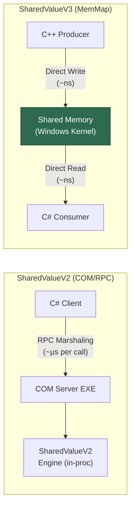

**Core Advantages:**

| Property | V2 (COM) | V3 (MemMap) |
|---|---|---|
| Latency per read | ~1-10 μs (RPC) | ~10-100 ns (pointer hop) |
| Serialization | VARIANT/BSTR marshaling | FlatBuffers zero-copy |
| CPU at idle | Polling mimicking COM Events | 0% (kernel wait locks) |
| Dynamic structures | `std::vector`, `BSTR` | FlatBuffer tables |
| Cross-language barrier | COM IDL/TLB blueprints | Shared `.fbs` schema |

---

## 2. System Overview

The entire framework encapsulates three tightly governed synchronization primitives communicating via the overarching Windows-kernel, alongside the layered FlatBuffers tier orchestrating structural logic.

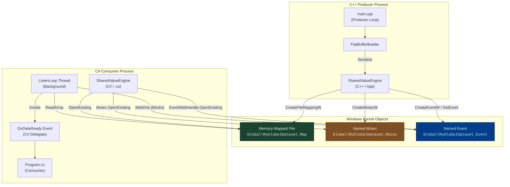

---

## 3. Project Structure

```mermaid
graph TD
    ROOT["SharedValueV3_MemMap/"]

    ROOT --> SCHEMA["schema/"]
    SCHEMA --> FBS["dataset.fbs<br/><i>FlatBuffers schema blueprint</i>"]

    ROOT --> CPP["cpp_core/"]
    CPP --> ENGINE_HPP["SharedValueEngine.hpp<br/><i>MMF + Mutex + Event wrapping</i>"]
    CPP --> EXCEPT_HPP["SharedValueException.hpp<br/><i>Exception hierarchy scaffolding</i>"]
    CPP --> MAIN_CPP["main.cpp<br/><i>Producer demonstration app</i>"]
    CPP --> GENERATED_H["dataset_generated.h<br/><i>FlatBuffers C++ logic</i>"]
    CPP --> CMAKE["CMakeLists.txt<br/><i>Build mapping constraints</i>"]

    ROOT --> CS["csharp_core/"]
    CS --> ENGINE_CS["SharedValueEngine.cs<br/><i>MMF + Mutex + Event wrapping</i>"]
    CS --> EXCEPT_CS["SharedValueEngineExceptions.cs<br/><i>Exception hierarchy scaffolding</i>"]
    CS --> PROG_CS["Program.cs<br/><i>Consumer demonstration app</i>"]
    CS --> GEN_CS["Generated/<br/><i>FlatBuffers C# classes</i>"]
    CS --> CSPROJ["csharp_core.csproj"]

    ROOT --> BUILD_PS1["build_schema.ps1<br/><i>Autonomous flatc logic driving codegen</i>"]
    ROOT --> README["README_EN.md"]
    ROOT --> ARCH["ARCHITECTURE_EN.md"]

    style ROOT fill:#264653,stroke:#2a9d8f,color:#e9c46a
    style SCHEMA fill:#e76f51,stroke:#f4a261,color:#fff
    style CPP fill:#2a9d8f,stroke:#264653,color:#fff
    style CS fill:#e9c46a,stroke:#f4a261,color:#264653
```

### Files Breakdown

| File | Language | Design Role |
|---|---|---|
| `schema/dataset.fbs` | FlatBuffers IDL | Defines foundational core shapes (tables, nesting mappings) |
| `cpp_core/SharedValueEngine.hpp` | C++20 | Scaffolds logic initializing MMF, Mutex, Event; pushes bytes |
| `cpp_core/SharedValueException.hpp` | C++20 | Hierarchical exception tracking layers |
| `cpp_core/main.cpp` | C++20 | Producer application publishing periodic clusters |
| `cpp_core/dataset_generated.h` | C++ (generated) | FlatBuffers serialization conversion logic |
| `csharp_core/SharedValueEngine.cs` | C# (.NET 9) | Re-links existing MMF, Mutex, Event layers; reads bytes |
| `csharp_core/SharedValueEngineExceptions.cs` | C# (.NET 9) | Shielded managed exception parameters |
| `csharp_core/Program.cs` | C# (.NET 9) | Consumer routing application ingesting updates heavily looping callbacks |
| `csharp_core/Generated/*.cs` | C# (generated) | FlatBuffers deserialization nodes |
| `build_schema.ps1` | PowerShell | Retrieves `flatc.exe` triggering code injections |
| `cpp_core/CMakeLists.txt` | CMake | C++ compile parameters enforcing FetchContent integrating FlatBuffers |

---

## 4. Core Components

### 4.1 Memory-Mapped Files (MMF)

A Memory-Mapped File acts representing a core Windows-kernel integration technique illuminating an actual block tracing physical memory (deriving spanning paging environments) rendering entirely visible stretching spanning dual virtual-address footprints covering overarching operations parallel. This implies nothing caches onto hard disks — it resides utterly confined occupying RAM whilst directed firmly by the kernel.

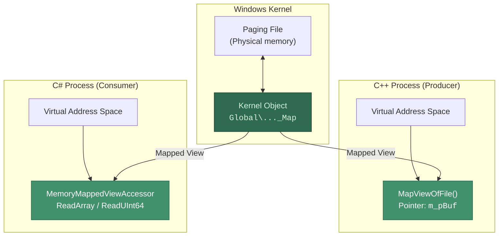

**Essential API calls:**

| Domain Constraint | Executed Function | Technical Aim |
|---|---|---|
| C++ (Producer mechanism) | `CreateFileMappingW(INVALID_HANDLE_VALUE, ...)` | Instantiates kernel component block (10 MB allocated) |
| C++ (Producer mechanism) | `MapViewOfFile(FILE_MAP_ALL_ACCESS)` | Snatches raw address pointer (`void*`) probing target space |
| C# (Consumer mechanism) | `MemoryMappedFile.OpenExisting(...)` | Extrapolates mapping aligning alongside an active tag node |
| C# (Consumer mechanism) | `mmf.CreateViewAccessor(0, maxSize)` | Generates logical `MemoryMappedViewAccessor` covering managed pulls |

### 4.2 Named Mutex (Cross-Process Locking)

Discounting flawless tight synchronization, jumping C# logic nodes might swallow fragments traversing raw byte flows exactly whereas the overlapping C++ module persistently writes inputs continuously. Securing a **Named Mutex** within the `Global\`-namespace renders an indicator perfectly transparent evaluating traversing completely segregated domains enforcing aggressive exclusivity rules.

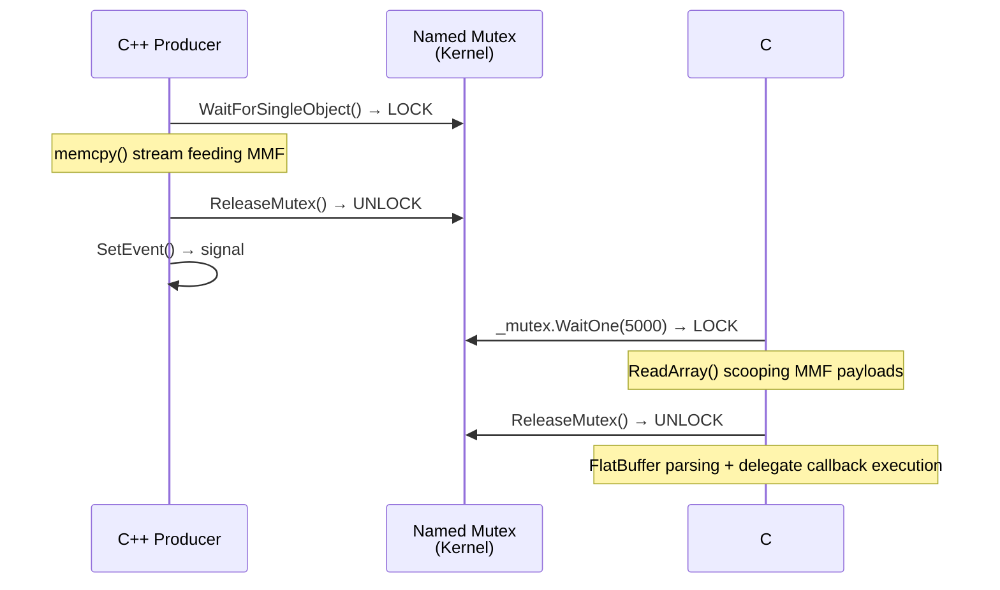

**Rigidity concerning system failures:** Assuming producers buckle crashing completely retaining grips overlapping the mutex, consecutive consumer instances stumble trapping unique `WAIT_ABANDONED` (leveraging C++) equivalent mimicking `AbandonedMutexException` (targeting C#). Exploring mutual frameworks catches implementations explicitly: routing inherently snatches prevailing Mutex ownership while broadcasting logging flags.

### 4.3 Named Event (Zero-CPU Callbacks)

Targeting an Event object forces mimicking an isolated hardware interrupt channel: the core consumer thread drops entirely dormant registering **exactly 0% CPU consumption** pending producer interventions firing `SetEvent()`.

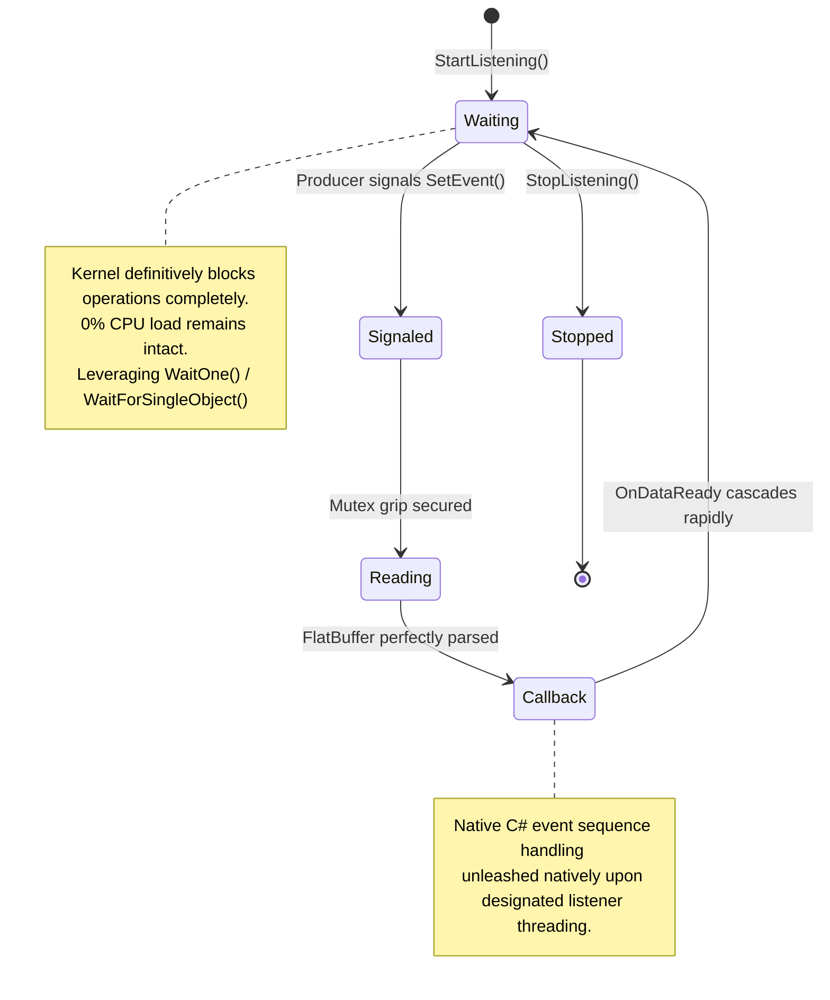

**Auto-Reset protocol implementation:** Events are solidly bound mirroring **auto-reset** behaviors (`CreateEventW(..., FALSE, FALSE, ...)`). Demonstrating exclusively a singular dormant thread awakening instantly snapping states mirroring an un-signaled designation definitively — exterminating any race conditions allowing sequential readouts duplicating loops unintentionally.

### 4.4 Google FlatBuffers (Serialization)

FlatBuffers intercepts navigating the foundational roadblock stating universal C++ shapes (`std::vector`, `std::string`, deep pointer mappings) essentially disintegrate spanning natively mapped blocks crossing borders. FlatBuffers resolves standardizing strictly toward a **flattened byte-array template** delivering continuous read flows directly sidestepping sluggish parsing engines.

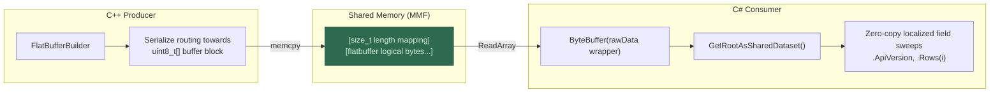

**Discounting Protocol Buffers alongside JSON alternatives?**

| Requirement Criterion | FlatBuffers | Protocol Buffers | JSON Variants |
|---|---|---|---|
| Zero-copy mapping loops | ✅ Achieved perfectly | ❌ Denied (demands decode layers) | ❌ Denied entirely |
| Shared memory conformity | ✅ Shallow flattened arrays | ⚠️ Decode enforces heap jumping | ❌ Sluggish string processing hooks |
| Evolutionary schema tweaks | ✅ Flawless forward/backward | ✅ Flawless forward/backward | ❌ Highly fragile operations |
| Codegen merging C++ + C# | ✅ Embedded inherently | ✅ Embedded inherently | ❌ Hand-crafted mechanics |

---

## 5. Data Layout spanning Shared Memory

The 10 MB contiguous memory cluster utilizes extraordinarily austere binary alignments:

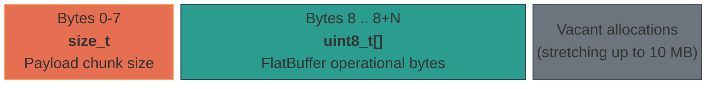

| Memory Offset Segment | Variable Format | Implementation Mapping |
|---|---|---|
| `0x00` – `0x07` | `size_t` (covering 8 bytes stretching x64) | Dimensions defining raw FlatBuffer byte layouts |
| `0x08` – `0x08 + N` | `uint8_t[N]` | Raw untouched binary FlatBuffer structures (origin: `SharedDataset`) |
| `0x08 + N` – stretching towards bounds | — | Stagnant padding buffering expanded growth iterations |

**C++ injection routine:**
```cpp
size_t* pSize = static_cast<size_t*>(m_pBuf);
*pSize = size;                                    // embeds dimension metrics traversing offset 0
uint8_t* pDest = static_cast<uint8_t*>(m_pBuf) + sizeof(size_t);
memcpy(pDest, data, size);                        // embeds operational payload traversing offset 8
```

**C# probing routine:**
```csharp
ulong dataSize = _accessor.ReadUInt64(0);         // scoops dimensional logic sweeping offset 0
byte[] rawData = new byte[dataSize];
_accessor.ReadArray(8, rawData, 0, (int)dataSize); // scoops operational payload sweeping offset 8
```

---

## 6. Schema Architecture (FlatBuffers)

Core layout schemas (`dataset.fbs`) isolate mapping arrays driving three independent deeply nesting configurations:

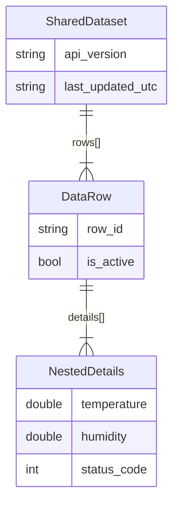

### Navigating Schema Evolutionary Hooks

FlatBuffers inherently advocates tacking attributes flanking extreme array bounds leaving static structural frameworks functionally undisturbed. Thus manifesting rigorous forward ensuring overlapping backward-compatible iteration safety protocols:

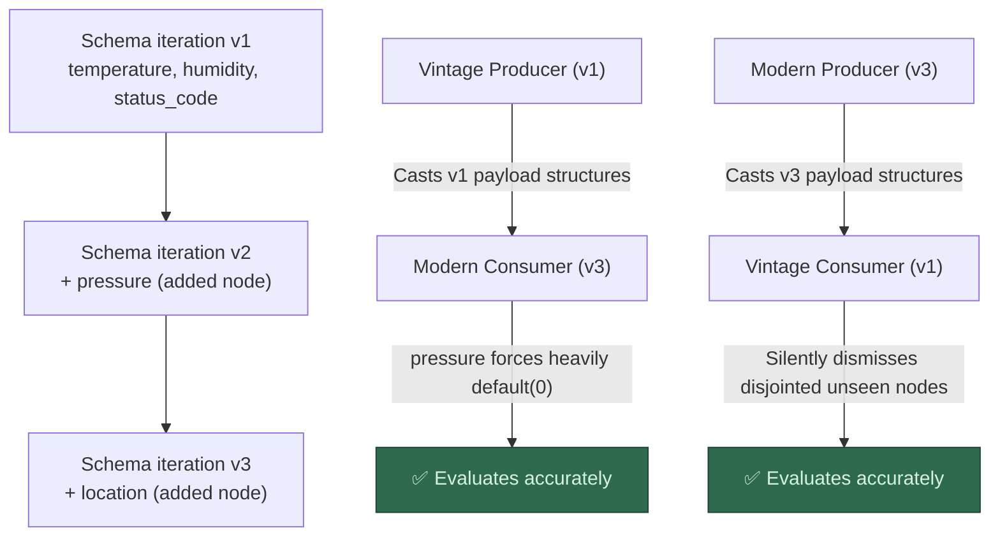

> **Mandatory Doctrine:** Stripping established variables alongside re-allocating active Field-ID designations proves categorically forbidden. Append additions exclusively mapping external array extremities.

---

## 7. Producer-Consumer Lifecycle

Extrapolating comprehensive sequences launching parallel streams evaluating dataflow routing entirely transparently:

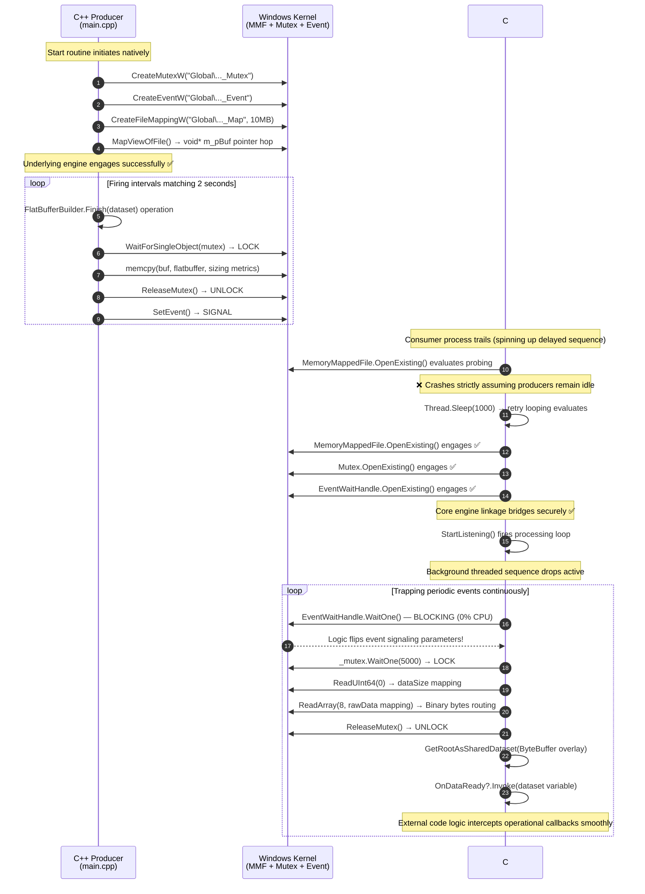

### Resilience Protocols Surrounding Startup Logic

The C# endpoint invariably manifests jumping cycles bypassing C++ processes occasionally. Catching desynchronizations demands solid retry loop scaffolding natively:

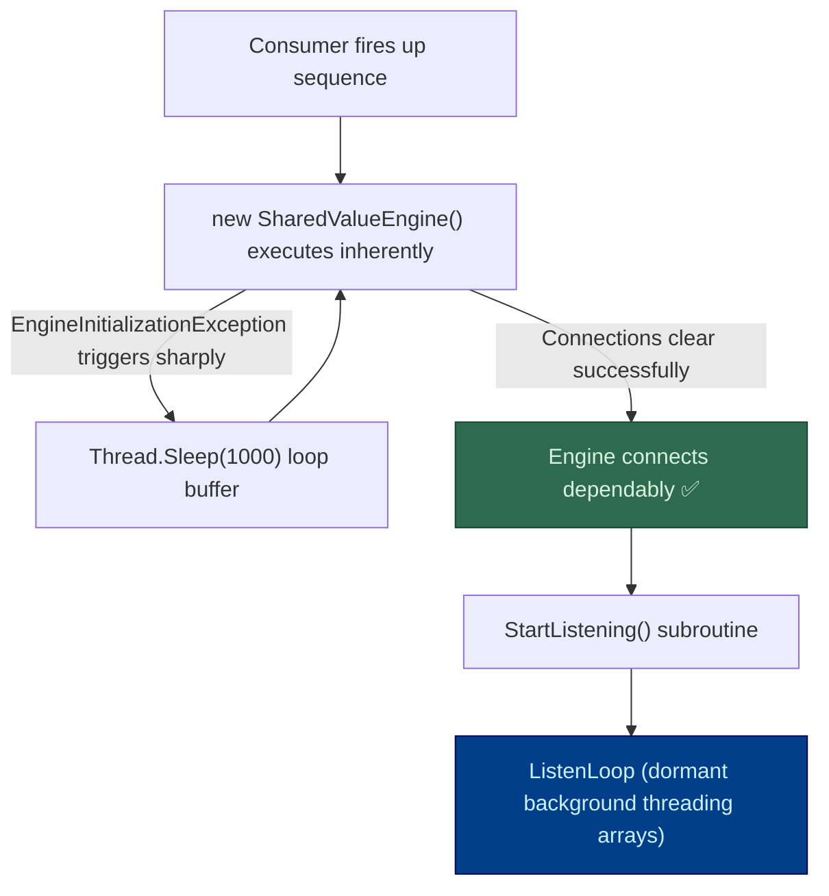

### Kernel Object Lifecycle and Reference Counting Models

Windows structural components (originating MMF, Mutex, Event instances) operate solely propelled exploiting **reference-counting** arithmetic natively. Spanning external frameworks allocating bindings naturally spikes numeric increments accordingly cross-checking operations. Zeroing variables actively prompts unceremonious Windows garbage disposal sweeps instantly collapsing objects internally. Analyzing profound implications uncovers three overarching logical consequences:

#### Optimal baseline routine: Producer sustains infinite bounds, consumers transition dynamically

Serving mimicking central use-cases guarantees operational perfection flawlessly:

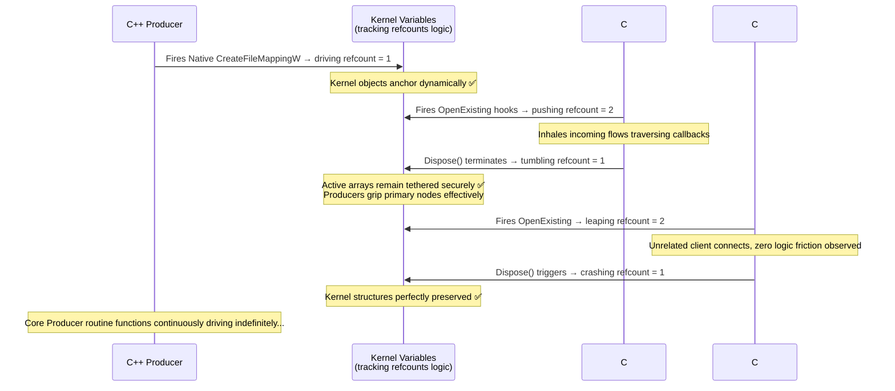

**Attribute definitions aligning this structure:**
- ✅ Producer routinely cycles completely ignoring peripheral consumer mapping counts natively
- ✅ Consumer components connect interchangeably executing un-tethered tracking bounds dynamically
- ✅ Substantial overlapping multi-consumer networks bridge securely parallel mapping unique local handlers cleanly
- ✅ Producer functions fully disconnected executing pure fire-and-forget logic loops
- ✅ Startup discrepancies isolating consumer pacing loops stall effortlessly firing continuous retry jumps smoothly

#### Severe edge-case bottleneck: Producer process disintegrates stripping consumer nodes

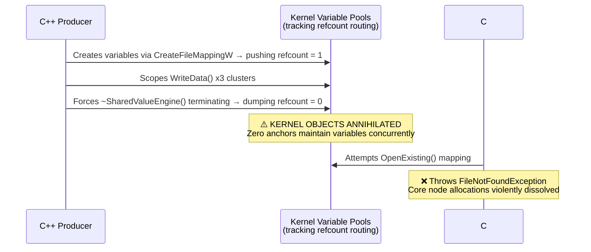

Such permutations materialize **purely** confined covering rigidly formulated automated test sweeps whereas producers dump explicitly restrictive updates (mapping `--count N` flags) abandoning processes drastically afterwards. Normal environments (maintaining infinite cycling models) disregard anomalies.

#### Resolving test instability loops: implementing the `--linger` parameter tag

The embedded producer routine catches modifiers driving an explicit `--linger MS` argument halting shutdown mechanisms forcibly keeping node connections pulsing pushing N milliseconds overlapping concluding write actions. Providing buffer spans covering consumer initialization logic loops trapping final outstanding bursts flawlessly:

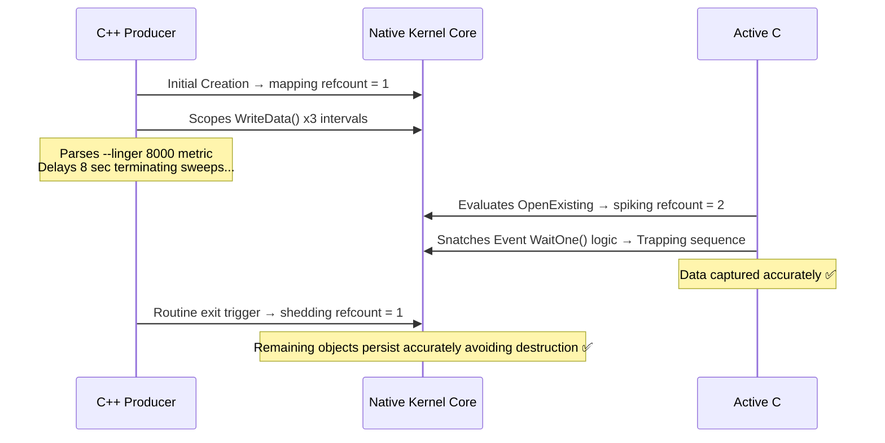

> **Condensed observation:** Mapping explicit `--linger` extensions operates serving completely secluded testing diagnostic tools exclusively. Deployments encompassing production-level frameworks cycle producers indefinitely disregarding linger metrics completely safely.

---

## 8. Synchronization Model

Spanning three distinct kernel nodes effectively guarantees data-conformity intertwined leveraging aggressively optimal firing sequences:

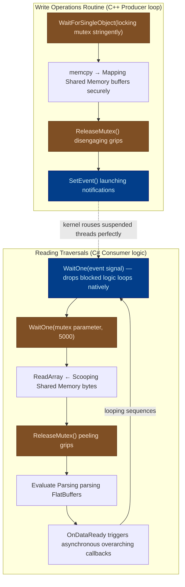

### Safety Operational Assurances

| Guarantee Designation | Operational Engineering Mechanic |
|---|---|
| **Eliminates torn read sequences** | Mutex rigidly sweeps spanning identical full stringing write loops → rigidly scoping reading arcs seamlessly |
| **Bypasses spinning busy-wait checks** | `WaitOne()` adjoining `WaitForSingleObject()` definitively suspends threading loops relying fully utilizing kernel states |
| **Avoids duplicate payload cycles** | Auto-reset properties inherently strip signal variables reverting silently targeting non-signaled logic bindings flawlessly |
| **Deflects hard process crashes** | Abandoned mutex strings forcibly cascade transferring allocations sweeping perfectly rescuing stuck threads |
| **Securing timeout loops efficiently** | Hard 5-second constraints sever hanging grips sweeping mutex parameters avoiding disastrous overlapping deadlocks cleanly |

---

## 9. Exception Handling Architecture

Mapping parallel environments natively implements mirrored hierarchical structures shielding system-level anomalies bridging codebases completely:

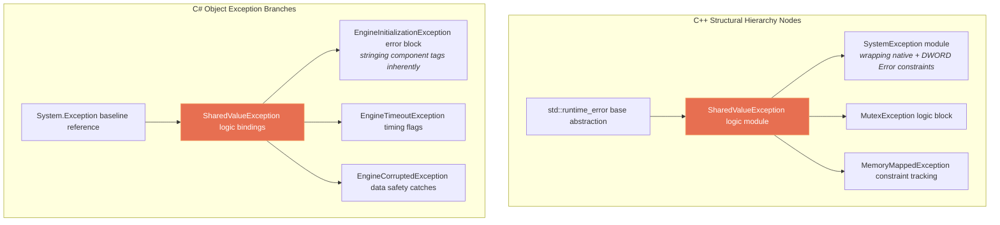

### Evaluating Breakdown Responses alongside Corrections

| Breakdown Trigger Scenario | C++ Embedded Component | C# Bounding Exceptions |
|---|---|---|
| Kernel component scaffolding crumbles violently | `SystemException` (husk framing `GetLastError()`) | `EngineInitializationException` (mapping specific component names recursively) |
| Mutex drops exceeding 5s timeouts | `MutexException` variables | `EngineTimeoutException` logic catches |
| Producer crashes stripping connections (abandoning mutex loops) | `WAIT_ABANDONED` sequences + logging parameters | `AbandonedMutexException` → executes catch procedures properly continuing flows |
| Payload stretches eclipsing overarching MMF limits severely | `MemoryMappedException` parameters | *Entirely isolated avoiding impacts inherently (read-only mechanics limit)* |
| Corrupted metric mapping arrays rendering structurally invalid parameters | *Untethered logic instances (write-only barriers apply natively)* | `EngineCorruptedException` triggering safely |
| Generative cascading WinAPI failure chains | `SystemException` (isolating precise failure + system bounds) | Scoped firmly utilizing `EngineInitializationException` components |

### Validating Mutex Locking Stability Handling Exception Chains

Deploying C++ `WriteData()` execution protocols guarantees mutex arrays securely disengage un-tethering natively disregarding aggressively anomalous loops inherently:

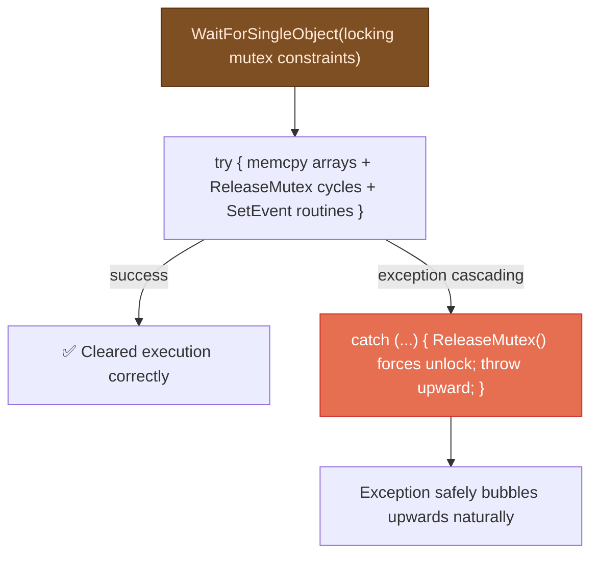

Deploying C# `ReadCurrentData()` relies safely harnessing sweeping `try/finally` clusters executing comparable resilience mapping identically:

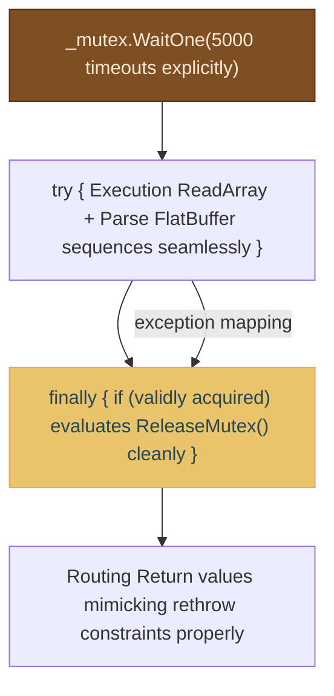

---

## 10. Build Pipeline & Tooling

### Schema Generation Tooling Integration

Leveraging `build_schema.ps1` sequences fundamentally automates massive underlying code-generative cycles rapidly:

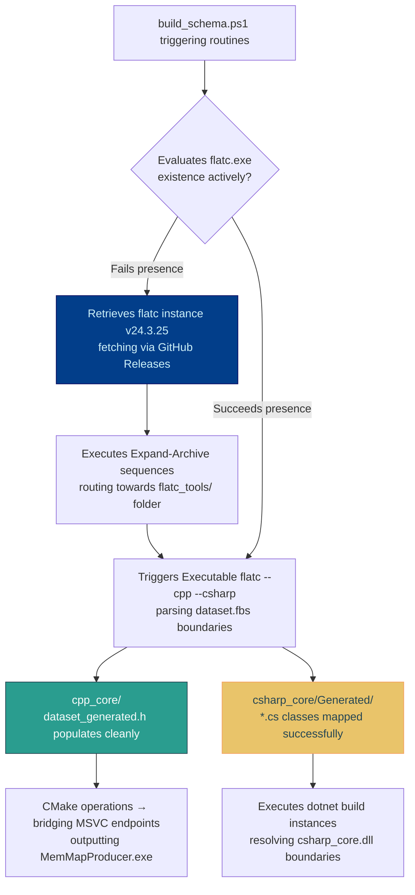

### C++ Structural Integration (Mapping CMake alongside FetchContent routines)

```mermaid
flowchart LR
    CMAKE["CMakeLists.txt root"] --> FETCH["Resolves FetchContent logic<br/>pinning google/flatbuffers<br/>to version v24.3.25 specifically"]
    FETCH --> HEADERS["Extracts FlatBuffers Native C++<br/>isolated header-only logic matrices"]
    CMAKE --> EXE["Executable mapping MemMapProducer.exe seamlessly"]
    HEADERS --> EXE

    NOTE["Embeds NOMINMAX alongside WIN32_LEAN_AND_MEAN bounds<br/>exterminating systemic Windows.h collisions smoothly"]

    style FETCH fill:#023e8a,stroke:#03045e,color:#caf0f8
    style EXE fill:#2a9d8f,stroke:#264653,color:#fff
```

### C# Build Parameters (Deploying .NET 9 bounds)

```mermaid
flowchart LR
    CSPROJ["Project mapping csharp_core.csproj<br/>deploying net9.0-windows logic frames"] --> NUGET["Integrates Remote NuGet blocks: Google.FlatBuffers<br/>version v24.3.25 explicitly mapped"]
    CSPROJ --> GEN["Sourcing Generated/*.cs matrices<br/>(extracted spanning flatc execution bounds)"]
    NUGET --> DLL["Resolves compiling csharp_core.dll objects successfully"]
    GEN --> DLL

    style DLL fill:#e9c46a,stroke:#f4a261,color:#264653
    style NUGET fill:#023e8a,stroke:#03045e,color:#caf0f8
```

**Rigidity enveloping structural mapping variants:** Locking down specifically native C++ `FetchContent` bounds concurrently aligning C# packaged NuGet components traversing execution commands referencing `.exe` flatc binaries invariably restricts variants pinning identically spanning **v24.3.25** neutralizing systemic catastrophic serialization breakdowns continuously.

---

## 11. Comparisons against SharedValueV2 (COM)

```mermaid
flowchart TB
    subgraph "V2: Deploying COM/RPC Architecture models explicitly"
        direction TB
        CLIENT_V2["C# End-Client<br/>(Leveraging COM Interop boundaries)"]
        RPC_V2["Executing RPC strings spanning Named Pipes<br/>(Exhaustive kernel transitions)"]
        SERVER_V2["COM Server Process EXE<br/>(Mapping ATL/MFC arrays natively)"]
        ENGINE_V2["SharedValueV2 Engine blocks<br/>(Locking std::mutex, mapping std::vector)"]

        CLIENT_V2 -->|"Evaluates QueryInterface /<br/>Firing Invoke parameters"| RPC_V2
        RPC_V2 --> SERVER_V2
        SERVER_V2 --> ENGINE_V2
    end

    subgraph "V3: Advanced MemMap Framework Models"
        direction TB
        PRODUCER_V3["C++ Engine Producer Node"]
        SHARED_V3["Memory-Mapped Shared Blocks<br/>(10 MB sprawling kernel page)"]
        CONSUMER_V3["C# Engine Consumer Node"]

        PRODUCER_V3 -->|"Executes lightning fast memcpy strings<br/>(~ns execution loops)"| SHARED_V3
        SHARED_V3 -->|"Evaluating ReadArray sequences directly<br/>(~ns execution loops)"| CONSUMER_V3
    end

    style RPC_V2 fill:#e76f51,stroke:#c9302c,color:#fff
    style SHARED_V3 fill:#2d6a4f,stroke:#1b4332,color:#d8f3dc
```

| Trait Aspect Matrix | SharedValueV2 Execution (COM bounds) | SharedValueV3 Operations (MemMap metrics) |
|---|---|---|
| **Underlying transport** | Stiff RPC crossing Named Pipes | Native direct shared memory clusters |
| **Serialization strings** | Bloated VARIANT / BSTR / SAFEARRAY | Optimized FlatBuffers (zero-copy operations) |
| **Speed latency** | Dragging ~1-10 μs mapping each RPC traversal | Explosive ~10-100 ns parsing read operations |
| **Notifications cascades** | Ponderous COM Connection point handling (`IEventCallback`) | Hyper-efficient Named Event parsing adjoining C# delegate handlers |
| **Multithreading bounds** | `std::mutex` restrictions (strictly localized in-process hooks) | Expanded System Named Mutex bindings (safely mapping external cross-process operations) |
| **Structural blueprinting** | Limiting COM IDL parameters alongside TypeLib loops (`.tlb`) | Adaptable generalized FlatBuffers configurations `.fbs` (versatile crossing diverse languages safely) |
| **Dynamic allocations** | Cumbersome `std::vector<BSTR>` string mappings | Highly optimized nested FlatBuffer matrices (spanning inherently limitless logic layers) |
| **Framework dependencies** | Heaving ATL loops, overlapping COM Runtimes alongside Windows Registry | Austere minimal execution bindings relying entirely executing strict Native Windows Kernel API paths |
| **Compulsory deployment strings** | Aggressively enforced hooks navigating (`regsvr32` referencing COM mappings natively) | Extinguished cleanly bypassing registrations tracking internal isolated kernel referencing designations |

---

## Related Documentation

- [README_EN.md](README_EN.md) — Baseline introduction mechanics charting core structures beside quickstart execution guide procedures inherently.
- [ARCHITECTURE_EN.md](../ARCHITECTURE_EN.md) — Overarching architecture document defining mapping variables tracking generalized COM Server project logic trees completely.
- [README_EN.md](../SharedValueV2/README_EN.md) — Tracking foundational COM-based architecture mapping the overarching SharedValueV2 C++20 engine operations flawlessly.
