# SharedValueV4 — Architectuurdocument

Dit document beschrijft de volledige architectuur van de **SharedValueV4 Memory-Mapped Engine**: een ultra-snelle, cross-process communicatielaag die Windows Memory-Mapped Files combineert met Google FlatBuffers voor nanoseconde-latency data-uitwisseling tussen C++ en C# applicaties.

---

## Inhoudsopgave

1. [Motivatie & Architectuurkeuze](#1-motivatie--architectuurkeuze)
2. [Systeemoverzicht](#2-systeemoverzicht)
3. [Projectstructuur](#3-projectstructuur)
4. [Kerncomponenten](#4-kerncomponenten)
   - [Memory-Mapped Files (MMF)](#41-memory-mapped-files-mmf)
   - [Named Mutex (Cross-Process Locking)](#42-named-mutex-cross-process-locking)
   - [Named Event (Zero-CPU Callbacks)](#43-named-event-zero-cpu-callbacks)
   - [Google FlatBuffers (Serialisatie)](#44-google-flatbuffers-serialisatie)
5. [Data Layout in Shared Memory](#5-data-layout-in-shared-memory)
6. [Schema-Architectuur (FlatBuffers)](#6-schema-architectuur-flatbuffers)
7. [Producer-Consumer Levenscyclus](#7-producer-consumer-levenscyclus)
8. [Synchronisatiemodel](#8-synchronisatiemodel)
9. [Exception Handling Architectuur](#9-exception-handling-architectuur)
10. [Build Pipeline & Tooling](#10-build-pipeline--tooling)
11. [Vergelijking met SharedValueV3 (MemMap)](#11-vergelijking-met-sharedvaluev3-memmap)

---

## 1. Motivatie & Architectuurkeuze

De vorige generatie (`SharedValueV3`) verving COM/RPC al door snelle gedeelde-memory communicatie. Die architectuur bleef echter primair enkelrichting (producer naar consumer) voor het hoofdpad.

SharedValueV4 bouwt daarop voort met **echte bidirectionele memory-mapped kanalen** plus startup-handshake signalering zodat beide kanten veilig kunnen synchroniseren vóór data-uitwisseling.

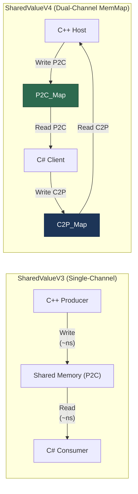

**Kernvoordelen:**

| Eigenschap | V3 (Single-Channel MemMap) | V4 (Dual-Channel MemMap) |
|---|---|---|
| Latency per read | ~10-100 ns (pointer) | ~10-100 ns (pointer) |
| Serialisatie | FlatBuffers zero-copy | FlatBuffers zero-copy |
| Richting | Alleen Producer → Consumer | Volledig Host ↔ Client |
| CPU bij idle | Event-driven sleeping threads | Event-driven sleeping threads + ready handshake |
| Dynamische data | FlatBuffer tables | FlatBuffer tables |
| Cross-language | Shared `.fbs` schema | Shared `.fbs` schema |

---

## 2. Systeemoverzicht

Het volledige systeem bestaat uit drie synchronisatieprimitieven die via de Windows-kernel gedeeld worden, en de FlatBuffers-laag die de data structureert.

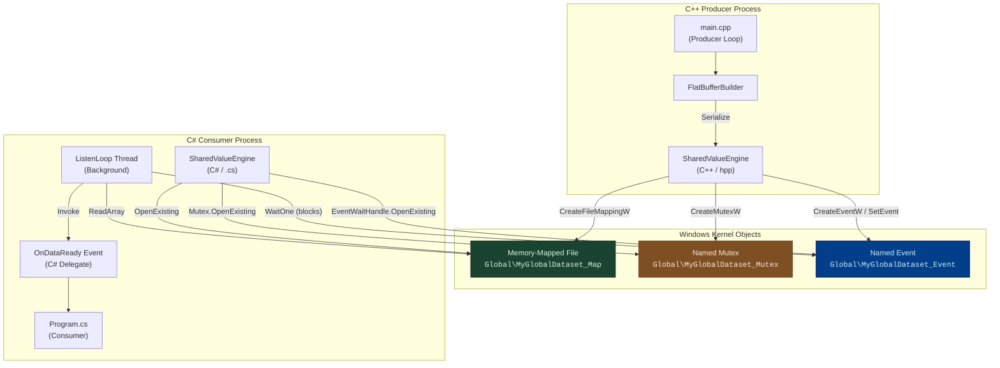

---

## 3. Projectstructuur

```mermaid
graph TD
    ROOT["SharedValueV4/"]

    ROOT --> SCHEMA["schema/"]
    SCHEMA --> FBS["dataset.fbs<br/><i>FlatBuffers schema definitie</i>"]

    ROOT --> CPP["cpp_core/"]
    CPP --> ENGINE_HPP["SharedValueEngine.hpp<br/><i>MMF + Mutex + Event wrapper</i>"]
    CPP --> EXCEPT_HPP["SharedValueException.hpp<br/><i>Exception hiërarchie</i>"]
    CPP --> MAIN_CPP["main.cpp<br/><i>Producer demo applicatie</i>"]
    CPP --> GENERATED_H["dataset_generated.h<br/><i>FlatBuffers C++ header</i>"]
    CPP --> CMAKE["CMakeLists.txt<br/><i>Build configuratie</i>"]

    ROOT --> CS["csharp_core/"]
    CS --> ENGINE_CS["SharedValueEngine.cs<br/><i>MMF + Mutex + Event wrapper</i>"]
    CS --> EXCEPT_CS["SharedValueEngineExceptions.cs<br/><i>Exception hiërarchie</i>"]
    CS --> PROG_CS["Program.cs<br/><i>Consumer demo applicatie</i>"]
    CS --> GEN_CS["Generated/<br/><i>FlatBuffers C# klassen</i>"]
    CS --> CSPROJ["csharp_core.csproj"]

    ROOT --> BUILD_PS1["build_schema.ps1<br/><i>Automatisch flatc download + codegen</i>"]
    ROOT --> README["README.md"]
    ROOT --> ARCH["ARCHITECTURE.md"]

    style ROOT fill:#264653,stroke:#2a9d8f,color:#e9c46a
    style SCHEMA fill:#e76f51,stroke:#f4a261,color:#fff
    style CPP fill:#2a9d8f,stroke:#264653,color:#fff
    style CS fill:#e9c46a,stroke:#f4a261,color:#264653
```

### Bestandsoverzicht

| Bestand | Taal | Rol |
|---|---|---|
| `schema/dataset.fbs` | FlatBuffers IDL | Definieert de datastructuur (tables, nesting) |
| `cpp_core/SharedValueEngine.hpp` | C++20 | Creëert en beheert MMF, Mutex, Event; schrijft data |
| `cpp_core/SharedValueException.hpp` | C++20 | Hiërarchische exception klassen |
| `cpp_core/main.cpp` | C++20 | Producer die periodiek datasets publiceert |
| `cpp_core/dataset_generated.h` | C++ (gegenereerd) | FlatBuffers serialisatie-helpers |
| `csharp_core/SharedValueEngine.cs` | C# (.NET 9) | Opent bestaande MMF, Mutex, Event; leest data |
| `csharp_core/SharedValueEngineExceptions.cs` | C# (.NET 9) | Managed exception hiërarchie |
| `csharp_core/Program.cs` | C# (.NET 9) | Consumer die via callbacks data ontvangt |
| `csharp_core/Generated/*.cs` | C# (gegenereerd) | FlatBuffers deserialisatie-klassen |
| `build_schema.ps1` | PowerShell | Download `flatc.exe` en regenereert code |
| `cpp_core/CMakeLists.txt` | CMake | C++ build met FetchContent voor FlatBuffers |

---

## 4. Kerncomponenten

### 4.1 Memory-Mapped Files (MMF)

Een Memory-Mapped File is een Windows-kernelmechanisme waarmee een blok fysiek geheugen (vanuit de paging file) zichtbaar wordt gemaakt in de virtuele adresruimte van meerdere processen tegelijk. Het is geen bestand op disk — het leeft puur in RAM en wordt beheerd door de kernel.

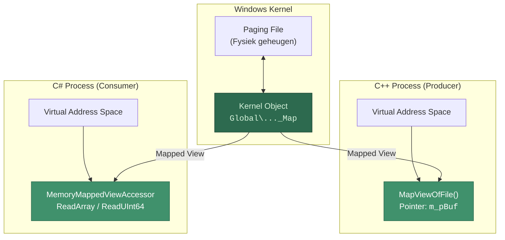

**Essentiële API-aanroepen:**

| Zijde | Functie | Doel |
|---|---|---|
| C++ (Producer) | `CreateFileMappingW(INVALID_HANDLE_VALUE, ...)` | Creëert het kernel object (10 MB) |
| C++ (Producer) | `MapViewOfFile(FILE_MAP_ALL_ACCESS)` | Krijgt een raw pointer (`void*`) naar het geheugen |
| C# (Consumer) | `MemoryMappedFile.OpenExisting(...)` | Opent het bestaande kernel object by name |
| C# (Consumer) | `mmf.CreateViewAccessor(0, maxSize)` | Krijgt een `MemoryMappedViewAccessor` voor gemanaged lezen |

### 4.2 Named Mutex (Cross-Process Locking)

Zonder synchronisatie zou de C# consumer half-geschreven data kunnen lezen terwijl de C++ producer nog bezig is. Een **Named Mutex** in de `Global\`-namespace is zichtbaar voor alle processen op het systeem en garandeert exclusieve toegang.

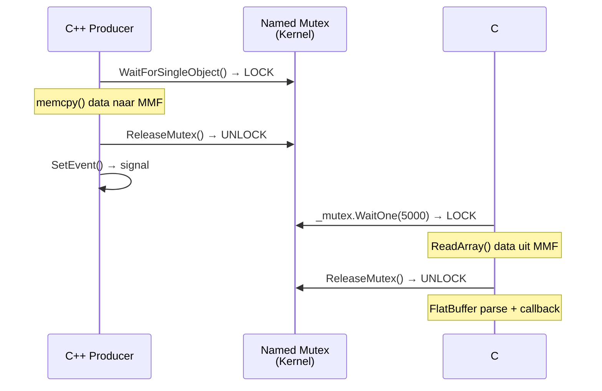

**Robuustheid bij crashes:** Als het producerproces crasht terwijl het de mutex vasthoudt, ontvangt de consumerthread een `WAIT_ABANDONED` (C++) of `AbandonedMutexException` (C#). In beide implementaties wordt dit expliciet opgevangen: de consumer verkrijgt eigendom van de mutex en logt een waarschuwing.

### 4.3 Named Event (Zero-CPU Callbacks)

Het Event-object fungeert als een interrupt-signaal: de consumerthread slaapt met **exact 0% CPU** totdat de producer `SetEvent()` aanroept.

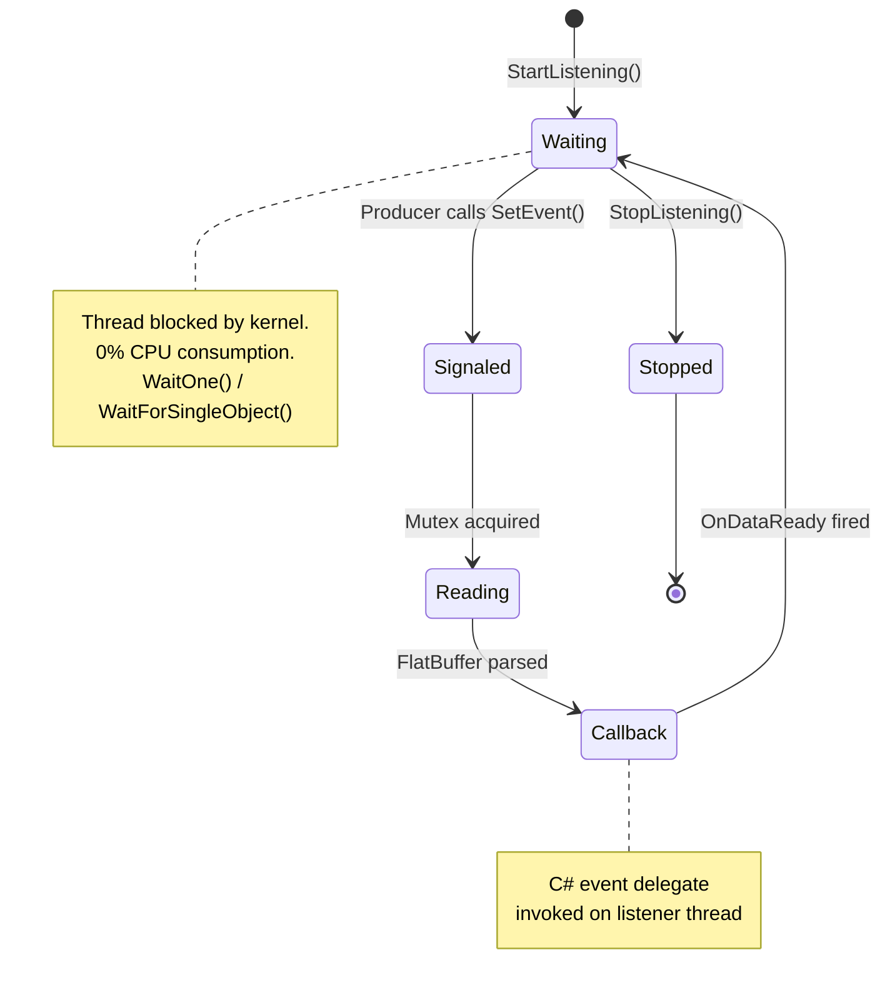

**Auto-Reset gedrag:** Het event is geconfigureerd als **auto-reset** (`CreateEventW(..., FALSE, FALSE, ...)`). Dit betekent dat nadat één wachtende thread wakker wordt, het event automatisch terug naar non-signaled gaat — er is geen race condition mogelijk waarbij meerdere consumers hetzelfde event twee keer lezen.

### 4.4 Google FlatBuffers (Serialisatie)

FlatBuffers lost het fundamentele probleem op dat reguliere C++ datastructuren (`std::vector`, `std::string`, pointers) onbruikbaar zijn in shared memory. FlatBuffers serialiseert alles naar een **plat byte-array** dat zonder parsing direct doorgelezen kan worden.

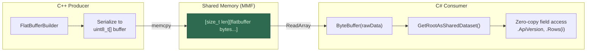

**Waarom geen Protocol Buffers of JSON?**

| Criterium | FlatBuffers | Protocol Buffers | JSON |
|---|---|---|---|
| Zero-copy access | ✅ Ja | ❌ Nee (decode vereist) | ❌ Nee |
| Shared memory compatible | ✅ Plat byte-array | ⚠️ Na decode, heap allocatie | ❌ String parsing |
| Schema evolutie | ✅ Forward/backward | ✅ Forward/backward | ❌ Fragiel |
| Codegen C++ + C# | ✅ Ja | ✅ Ja | ❌ Handmatig |

---

## 5. Data Layout in Shared Memory

Het geheugenblok van 10 MB heeft een eenvoudige binaire layout:

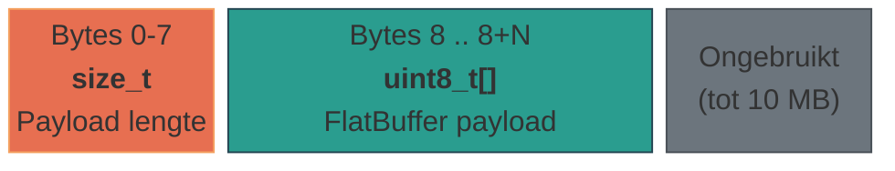

| Offset | Type | Beschrijving |
|---|---|---|
| `0x00` – `0x07` | `size_t` (8 bytes, x64) | Grootte van de FlatBuffer payload in bytes |
| `0x08` – `0x08 + N` | `uint8_t[N]` | De ruwe FlatBuffer binary (root: `SharedDataset`) |
| `0x08 + N` – einde | — | Ongebruikte ruimte (beschikbaar voor groei) |

**C++ schrijft:**
```cpp
size_t* pSize = static_cast<size_t*>(m_pBuf);
*pSize = size;                                    // lengte op offset 0
uint8_t* pDest = static_cast<uint8_t*>(m_pBuf) + sizeof(size_t);
memcpy(pDest, data, size);                        // payload op offset 8
```

**C# leest:**
```csharp
ulong dataSize = _accessor.ReadUInt64(0);         // lengte van offset 0
byte[] rawData = new byte[dataSize];
_accessor.ReadArray(8, rawData, 0, (int)dataSize); // payload van offset 8
```

---

## 6. Schema-Architectuur (FlatBuffers)

Het FlatBuffers-schema (`dataset.fbs`) definieert een drietal geneste tables:

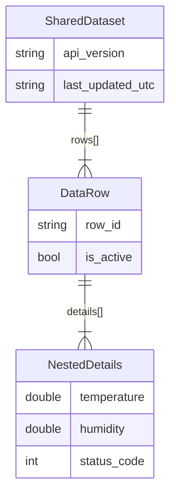

### Schema Evolutie

FlatBuffers laat velden toe aan het einde van een table zonder bestaande data te breken. Dit maakt forward- en backward-compatibele schema-wijzigingen mogelijk:

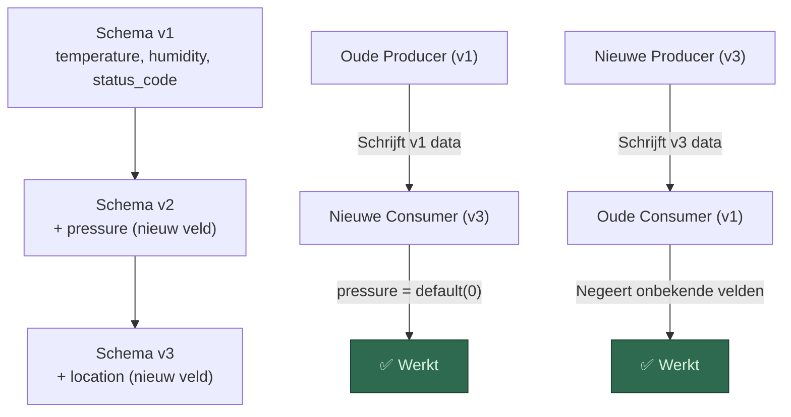

> **Regel:** Verwijder nooit bestaande velden en hergebruik nooit veld-ID's. Voeg alleen velden toe aan het einde.

---

## 7. Producer-Consumer Levenscyclus

De complete opstartsequentie en dataflow van begin tot eind:

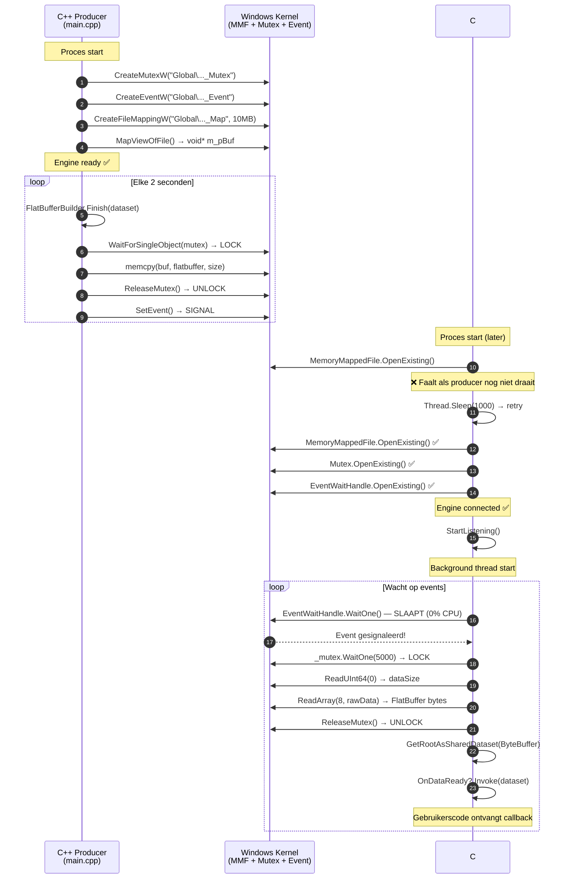

### Retry-Mechanisme bij Opstarten

De C# consumer kan eerder starten dan de C++ producer. Het retry-patroon vangt dit op:

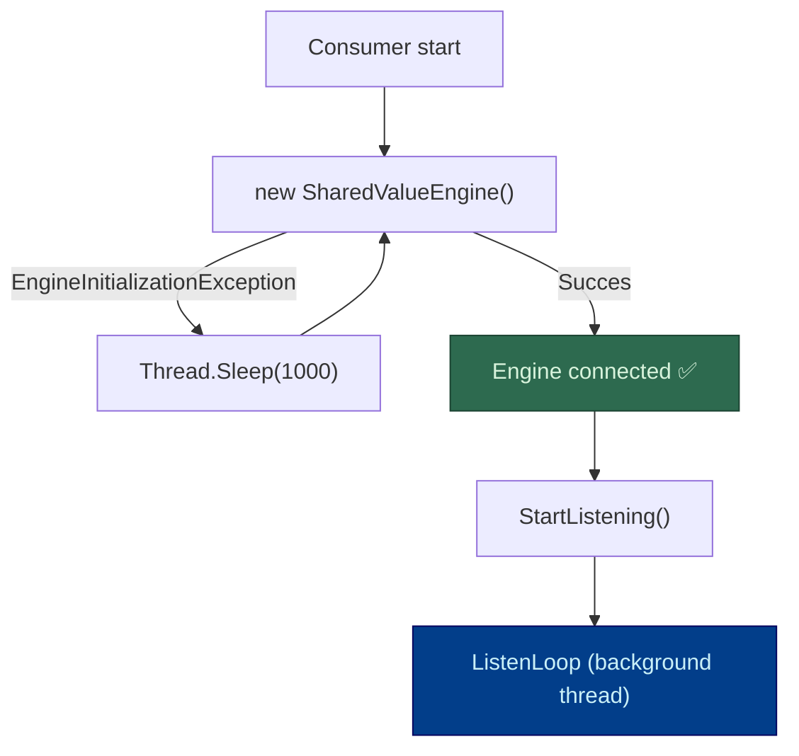

### Kernel Object Levenscyclus en Reference Counting

Windows kernel objects (MMF, Mutex, Event) werken op basis van **reference counting**. Elk proces dat een handle opent verhoogt de interne teller. Zodra alle handles gesloten zijn (refcount → 0), vernietigt Windows het object. Dit heeft drie belangrijke implicaties:

#### Normaal gebruik: Producer draait oneindig, consumers komen en gaan

Dit is het primaire use-case scenario en werkt probleemloos:

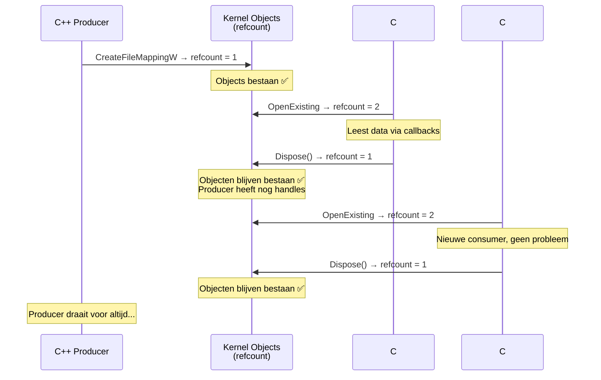

**Eigenschappen van dit model:**
- ✅ Producer draait oneindig lang ongeacht of er consumers zijn
- ✅ Consumers kunnen op elk moment verbinden en weer loskoppelen
- ✅ Meerdere consumers tegelijk is mogelijk (ieder opent eigen handle)
- ✅ De producer merkt niets van consumers (fire-and-forget)
- ✅ Consumer die eerder start dan de producer wacht via retry-loop

#### Problematisch scenario: Producer stopt terwijl er geen consumers zijn

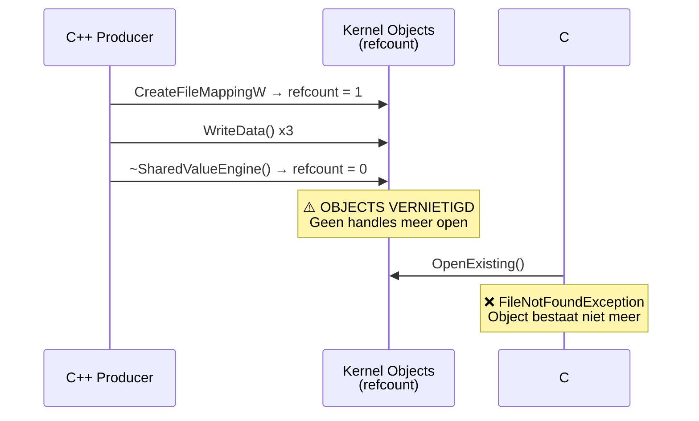

Dit scenario treedt **alleen** op bij geautomatiseerde tests waar de producer een beperkt aantal updates stuurt (`--count N`) en dan afsluit. Bij normaal gebruik (producer draait oneindig) is dit geen probleem.

#### Oplossing voor tests: `--linger` parameter

De producer ondersteunt een `--linger MS` parameter die hem na de laatste write nog N milliseconden in leven houdt. Dit geeft de consumer tijd om te verbinden en het laatste event te ontvangen:

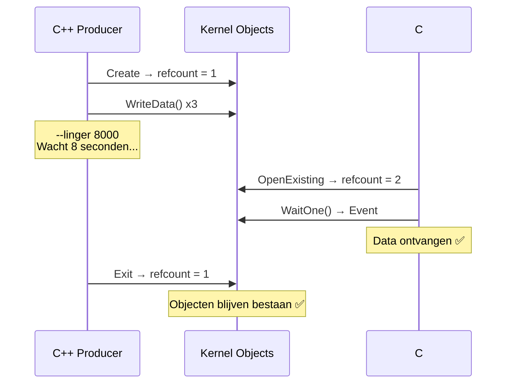

> **Samenvatting:** De `--linger` parameter is uitsluitend een testing utility. Bij productiegebruik draait de producer oneindig en is er geen linger nodig.

---


## 8. Synchronisatiemodel

Alle drie kernel-objecten werken samen om data-integriteit en efficiënte notificatie te garanderen:

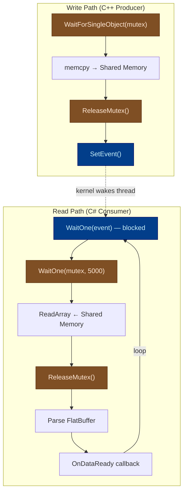

### Garanties

| Garantie | Mechanisme |
|---|---|
| **Geen torn reads** | Mutex lockt de hele write → Mutex lockt de hele read |
| **Geen busy-wait** | `WaitOne()` en `WaitForSingleObject()` blokkeren in de kernel |
| **Geen dubbele lezing** | Auto-reset event keert automatisch terug naar non-signaled |
| **Crash-bestendig** | Abandoned mutex wordt automatisch overgenomen door wachtende thread |
| **Timeout-beveiliging** | 5 seconden timeout op mutex acquisitie voorkomt deadlocks |

---

## 9. Exception Handling Architectuur

Beide talen implementeren een parallelle exception-hiërarchie die alle faalscenario's van het systeem afdekt:

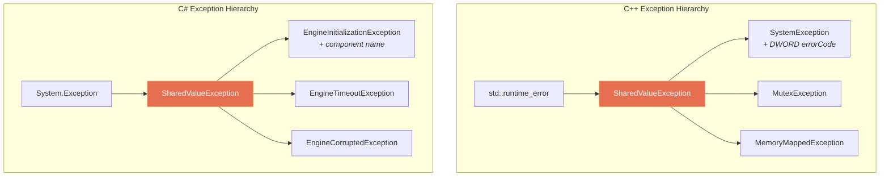

### Faalscenario's en Afhandeling

| Scenario | C++ Exception | C# Exception |
|---|---|---|
| Kernel object creatie faalt | `SystemException` (met `GetLastError()`) | `EngineInitializationException` (met component naam) |
| Mutex timeout (5s) | `MutexException` | `EngineTimeoutException` |
| Producer crasht (abandoned mutex) | `WAIT_ABANDONED` + warning log | `AbandonedMutexException` → catch + continue |
| Data groter dan MMF capaciteit | `MemoryMappedException` | *Niet van toepassing (read-only)* |
| Corrupte payload size | *Niet van toepassing (write-only)* | `EngineCorruptedException` |
| Generieke WinAPI fout | `SystemException` (context + error code) | Wrapped in `EngineInitializationException` |

### Mutex Safety in Exception Context

De C++ `WriteData()` methode garandeert dat de mutex altijd vrijgegeven wordt, zelfs bij onverwachte fouten:

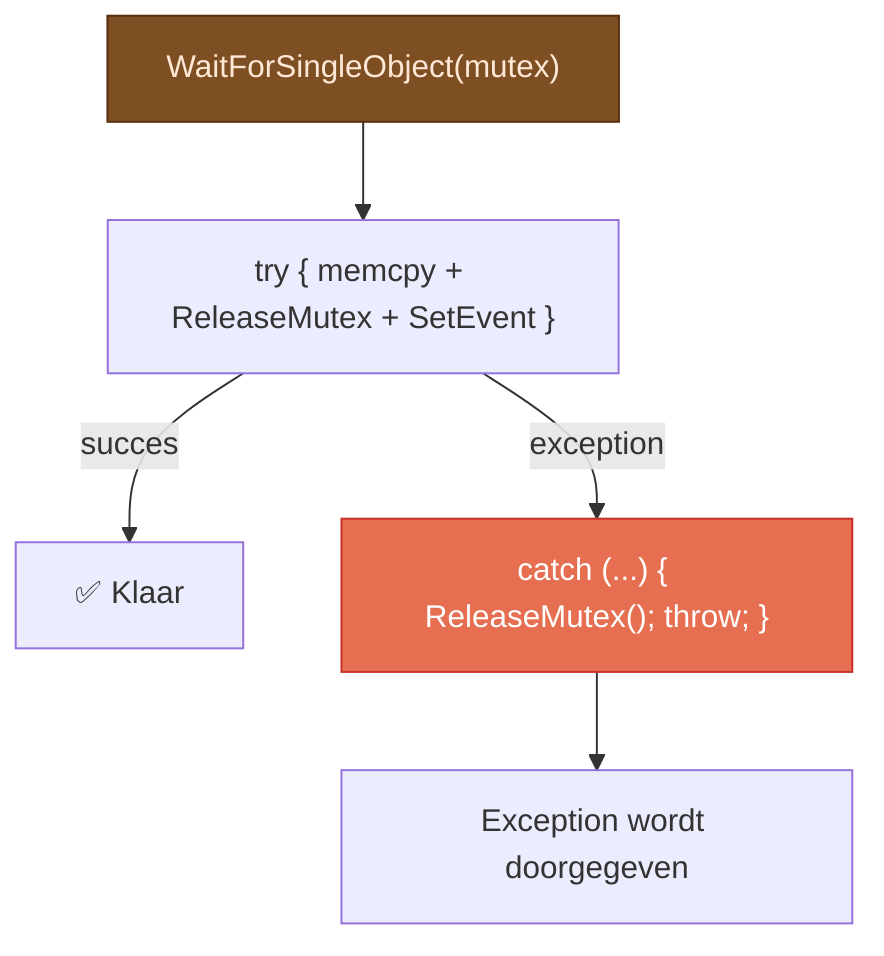

De C# `ReadCurrentData()` gebruikt een `try/finally` blok met dezelfde garantie:

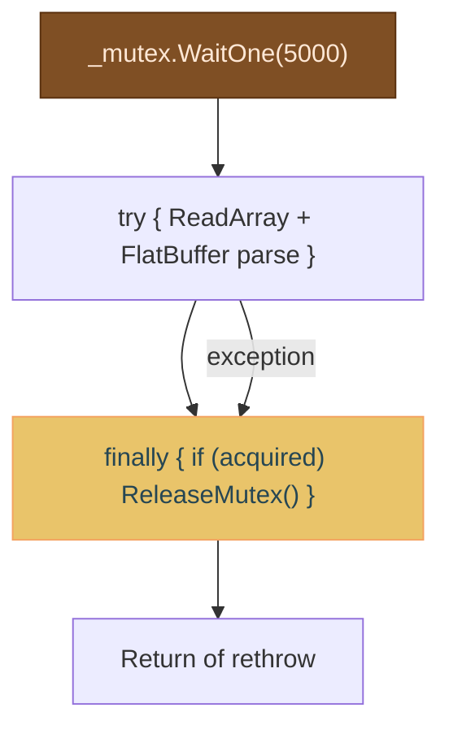

---

## 10. Build Pipeline & Tooling

### Schema Compilatie

Het `build_schema.ps1` script automatiseert het gehele codegeneratie-proces:

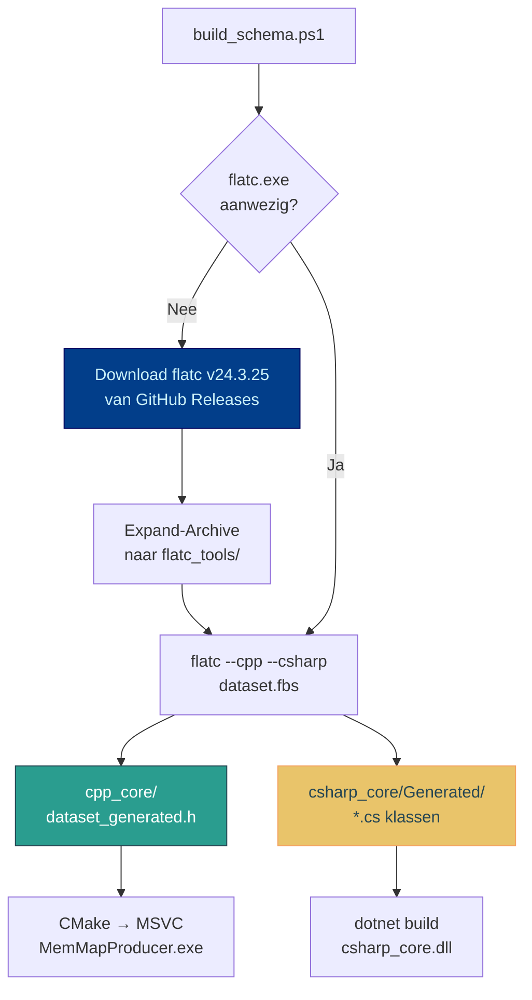

### C++ Build (CMake + FetchContent)

```mermaid
flowchart LR
    CMAKE["CMakeLists.txt"] --> FETCH["FetchContent<br/>google/flatbuffers<br/>v24.3.25"]
    FETCH --> HEADERS["FlatBuffers C++<br/>header-only library"]
    CMAKE --> EXE["MemMapProducer.exe"]
    HEADERS --> EXE

    NOTE["NOMINMAX + WIN32_LEAN_AND_MEAN<br/>voorkomt Windows.h conflicten"]

    style FETCH fill:#023e8a,stroke:#03045e,color:#caf0f8
    style EXE fill:#2a9d8f,stroke:#264653,color:#fff
```

### C# Build (.NET 9)

```mermaid
flowchart LR
    CSPROJ["csharp_core.csproj<br/>net9.0-windows"] --> NUGET["NuGet: Google.FlatBuffers<br/>v24.3.25"]
    CSPROJ --> GEN["Generated/*.cs<br/>(van flatc)"]
    NUGET --> DLL["csharp_core.dll"]
    GEN --> DLL

    style DLL fill:#e9c46a,stroke:#f4a261,color:#264653
    style NUGET fill:#023e8a,stroke:#03045e,color:#caf0f8
```

**Versie-afstemming:** Zowel de C++ `FetchContent` als het C# NuGet-package en het `flatc`-binary zijn vastgepind op **v24.3.25** om serialisatie-incompatibiliteiten te voorkomen.

---

## 11. Vergelijking met SharedValueV3 (MemMap)

```mermaid
flowchart TB
    subgraph "V3: Single-Channel MemMap"
        direction TB
        PRODUCER_V3["C++ Producer"]
        SHARED_V3["P2C Shared Memory"]
        CONSUMER_V3["C# Consumer"]

        PRODUCER_V3 --> SHARED_V3
        SHARED_V3 --> CONSUMER_V3
    end

    subgraph "V4: Dual-Channel MemMap"
        direction TB
        HOST_V4["C++ Host"]
        P2C_V4["P2C_Map"]
        CLIENT_V4["C# Client"]
        C2P_V4["C2P_Map"]

        HOST_V4 -->|"Write P2C"| P2C_V4
        P2C_V4 -->|"Read P2C"| CLIENT_V4
        CLIENT_V4 -->|"Write C2P"| C2P_V4
        C2P_V4 -->|"Read C2P"| HOST_V4
    end

    style SHARED_V3 fill:#2d6a4f,stroke:#1b4332,color:#d8f3dc
    style P2C_V4 fill:#2d6a4f,stroke:#1b4332,color:#d8f3dc
    style C2P_V4 fill:#1d3557,stroke:#0b2545,color:#d8f3dc
```

| Aspect | SharedValueV3 (MemMap) | SharedValueV4 (MemMap) |
|---|---|---|
| **Transport** | Enkel MMF-kanaal (P2C) | Dubbel MMF-kanaal (P2C + C2P) |
| **Richting** | Producer → Consumer | Host ↔ Client bidirectioneel |
| **Startup synchronisatie** | Event-driven, zonder expliciete dual-ready handshake | Expliciete Ready Event handshake in beide richtingen |
| **Latency** | ~10-100 ns per read | ~10-100 ns per read en write in beide richtingen |
| **Schema** | FlatBuffers `.fbs` | FlatBuffers `.fbs` (zelfde compatibiliteitsmodel) |
| **Thread safety** | Named Mutex + Named Event | Per kanaal Named Mutex + Named Event + Ready Event |
| **Functionele scope** | Hoge snelheid éénrichtingsstream | Volledige request/response over shared memory |

---

## Gerelateerde Documentatie

- [README.md](README.md) — Introductie, projectstructuur en quickstart handleiding.
- [ARCHITECTURE.md](../ARCHITECTURE.md) — Hoofd architectuurdocument voor het gehele COM Server project.
- [README.md](../SharedValueV3_MemMap/README.md) — SharedValueV3 baseline memory-mapped architectuur.
