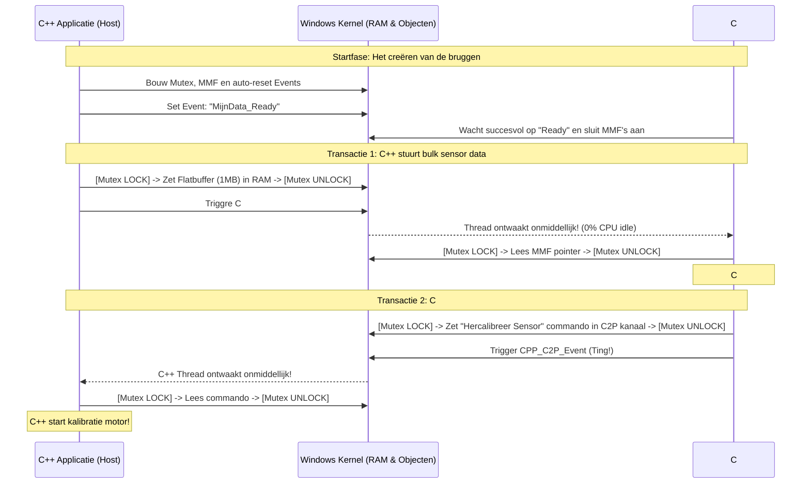

# SharedValueV4 — Architectuur & Ontwerp

**SharedValueV4** is een ultra-snelle, cross-process communicatie-engine (IPC). In tegenstelling tot netwerksockets of RPC-calls, maakt V4 100% gebruik van **Memory-Mapped Files (Windows Shared Memory)** in combinatie met **Symmetrische Bidirectionaliteit** en **FlatBuffers zero-copy serialisatie**.

Dit document is bedoeld om de abstracte concepten van het systeem concreet en tastbaar te maken.

---

## 1. Het Kernprobleem (Waarom V4?)

Wanneer twee processen (applicaties) met elkaar willen praten op dezelfde machine (bijv. een C++ applicatie die sensordata leest en een C# applicatie die een UI toont), is traditionele dataoverdracht traag:
- **Netwerksockets / TCP / Named Pipes:** Data moet gerepliceerd, geserialiseerd, en via de Windows kernel gekopieerd worden. Dit kost CPU-cycles en introduceert `~1 tot 10 milliseconden` vertraging.
- **COM (V2):** Object oriëntatie en remote procedure calls (RPC) zijn zwaar en vereisen marshaling en registry overhead (`~1 tot 10 microseconden`).

**Oplossing V4 (Memory-Mapped Files):** 
Met een Memory-Mapped File reserveren we een blok pure RAM-geheugen via het Windows OS. Zowel Applicatie A als Applicatie B krijgen een "pointer" (een directe geheugenadres) naar dat *exacte, zelfde blok RAM*. Er is **nul kopieer-overhead**. Als C++ het geheugen op adres `0x1000` wijzigt, ziet C# die wijziging onmiddellijk op hetzelfde moment. De vertraging zakt naar **`~10 tot 100 nanoseconden`**.

---

## 2. De 4 Pilaren van de Architectuur

Omdat beide programma's blind, tegelijkertijd, in hetzelfde RAM-blok graaien, ontstaat er chaos zonder verkeersregels (data corruptie, crashes). De architectuur leunt daarom op 4 rigide pilaren.

### Pilaar 1: Symmetrische Dual-Channel MMF (De Weg)
In V3 was de weg eenrichtingsverkeer (C++ -> C#). In V4 hebben we een **Symmetrische Dual-Channel** opgezet.
- **P2C (Producer-to-Consumer):** Kanaal 1, gereserveerd voor bulkdata van Applicatie A naar B.
- **C2P (Consumer-to-Producer):** Kanaal 2, gereserveerd voor opdrachten en reacties van Applicatie B naar A.
*(Elk kanaal is zijn eigen afzonderlijke Memory-Mapped File van bijv. 10MB groot).*

### Pilaar 2: De "Ready" Event (De Handshake)
Hoe weten de applicaties op welk moment *beide* kanalen succesvol in het geheugen zijn geladen? Eén applicatie moet de `Host` zijn. Dit is doorgaans C++. 
1. C# start op, en probeert niet domweg te lezen, maar zegt tegen Windows: "Stop mijn thread (0% CPU), en wek me pas als object `Global\MinaData_Ready` geactiveerd wordt."
2. C++ start, bouwt alle geheugenkanalen op in RAM, en drukt vervolgens op de knop van `Global\MijnData_Ready`.
3. Windows wekt C# razendsnel direct op. De verbinding is gelegd.

### Pilaar 3: Named Mutex (Het Stoplicht)
Bij het wegschrijven van een datablok van bijv. 1MB wegschrijft, duurt dit een paar nanoseconden. Wat als C# precies in die nanoseconden de data begint te lezen? Dan leest C# "gehalveerde" corrupte zooi.
- We gebruiken een **Named Mutex**. Dit is simpelweg een stoplicht in de kernel. 
- Voordat C++ wil schrijven vraagt hij: `Mutex.Wait()`. Het licht springt op rood voor anderen. C++ parkeert zijn data, en zegt `Mutex.Release()` (het licht wordt groen). 
- Wil C# lezen? Dan roept C# `Mutex.Wait()`. Als C++ bezig is, zet Windows de C# applicatie even stil.

### Pilaar 4: FlatBuffers (De Taal)
We kunnen geen abstracte klassen zoals `List<String>()` zomaar in RAM dumpen, want C++ begrijpt die referentie-pointers van C# niet. We moeten "platte bytes" (een array) sturen. Echter, JSON of XML sturen is enorm traag omweer uit te pakken en te parsen (CPU zwaar).
- We dwingen beide kanten dezelfde taal te spreken: **Google FlatBuffers**. 
- FlatBuffers pre-compileert data in een keiharde byte-layout (een "struct"). 
- Zodra C# de FlatBuffer array opent, hoeft dit **niet geparsed of gedecodeerd te worden**. De properties die je in C# opvraagt, zijn simpele wiskundige sprongen (offsets) direct over dat ruwe RAM blok. *Zero-copy deserialization*.

---

## 3. Sequentiediagram: Hoe stroomt data écht?

Wat gebeurt er als we bidirectioneel streamen op hoge snelheid?

---

## 4. Crash-Veiligheid en Architectuur Robuustheid

Dit abstracte model kent een reële wereld met crashes, power-losses en freezes.

| Gevaarlijk Scenario | Hoe V4 het opvangt |
| :--- | :--- |
| **C++ Crasht halverwege een schrijf-operatie (Mutex Lock blijft hangen)** | De Mutex leeft in de Windows Kernel. Als C++ met een foutcode afsluit, ziet Windows dit en vuurt direct `WAIT_ABANDONED` af. De C# engine vangt dit af, breekt het slot open, incasseert het gedeeltelijk geschreven RAM, deelt een logging warning uit en gaat rustig door zonder vast te lopen (Deadlocks geëlimineerd). |
| **C# Process wordt handmatig gereset of herstart** | De MMF refcount logica van Windows lost dit op. De MMF blijft door C++ in de lucht gehouden in RAM. C# start razendsnel opnieuw op, verbindt naadloos met de objecten, en mist pas vanaf dat moment geen enkel event meer. |
| **Er komt een C# en een Python consumer tegelijkertijd aan** | Geen probleem. Beide (of meer) consumers kunnen tegelijkertijd hun eigen Mutex Lock afwachten. Slechts de snelste opent het slot als eerste, de tweede is een fractie van nanoseconden erna aan de beurt. Multi-client veiligheid zit ingebakken. |
