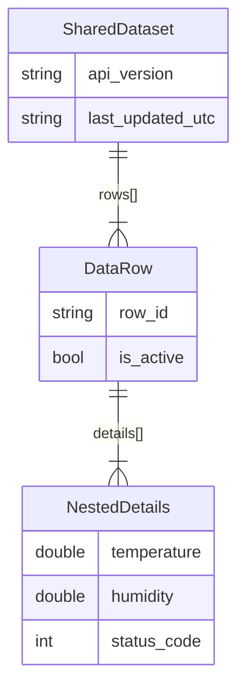
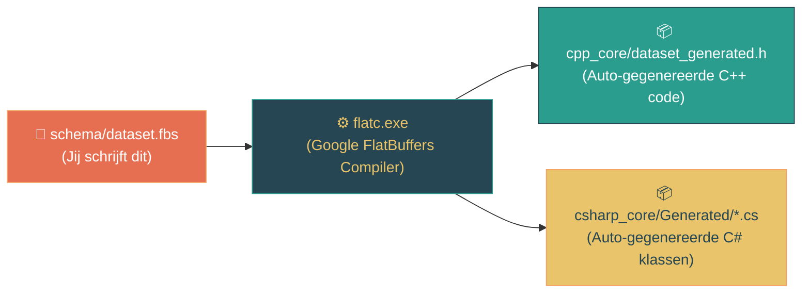
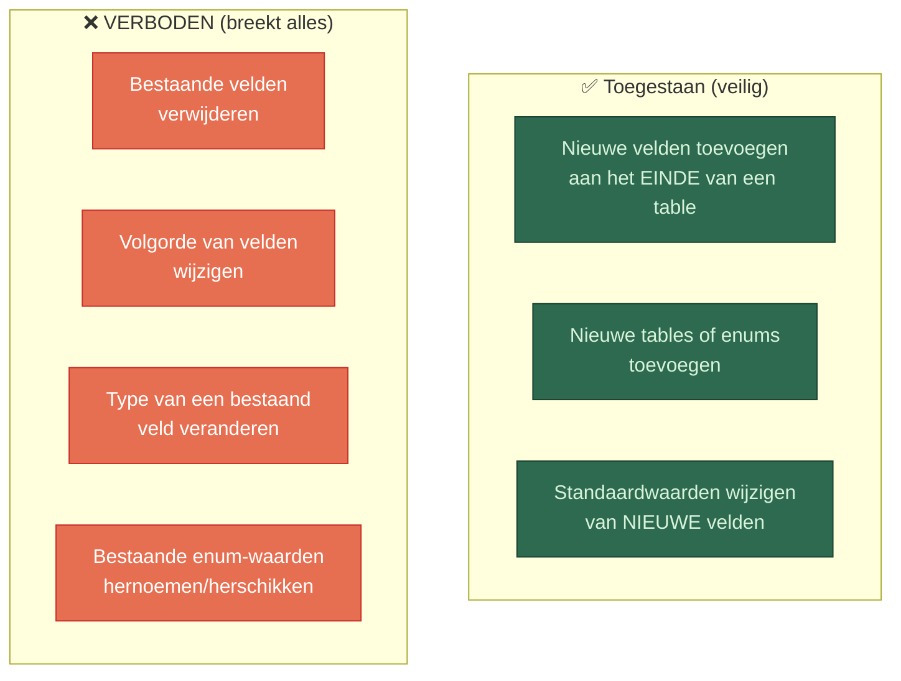
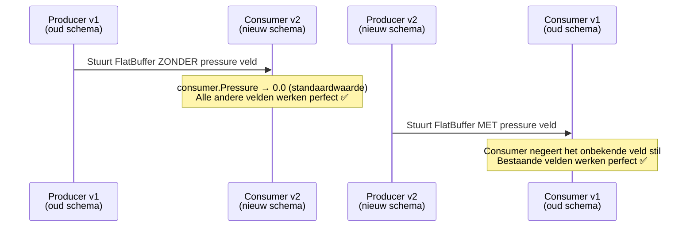
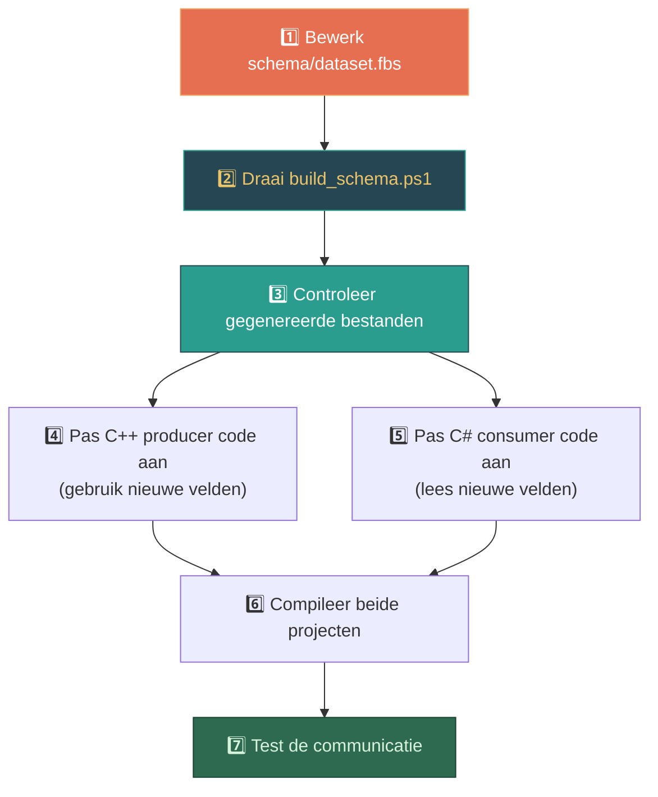

# SharedValueV4 — Schema Handleiding (FlatBuffers)

> **Hoe wordt de structuur van de dataset bepaald, en hoe pas je die aan?**

Dit document legt stap voor stap uit hoe de datastructuur in SharedValueV4 wordt gedefinieerd, hoe die structuur door de build-pipeline wordt omgezet naar bruikbare code, en hoe je het schema kunt aanpassen voor je eigen projecten.

---

## 1. De Kern: Het `.fbs` Schema-bestand

De volledige structuur van je dataset wordt bepaald in **één enkel tekstbestand**: het zogenaamde **FlatBuffers Schema** (`.fbs`). Dit bestand is het **enige bronbestand** — alle code die de structuur beschrijft wordt hier automatisch uit gegenereerd.

📍 **Locatie:** `SharedValueV4/schema/dataset.fbs`

### Het huidige schema

```fbs
namespace SharedMemMap;

table NestedDetails {
  temperature: double;
  humidity: double;
  status_code: int;
}

table DataRow {
  row_id: string;
  is_active: bool;
  details: [NestedDetails];   // Een array van geneste objecten
}

table SharedDataset {
  api_version: string;
  last_updated_utc: string;
  rows: [DataRow];            // Een array van rijen
}

root_type SharedDataset;
```

### Wat betekent dit?



**In mensentaal:**
- `SharedDataset` is de "root" — het hoofdobject dat in het gedeelde geheugen staat. Het bevat een versienummer, een tijdstempel, en een **lijst van rijen**.
- Elke `DataRow` is een rij met een ID, een actief-vlag, en een **lijst van details**.
- Elk `NestedDetails` object bevat meetwaarden (temperatuur, vochtigheid, statuscode).

> **De structuur zit dus NIET in je C++ of C# code.** Die code wordt *gegenereerd* uit dit ene `.fbs` bestand.

---

## 2. De Pipeline: Van Schema naar Code

Wanneer je het schema wijzigt, moet je de **codegeneratie** opnieuw uitvoeren. De `flatc` compiler leest je `.fbs` bestand en genereert automatisch de bijbehorende klassen en structs in C++ en C#.



### Het build-commando

```powershell
# Voer uit vanuit de SharedValueV4 map:
.\build_schema.ps1
```

Dit script doet het volgende:
1. **Downloadt** automatisch `flatc.exe` (v24.3.25) als die nog niet aanwezig is
2. **Compileert** het schema naar C++ (`--cpp`) → `cpp_core/dataset_generated.h`
3. **Compileert** het schema naar C# (`--csharp`) → `csharp_core/Generated/SharedMemMap/*.cs`

### Wat er gegenereerd wordt

| Gegenereerd bestand | Taal | Wat er in zit |
| :--- | :--- | :--- |
| `dataset_generated.h` | C++ | `SharedDataset`, `DataRow`, `NestedDetails` structs + builders |
| `SharedDataset.cs` | C# | `SharedDataset` klasse met properties als `ApiVersion`, `Rows(i)` |
| `DataRow.cs` | C# | `DataRow` klasse met `RowId`, `IsActive`, `Details(i)` |
| `NestedDetails.cs` | C# | `NestedDetails` klasse met `Temperature`, `Humidity`, `StatusCode` |

> ⚠️ **JE MAG DEZE GEGENEREERDE BESTANDEN NOOIT HANDMATIG BEWERKEN!** Ze worden overschreven bij de volgende `build_schema.ps1` run.

---

## 3. FlatBuffers Typen — Wat kun je gebruiken?

Het FlatBuffers schema ondersteunt een rijke set datatypes:

### Scalaire typen (enkelvoudig)

| FlatBuffers type | C++ equivalent | C# equivalent | Voorbeeld |
| :--- | :--- | :--- | :--- |
| `bool` | `bool` | `bool` | `is_active: bool;` |
| `byte` | `int8_t` | `sbyte` | `status: byte;` |
| `ubyte` | `uint8_t` | `byte` | `flags: ubyte;` |
| `short` | `int16_t` | `short` | `small_val: short;` |
| `ushort` | `uint16_t` | `ushort` | `port: ushort;` |
| `int` | `int32_t` | `int` | `status_code: int;` |
| `uint` | `uint32_t` | `uint` | `counter: uint;` |
| `long` | `int64_t` | `long` | `big_id: long;` |
| `ulong` | `uint64_t` | `ulong` | `timestamp_ns: ulong;` |
| `float` | `float` | `float` | `speed: float;` |
| `double` | `double` | `double` | `temperature: double;` |
| `string` | `const char*` | `string` | `name: string;` |

### Complexe typen

| Type | Syntax | Uitleg |
| :--- | :--- | :--- |
| **Array (vector)** | `[Type]` | Lijst van waarden, bijv. `sensors: [SensorRow];` |
| **Geneste table** | `table Naam { ... }` | Object met benoemde velden |
| **Struct** | `struct Naam { ... }` | Compact object, alleen scalaire velden, geen optionele velden |
| **Enum** | `enum Naam : type { ... }` | Een beperkte set aan waarden |
| **Union** | `union Naam { ... }` | Polymorfe waarden (meerdere table-types) |

### Voorbeeld: Struct vs Table

```fbs
// Struct: compact, fixed-size, geen optionele velden (sneller)
struct Vec3 {
  x: float;
  y: float;
  z: float;
}

// Table: flexibel, optionele velden, kan later uitgebreid worden
table SensorReading {
  position: Vec3;         // Geneste struct
  label: string;          // Optioneel (kan null zijn)
  confidence: float;
}
```

### Voorbeeld: Enum

```fbs
enum SensorStatus : byte {
  Unknown = 0,
  Online = 1,
  Offline = 2,
  Error = 3
}

table SensorRow {
  name: string;
  status: SensorStatus = Unknown;   // Standaardwaarde
}
```

---

## 4. Praktijkvoorbeeld: Schema Aanpassen

Stel, je wilt het schema uitbreiden om GPS-coördinaten en een alarm-status toe te voegen. Hier is het volledige stappenplan.

### Stap 1: Bewerk het schema

Bewerk `schema/dataset.fbs`:

```fbs
namespace SharedMemMap;

// NIEUW: Enum voor sensorstatus
enum SensorStatus : byte {
  Unknown = 0,
  Online = 1,
  Offline = 2,
  Error = 3
}

// NIEUW: GPS-coördinaten als compacte struct
struct GpsCoord {
  latitude: double;
  longitude: double;
  altitude: float;
}

table NestedDetails {
  temperature: double;
  humidity: double;
  status_code: int;
  pressure: double;            // NIEUW: toegevoegd veld (backward-compatible!)
}

table DataRow {
  row_id: string;
  is_active: bool;
  details: [NestedDetails];
  location: GpsCoord;          // NIEUW: GPS locatie
  status: SensorStatus = Online; // NIEUW: enum veld met standaardwaarde
}

table SharedDataset {
  api_version: string;
  last_updated_utc: string;
  rows: [DataRow];
  total_sensor_count: int;     // NIEUW: metadata veld
}

root_type SharedDataset;
```

### Stap 2: Voer de codegeneratie uit

```powershell
.\build_schema.ps1
```

Na succesvolle uitvoering zie je:
```
Compiling FlatBuffers schema...
Schema successfully compiled!
```

De bestanden `dataset_generated.h` en `Generated/*.cs` zijn nu bijgewerkt.

### Stap 3: Gebruik de nieuwe velden in C++

```cpp
// main.cpp — Producer
#include "dataset_generated.h"

flatbuffers::FlatBufferBuilder builder(4096);

// Gebruik de nieuwe GpsCoord struct (inline, geen offset nodig)
SharedMemMap::GpsCoord gps(52.3676, 4.9041, 15.0f); // Amsterdam

// Maak een detail aan met het nieuwe 'pressure' veld
auto detail = SharedMemMap::CreateNestedDetails(
    builder, 
    22.5,       // temperature
    65.0,       // humidity
    200,        // status_code
    1013.25     // pressure (NIEUW!)
);
// ... bouw de rest van de row en dataset
```

### Stap 4: Gebruik de nieuwe velden in C#

```csharp
// Program.cs — Consumer
var dataset = SharedDataset.GetRootAsSharedDataset(bb);

// Nieuw veld uitlezen
int totaal = dataset.TotalSensorCount;  // Gegenereerde property!

for (int i = 0; i < dataset.RowsLength; i++)
{
    var row = dataset.Rows(i);
    
    // GPS coördinaten (struct)
    var loc = row.Value.Location;
    Console.WriteLine($"Locatie: {loc.Latitude}, {loc.Longitude}");
    
    // Enum
    var status = row.Value.Status; // SensorStatus.Online
    
    // Nieuw genest veld
    var detail = row.Value.Details(0);
    double druk = detail.Value.Pressure; // Nieuw veld!
}
```

---

## 5. Gouden Regels voor Schema-evolutie

FlatBuffers is ontworpen voor **forward- en backward-compatibiliteit**, maar alleen als je deze regels volgt:



### Wat gebeurt er bij een niet-matchend schema?

| Situatie | Resultaat |
| :--- | :--- |
| **Nieuwe producer, oude consumer** | Consumer ziet nieuwe velden simpelweg niet → oude velden werken gewoon ✅ |
| **Oude producer, nieuwe consumer** | Nieuwe velden krijgen hun standaardwaarde (0, `null`, `false`) → geen crash ✅ |
| **Veld verwijderd of hernummerd** | `⛔ DATA CORRUPTIE` — binaire offsets kloppen niet meer, applicaties crashen |

### Voorbeeld: Veilige uitbreiding over versies heen



---

## 6. Geavanceerd: Wanneer `struct` vs `table`?

| Eigenschap | `table` | `struct` |
| :--- | :--- | :--- |
| Velden optioneel? | ✅ Ja | ❌ Nee, altijd verplicht |
| Nieuwe velden toevoegen? | ✅ Ja (backward-compatible) | ❌ Nee (breekt layout) |
| Snelheid | Snel (offset-lookup) | Snelst (directe pointer-cast) |
| Geschikt voor | Uitbreidbare datastructuren | Compacte, vaste metingen (Vec3, GPS, RGB) |
| Nesting in arrays | Referentie (4 bytes per element) | Inline (vaste grootte per element) |

**Vuistregel:**
- Gebruik `table` voor alles wat in de toekomst kan veranderen
- Gebruik `struct` alleen voor vaste, nooit-wijzigende, compacte datablokken (coördinaten, kleuren, vectoren)

---

## 7. Quick Reference: Het Volledige Proces



### Samenvatting commando's

```powershell
# 1. Schema bewerken
notepad .\schema\dataset.fbs

# 2. Code genereren (downloadt flatc automatisch als nodig)
.\build_schema.ps1

# 3. C++ opnieuw bouwen
cmake --build .\cpp_core\build --config Release

# 4. C# opnieuw bouwen
dotnet build .\csharp_core

# 5. Test draaien
.\tests\Run-MemMapTests.ps1 -SkipBuild
```

---

## 8. Veelgestelde Vragen

### "Moet ik de structuur in de code bepalen?"
**Nee.** De structuur wordt bepaald in het `.fbs` schemabestand. De `flatc` compiler genereert vervolgens alle code. Jij schrijft alleen de logica die de gegenereerde klassen *gebruikt* (vullen en uitlezen).

### "Kan ik meerdere schema's hebben?"
Ja, je kunt meerdere `.fbs` bestanden maken en `include` gebruiken:
```fbs
// commands.fbs
include "dataset.fbs";   // Hergebruik bestaande types

table TradeCommand {
  action: string;
  portfolio_id: int;
  source_dataset: SharedDataset;  // Type uit ander schema!
}
```

### "Hoe voeg ik een nieuw kanaal toe met een ander schema?"
Maak een apart `.fbs` bestand, genereer de code, en gebruik een aparte `SharedValueEngine` instantie met een andere kanaalnaam. Elk kanaal kan zijn eigen schema hebben.

### "Waar staan de `flatc.exe` commandline opties?"
```powershell
.\flatc_tools\flatc.exe --help
```
Handige opties:
- `--cpp` → Genereer C++ headers
- `--csharp` → Genereer C# klassen
- `--python` → Genereer Python klassen
- `--json` → (Optioneel) Genereer JSON schema
- `-o <pad>` → Output directory

### "Werkt dit ook met Python/Java/Go/Rust?"
Ja! FlatBuffers ondersteunt 15+ talen. Voeg simpelweg het juiste flag toe:
```powershell
# Python code genereren
.\flatc_tools\flatc.exe --python -o python_core\generated schema\dataset.fbs

# Java code genereren
.\flatc_tools\flatc.exe --java -o java_core\generated schema\dataset.fbs
```

---

## Gerelateerde Documentatie

- [ARCHITECTURE_NL.md](ARCHITECTURE_NL.md) — Architectuur: hoe MMF, Mutex, Events en FlatBuffers samenwerken
- [USAGE_NL.md](USAGE_NL.md) — Praktijkvoorbeelden in C++, C#, Python en VBScript
- [CODE_REFERENCE.md](CODE_REFERENCE.md) — Technische API-referentie van de engine-klassen
- [Google FlatBuffers Documentatie](https://flatbuffers.dev/flatbuffers_guide_writing_schema.html) — Officiële schema-schrijfgids
