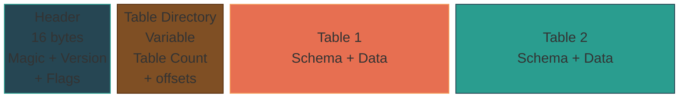
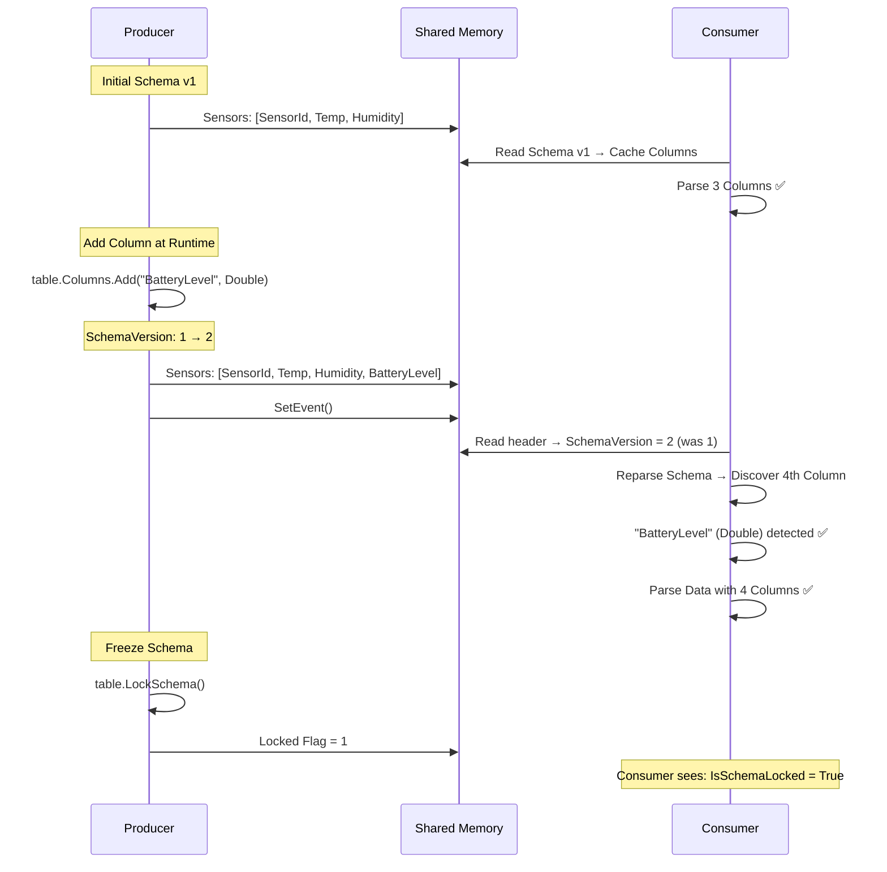

# SharedValueV5 — Dynamic Schema Design

> **Translation Note:** This document is a placeholder for the English translation of the technical architecture. The original and most up-to-date document is currently maintained in Dutch. Please refer to [ARCHITECTURE_NL.md](ARCHITECTURE_NL.md) for the exhaustive design specifications.

## Overview
SharedValueV5 introduces a dynamic schema IPC engine designed to overcome the limitations of compile-time `FlatBuffers` schemas found in V3 and V4. By employing a "self-describing" binary memory layout alongside an ADO.NET-style `DataSet` and `DataTable` model, SharedValueV5 allows any language (including VBScript via COM) to dynamically define table columns at runtime.

### Core Architecture
1. **Schema Definition at Runtime:** Instead of `.fbs` files, tables are configured via programmatic API calls (`AddColumn()`, `LockSchema()`).
2. **Backward-Compatible Evolution:** Consumers automatically detect schema version changes and re-parse column offsets without breaking existing operations.
3. **Data Serialization:** Achieved through a specialized internal BinarySerializer that segregates fixed-size variables and a dynamic string/blob pool to prevent memory fragmentation.
4. **Transport:** Relies on the same battle-tested `SharedValueEngine` from V4, utilizing unmanaged Windows Memory-Mapped Files, Named Mutexes, and Named Events.

---

## 1. System Overview

---

## 2. Binary Memory Layout (Self-Describing)

---

## 3. Schema Evolution & Auto-Discovery

