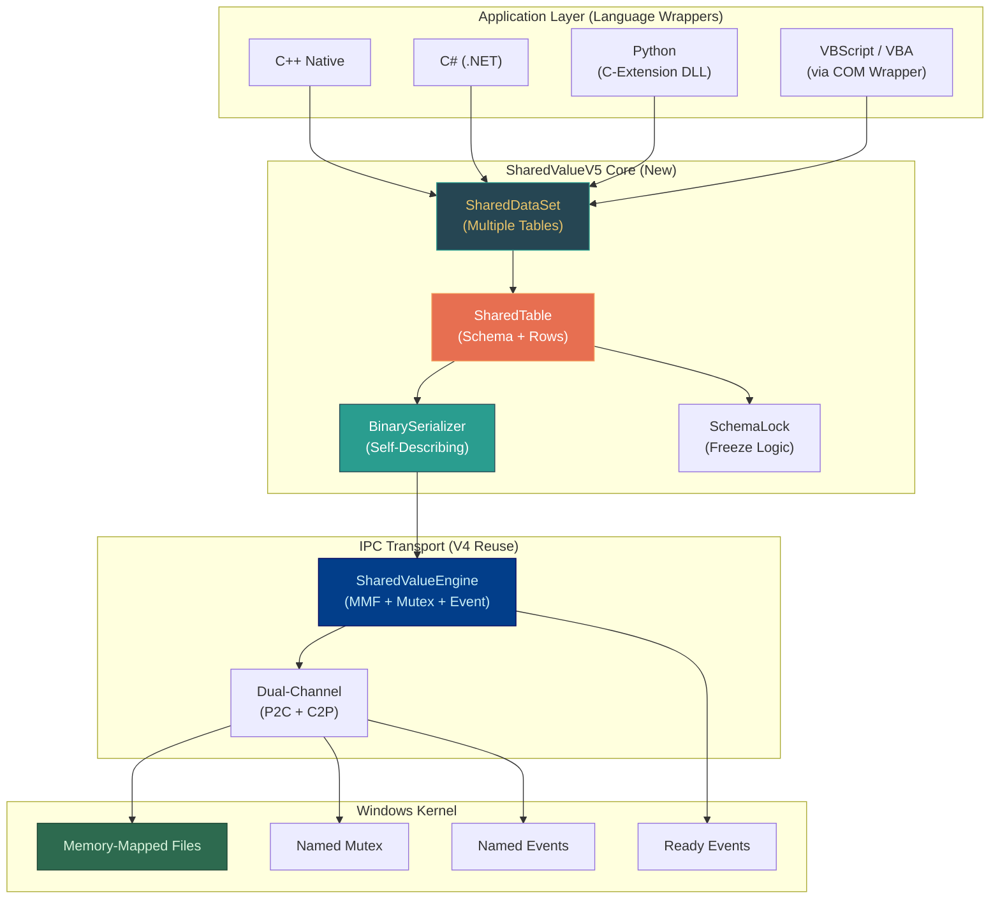
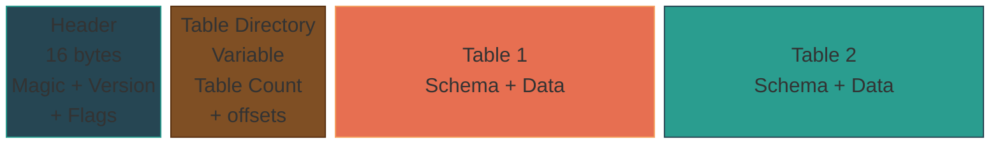
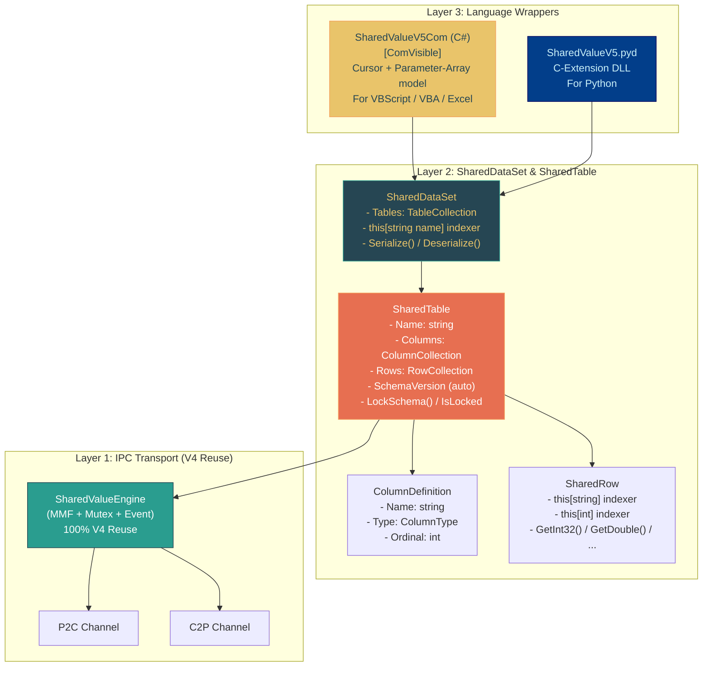
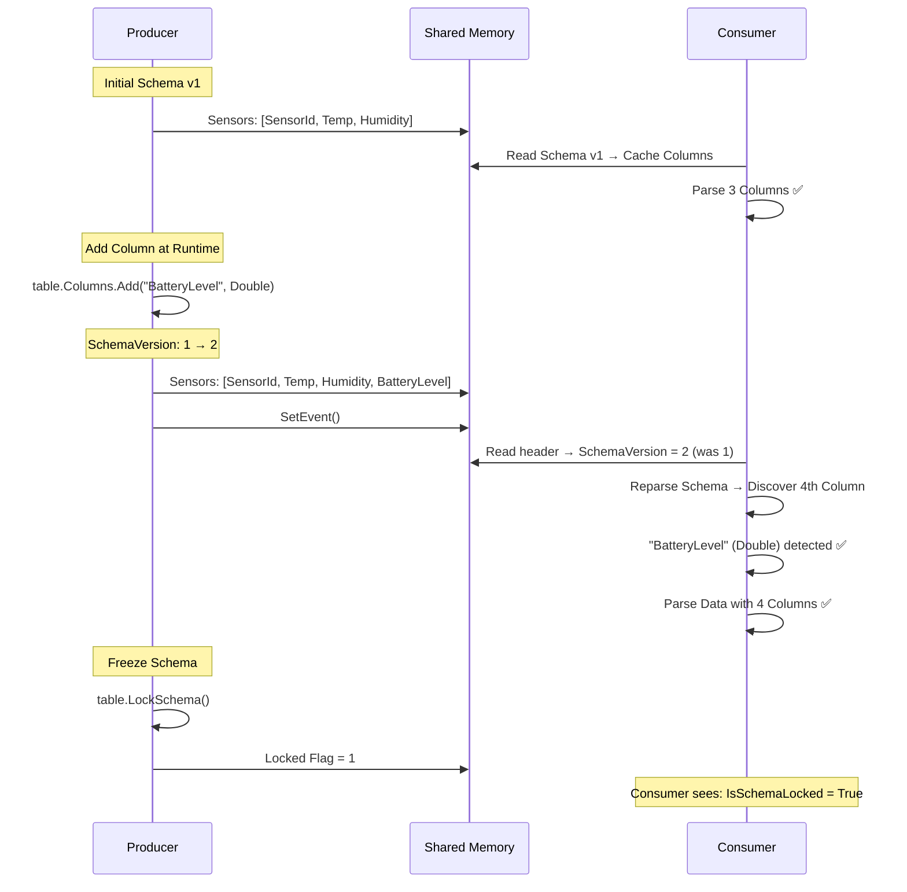

# SharedValueV5 — Architecture & Design

**SharedValueV5** is the next generation of the SharedValue IPC engine. Whereas V4 relies on compile-time FlatBuffers schemas, V5 introduces **dynamic, programmatic schema definition at runtime** — akin to `System.Data.DataSet` / `DataTable`.

Any language (C++, C#, Python, VBScript/VBA) can define the structure of the dataset **itself via method calls**, without needing to pre-compile schemas or generate code.

---

## 1. The Problem that V5 Solves

| Feature | V4 (FlatBuffers) | V5 (Dynamic Schema) |
| :--- | :--- | :--- |
| Schema definition | `.fbs` file + `flatc` codegen | Method calls at runtime |
| Schema modification | Recompilation required | Live, without restart |
| VBScript/VBA access | Only via fixed COM wrapper | Full dynamic control |
| Codegen required | ✅ Yes (`flatc --cpp --csharp`) | ❌ No |
| Serialization | Google FlatBuffers (zero-copy) | Custom binary format (self-describing) |
| Speed per operation | ~10-100 ns | ~50-500 ns |
| Multi-table support | ❌ No (1 schema per channel) | ✅ Yes (DataSet model) |
| Bidirectional | ✅ (Dual-Channel) | ✅ (Dual-Channel + per table) |
| Schema freezing | N/A (always frozen) | ✅ Optional (`LockSchema()`) |

> **V5 does not replace V4.** V4 remains the go-to for ultra-HFT scenarios (>100K updates/sec). V5 is designed for flexibility, cross-language accessibility, and legacy integration.

---

## 2. The 5 Pillars of V5

### Pillar 1: Programmatic Schema (DataTable API)

Instead of an `.fbs` file, you define the schema in code — from any language:

```csharp
// C#: Just like System.Data.DataTable
var table = new SharedTable("Sensors");
table.Columns.Add("SensorId",    ColumnType.String);
table.Columns.Add("Temperature", ColumnType.Double);
table.Columns.Add("IsActive",    ColumnType.Bool);
```

```vbscript
' VBScript: Same structure, same power
engine.DefineColumn "SensorId",    "String"
engine.DefineColumn "Temperature", "Double"
engine.DefineColumn "IsActive",    "Bool"
```

### Pillar 2: Self-Describing Shared Memory

The schema is **transmitted within the shared memory**. A Consumer doesn't need to know the schema in advance — it automatically discovers the columns, types, and names while reading.

### Pillar 3: Bidirectional on Every Level

Symmetrical Dual-Channel communication (like V4), but now also per individual `SharedTable`. Every table can be read and written from both sides.

### Pillar 4: Multi-Table Support (DataSet Model)

A single engine manages multiple `SharedTable` instances simultaneously — effectively mirroring a `DataSet` containing multiple `DataTable`s. Each table maintains its own schema, rows, and version number.

### Pillar 5: Schema Lock-Out

A table's schema can be permanently "frozen" using `LockSchema()`. Once locked, no further columns can be added or removed. This prevents consumers from accidentally modifying the structural blueprints.

### Domain Example: Industrial Sensor Network
Throughout this architecture document—and in the underlying sequence and API example diagrams—we use a consistent domain example to illustrate V5's capabilities: an **Industrial Sensor Network**.
In this scenario, a series of hardware sensors pipe their state into the shared memory. We store data such as `SensorId` (String), `Temperature` (Double), and `Humidity` (Double). Thanks to V5, we can roll out a new generation of sensors at runtime that introduces a `BatteryLevel` (Double) metric. The dynamic schema updates automatically in the backend, allowing application consumers to instantly discover the extra data columns without any compilation efforts or restarts.

---

## 3. System Overview



---

## 4. Type System

The V5 type system is intentionally kept simple to ensure maximum cross-language compatibility:

| V5 Type Enum | Bytes | C++ | C# | Python | VBScript/COM |
| :--- | :--- | :--- | :--- | :--- | :--- |
| `Int32` | 4 | `int32_t` | `int` | `int` | `Long` |
| `Int64` | 8 | `int64_t` | `long` | `int` | *(via Variant)* |
| `Float` | 4 | `float` | `float` | `float` | `Single` |
| `Double` | 8 | `double` | `double` | `float` | `Double` |
| `Bool` | 1 | `bool` | `bool` | `bool` | `Boolean` |
| `String` | variable | `std::string` | `string` | `str` | `String` |
| `Blob` | variable | `vector<uint8_t>` | `byte[]` | `bytes` | `Variant(Byte())` |
| `DateTime` | 8 | `int64_t` (ticks) | `DateTime` | `datetime` | `Date` |

---

## 5. Binary Memory Layout (Self-Describing)

### Structure Overview



### Detailed Byte Layout

```
┌──────────────────────────────────────────────────────────────────┐
│ GLOBAL HEADER (16 bytes)                                         │
│  [0..3]    Magic Bytes: 0x53 0x56 0x35 0x44 ("SV5D")            │
│  [4..5]    Format Version (uint16): 1                            │
│  [6..7]    Flags (uint16): bitflags                              │
│  [8..9]    Table Count (uint16): N tables                        │
│  [10..15]  Reserved                                              │
├──────────────────────────────────────────────────────────────────┤
│ TABLE DIRECTORY (N × 12 bytes)                                   │
│  Per table:                                                      │
│    [0..3]   Name Length (uint32)                                 │
│    [4..7]   Data Offset (uint32): absolute position in MMF       │
│    [8..11]  Data Size (uint32): size of this table block         │
│  Followed by: table name strings (UTF-8)                         │
├──────────────────────────────────────────────────────────────────┤
│ TABLE BLOCK (per table, repeat for each SharedTable)             │
│                                                                  │
│  ┌── TABLE HEADER (8 bytes) ────────────────────────────────┐    │
│  │  [0..1]  Schema Version (uint16): auto-increment         │    │
│  │  [2]     Schema Locked (uint8): 0=open, 1=frozen         │    │
│  │  [3]     Column Count (uint8): max 255 columns           │    │
│  │  [4..7]  Row Count (uint32)                              │    │
│  └──────────────────────────────────────────────────────────┘    │
│                                                                  │
│  ┌── SCHEMA DEFINITION (variable) ──────────────────────────┐    │
│  │  Per column:                                             │    │
│  │    [0]       Type (uint8 enum: Int32=1, Double=4, ...)   │    │
│  │    [1]       Name Length (uint8): max 255 chars          │    │
│  │    [2..2+N]  Name (UTF-8, N bytes)                       │    │
│  └──────────────────────────────────────────────────────────┘    │
│                                                                  │
│  ┌── DATA HEADER (8 bytes) ─────────────────────────────────┐    │
│  │  [0..3]  Row Stride (uint32): bytes per fixed-size row   │    │
│  │  [4..7]  String Pool Offset (uint32): relative           │    │
│  └──────────────────────────────────────────────────────────┘    │
│                                                                  │
│  ┌── FIXED-SIZE ROW DATA (R × stride bytes) ────────────────┐    │
│  │  Each row: [col1][col2]...[colN]                         │    │
│  │  Fixed types: value embedded inline                      │    │
│  │  String/Blob: (offset:uint32, length:uint32) pointer     │    │
│  └──────────────────────────────────────────────────────────┘    │
│                                                                  │
│  ┌── STRING POOL (variable) ────────────────────────────────┐    │
│  │  All variable-length payload data packed linearly        │    │
│  │  Row cells resolve these via (offset, length)            │    │
│  └──────────────────────────────────────────────────────────┘    │
│                                                                  │
└──────────────────────────────────────────────────────────────────┘
```

---

## 6. Component Architecture



### Layer 1: SharedValueEngine (100% V4 Reuse)

The existing `SharedValueEngine` remains **completely untouched**:
- `WriteData(byte[])` — serialize raw bytes to the MMF
- `OnDataReady` — callback triggers on incoming writes
- Ready Event handshake — boot synchronization
- Named Mutex — cross-process locking boundary
- Dual-Channel (P2C + C2P)

### Layer 2: SharedDataSet & SharedTable (New)

#### SharedDataSet (Multi-Table Container)

```csharp
public class SharedDataSet
{
    public string Name { get; }
    public TableCollection Tables { get; }
    
    // Indexer: dataset["Sensors"] → SharedTable
    public SharedTable this[string tableName] { get; }
    
    // Serializes ALL tables + schemas into a single byte payload
    public byte[] Serialize();
    public static SharedDataSet Deserialize(byte[] data);
}

public class TableCollection : IEnumerable<SharedTable>
{
    public SharedTable Add(string name);
    public SharedTable this[string name] { get; }
    public SharedTable this[int index] { get; }
    public int Count { get; }
    public bool Contains(string name);
    public void Remove(string name);
}
```

#### SharedTable (Data + Schema)

```csharp
public class SharedTable
{
    public string Name { get; }
    public ColumnCollection Columns { get; }
    public RowCollection Rows { get; }
    public ushort SchemaVersion { get; }      // Auto-incremented
    public bool IsSchemaLocked { get; }
    
    public SharedRow NewRow();
    public void LockSchema();                  // Permanently freezes the schema
    
    // Internal
    internal byte[] SerializeTable();
    internal static SharedTable DeserializeTable(byte[] block);
}
```

#### ColumnCollection & ColumnDefinition

```csharp
public enum ColumnType : byte
{
    Int32    = 1,
    Int64    = 2,
    Float    = 3,
    Double   = 4,
    Bool     = 5,
    String   = 6,
    Blob     = 7,
    DateTime = 8
}

public class ColumnDefinition
{
    public string Name { get; }
    public ColumnType Type { get; }
    public int Ordinal { get; }                // 0-based position
    public int FixedByteSize { get; }          // Fixed size, or 8 for string/blob refs
}

public class ColumnCollection : IEnumerable<ColumnDefinition>
{
    /// <exception cref="SchemaLockedException">Schema is frozen</exception>
    public ColumnDefinition Add(string name, ColumnType type);
    public ColumnDefinition this[string name] { get; }
    public ColumnDefinition this[int ordinal] { get; }
    public int Count { get; }
    public bool Contains(string name);
}
```

#### SharedRow

```csharp
public class SharedRow
{
    // Dynamic accessors
    public object this[string columnName] { get; set; }
    public object this[int ordinal] { get; set; }
    
    // Strongly-typed accessors (avoids boxing runtime overhead)
    public int GetInt32(string col);
    public int GetInt32(int ordinal);
    public long GetInt64(string col);
    public float GetFloat(string col);
    public double GetDouble(string col);
    public bool GetBool(string col);
    public string GetString(string col);
    public byte[] GetBlob(string col);
    public DateTime GetDateTime(string col);
    
    // Strongly-typed setters
    public void SetInt32(string col, int value);
    public void SetDouble(string col, double value);
    public void SetString(string col, string value);
    // ... etc.
}

public class RowCollection : IEnumerable<SharedRow>
{
    public void Add(SharedRow row);
    public void RemoveAt(int index);
    public void Clear();
    public SharedRow this[int index] { get; }
    public int Count { get; }
}
```

### Layer 3: COM Wrapper (Dual Model)

The COM wrapper exposes **two distinct paradigms** for row insertions:

```csharp
[ComVisible(true)]
[Guid("A1B2C3D4-E5F6-7890-ABCD-EF1234567890")]
[ProgId("SharedValueV5.Engine")]
[ClassInterface(ClassInterfaceType.AutoDual)]
public class SharedValueV5Com : IDisposable
{
    private SharedDataSet _dataSet;
    private SharedValueEngine _engineP2C;
    private SharedValueEngine _engineC2P;
    private string _currentTable;
    private int _cursorRowIndex = -1;

    // =========== SCHEMA DEFINITION ===========
    
    /// <summary>Create a new table strictly within the active dataset</summary>
    public void CreateTable(string tableName);
    
    /// <summary>Select the active table targeting resulting operations</summary>
    public void SelectTable(string tableName);
    
    /// <summary>Append a column directly into the currently active table</summary>
    public void DefineColumn(string name, string typeName);
    
    /// <summary>Freeze the schema — no columns can be arbitrarily altered/removed afterward</summary>
    public void LockSchema();
    
    /// <summary>Raises True if the schema is perpetually frozen</summary>
    public bool IsSchemaLocked { get; }
    
    public int ColumnCount { get; }
    public string ColumnName(int index);
    public string ColumnTypeName(int index);
    public int TableCount { get; }
    public string TableName(int index);

    // =========== CONNECTIVITY ===========
    
    /// <summary>Connect the memory pipeline arrays (bidirectionally)</summary>
    public bool Connect(string channelName, bool isHost);
    public void Disconnect();

    // =========== DATA WRITING: MODEL 1 — Cursor ===========
    
    /// <summary>Allocate a fresh row (advances cursor to new offset row)</summary>
    public void AddRow();
    
    /// <summary>Overwrite a distinct variable relative to the active cursor row</summary>
    public void SetValue(string column, object value);

    // =========== DATA WRITING: MODEL 2 — Parameter Array ===========
    
    /// <summary>Embed a full row mapping directly leveraging consecutive arg ordinals.</summary>
    /// <example>engine.AddRowDirect "Sensor01", 22.5, 65.0, True, 200</example>
    public void AddRowDirect(
        object val1, 
        [Optional] object val2, 
        [Optional] object val3,
        [Optional] object val4,
        [Optional] object val5,
        [Optional] object val6,
        [Optional] object val7,
        [Optional] object val8,
        [Optional] object val9,
        [Optional] object val10
    );

    // =========== PUBLISHING ===========
    
    /// <summary>Deploy all updated table states mapping cleanly via the P2C kernel layer.</summary>
    public void Publish();
    
    /// <summary>Dispatch reverse updates specifically bypassing onto the C2P return channel</summary>
    public void PublishReverse();

    // =========== DATA READING ===========
    
    public int RowCount { get; }
    public object GetValue(int rowIndex, string column);
    public object GetValueByIndex(int rowIndex, int colIndex);
    public string GetAllAsCsv();
    public string GetTableAsCsv(string tableName);
    public bool HasNewData();

    // =========== EVENTS / LISTENING ===========
    
    public void StartListening();
    public void StopListening();
    public bool IsConnected { get; }
    public string GetLastError();
}
```

### Layer 3: Python C-Extension (`.pyd`)

```python
# SharedValueV5.pyd — Native C-Extension module
import sharedvalue5 as sv5

# --- As Producer ---
ds = sv5.SharedDataSet("SensorNet", is_host=True)

# Programmatic Schema Generation
sensors = ds.create_table("Sensors")
sensors.add_column("sensor_id", sv5.STRING)
sensors.add_column("temperature", sv5.DOUBLE)
sensors.add_column("humidity", sv5.DOUBLE)
sensors.add_column("is_active", sv5.BOOL)

# Appending Data
row = sensors.new_row()
row["sensor_id"] = "PySensor_01"
row["temperature"] = 22.5
row["humidity"] = 65.0
row["is_active"] = True
sensors.add_row(row)

ds.publish()

# --- As Consumer ---
reader = sv5.SharedDataSet("SensorNet", is_host=False)
reader.start_listening()

# Automatic Schema Discovery parsing binary headers!
for table in reader.tables:
    print(f"Table: {table.name}, Columns: {table.column_count}")
    for row in table.rows:
        print(f"  {row['sensor_id']}: {row['temperature']}°C")

# Bidirectional Return Channel Dispatches
command_table = reader.create_table("Commands")
command_table.add_column("action", sv5.STRING)
command_table.add_column("target", sv5.STRING)
row = command_table.new_row()
row["action"] = "RECALIBRATE"
row["target"] = "PySensor_01"
command_table.add_row(row)
reader.publish_reverse()  # Emits via the explicit C2P bounds
```

---

## 7. Comprehensive Code Examples Per Language

### 7.1 C# — Producer & Consumer

```csharp
// ===== PRODUCER =====
var ds = new SharedDataSet("Factory");

// Table 1: Sensors
var sensors = ds.Tables.Add("Sensors");
sensors.Columns.Add("SensorId",    ColumnType.String);
sensors.Columns.Add("Temperature", ColumnType.Double);
sensors.Columns.Add("Humidity",    ColumnType.Double);
sensors.Columns.Add("IsActive",    ColumnType.Bool);
sensors.Columns.Add("LastSeen",    ColumnType.DateTime);

// Table 2: Alarms
var alarms = ds.Tables.Add("Alarms");
alarms.Columns.Add("AlarmId",     ColumnType.Int32);
alarms.Columns.Add("Message",     ColumnType.String);
alarms.Columns.Add("Severity",    ColumnType.Int32);

// Enforce schema immutability
sensors.LockSchema();
alarms.LockSchema();

// Boot engine
var engine = new SharedValueV5Engine("Factory", isHost: true);

// Populate runtime block elements
var row = sensors.NewRow();
row["SensorId"]    = "TempSensor_01";
row["Temperature"] = 22.5;
row["Humidity"]    = 65.0;
row["IsActive"]    = true;
row["LastSeen"]    = DateTime.UtcNow;
sensors.Rows.Add(row);

var alarm = alarms.NewRow();
alarm["AlarmId"]  = 1001;
alarm["Message"]  = "Temperature peak detected inside sector A";
alarm["Severity"] = 3;
alarms.Rows.Add(alarm);

// Automatically dispatch ALL tables continuously tracking kernel mappings
engine.Publish(ds);

// ===== CONSUMER =====
var reader = new SharedValueV5Engine("Factory", isHost: false);
reader.OnDataReady += (dataSet) => {
    // Dynamic Schema Autodiscovery triggers automatically!
    foreach(var table in dataSet.Tables) {
        Console.WriteLine($"=== Table: {table.Name} ({table.Rows.Count} items) ===");
        foreach(var col in table.Columns) {
            Console.Write($"{col.Name} ({col.Type})\t");
        }
        Console.WriteLine();
        foreach(var r in table.Rows) {
            foreach(var col in table.Columns) {
                Console.Write($"{r[col.Name]}\t");
            }
            Console.WriteLine();
        }
    }
};
reader.StartListening();
```

### 7.2 C++ — Producer

```cpp
#include "SharedDataSet.hpp"
#include "SharedValueV5Engine.hpp"

int main() {
    SharedDataSet ds("Factory");
    
    // Multi-table
    auto& sensors = ds.AddTable("Sensors");
    sensors.AddColumn("SensorId",    ColumnType::String);
    sensors.AddColumn("Temperature", ColumnType::Double);
    sensors.AddColumn("Humidity",    ColumnType::Double);
    sensors.AddColumn("IsActive",    ColumnType::Bool);
    
    auto& alarms = ds.AddTable("Alarms");
    alarms.AddColumn("AlarmId",  ColumnType::Int32);
    alarms.AddColumn("Message",  ColumnType::String);
    alarms.AddColumn("Severity", ColumnType::Int32);
    
    // Lock schemas
    sensors.LockSchema();
    alarms.LockSchema();
    
    // Engine execution
    SharedValueV5Engine engine(L"Factory", true);
    
    // Data allocation
    auto row = sensors.NewRow();
    row.Set("SensorId",    std::string("CppSensor_01"));
    row.Set("Temperature", 22.5);
    row.Set("Humidity",    65.0);
    row.Set("IsActive",    true);
    sensors.AddRow(std::move(row));
    
    engine.Publish(ds);
    
    // Bidirectional listener hooks directly querying C2P streams inherently
    engine.OnReverseData([](const SharedDataSet& incoming) {
        if (incoming.HasTable("Commands")) {
            auto& cmds = incoming.GetTable("Commands");
            for (int i = 0; i < cmds.RowCount(); i++) {
                std::cout << "Command Dispatch: " << cmds.Row(i).GetString("action") << "\n";
            }
        }
    });
    engine.StartListeningReverse();
}
```

### 7.3 VBScript — Producer (Cursor Model)

```vbscript
' vbs_producer_cursor.vbs
' Cursor Mode: AddRow → SetValue → SetValue → Publish
Option Explicit

Set engine = CreateObject("SharedValueV5.Engine")

' Register mapping block
engine.CreateTable "Sensors"
engine.SelectTable "Sensors"

' Define rigid constraints
engine.DefineColumn "SensorId",    "String"
engine.DefineColumn "Temperature", "Double"
engine.DefineColumn "Humidity",    "Double"
engine.DefineColumn "IsActive",    "Bool"
engine.DefineColumn "StatusCode",  "Int32"

' Lock configuration statically
engine.LockSchema

' Spawn distinct secondary data layout mapping
engine.CreateTable "Alarms"
engine.SelectTable "Alarms"
engine.DefineColumn "AlarmId",  "Int32"
engine.DefineColumn "Message",  "String"
engine.DefineColumn "Severity", "Int32"
engine.LockSchema

' Mount process connections identically mapping globally reserved pipes
engine.Connect "FactoryData", True

' === Writing Data using standard Cursor Model paradigms ===
engine.SelectTable "Sensors"

engine.AddRow
engine.SetValue "SensorId",    "VBS_Sensor_01"
engine.SetValue "Temperature", 22.5
engine.SetValue "Humidity",    65.0
engine.SetValue "IsActive",    True
engine.SetValue "StatusCode",  200

engine.AddRow
engine.SetValue "SensorId",    "VBS_Sensor_02"
engine.SetValue "Temperature", 18.3
engine.SetValue "Humidity",    72.1
engine.SetValue "IsActive",    False
engine.SetValue "StatusCode",  503

' Transmit distinct alarm event
engine.SelectTable "Alarms"
engine.AddRow
engine.SetValue "AlarmId",  1001
engine.SetValue "Message",  "Critical Temperature spike detected tracking Sector A"
engine.SetValue "Severity", 3

' Instantly serialize multi-table collections straight pushing into physical RAM
engine.Publish

WScript.Echo "Memory Blocks Successfully Published via SharedValueV5!"
```

### 7.4 VBScript — Producer (Parameter-Array Model)

```vbscript
' vbs_producer_array.vbs
' Parameter-Array model: Single invocation insertion sequences resolving internally
Option Explicit

Set engine = CreateObject("SharedValueV5.Engine")

engine.CreateTable "Sensors"
engine.SelectTable "Sensors"
engine.DefineColumn "SensorId",    "String"
engine.DefineColumn "Temperature", "Double"
engine.DefineColumn "Humidity",    "Double"
engine.DefineColumn "IsActive",    "Bool"
engine.DefineColumn "StatusCode",  "Int32"

engine.Connect "FactoryData", True

' === Execute flat sequences resolving directly towards explicit numeric array lengths ===
engine.AddRowDirect "VBS_Sensor_01", 22.5, 65.0, True, 200
engine.AddRowDirect "VBS_Sensor_02", 18.3, 72.1, False, 503
engine.AddRowDirect "VBS_Sensor_03", 30.1, 44.0, True, 200

engine.Publish
WScript.Echo "Processed exactly 3 rows successfully within fractional calls!"
```

### 7.5 VBScript — Consumer (Schema Autodiscovery)

```vbscript
' vbs_consumer.vbs
' Interrogates incoming binary transmissions completely blind evaluating strictly off headers!
Option Explicit

Set engine = CreateObject("SharedValueV5.Engine")
engine.Connect "FactoryData", False

WScript.Echo "Connected. Waiting for host signal..."
WScript.Echo "Detected Table Formations: " & engine.TableCount

Dim t, r, c
For t = 0 To engine.TableCount - 1
    Dim strTableName
    strTableName = engine.TableName(t)
    engine.SelectTable strTableName
    
    WScript.Echo ""
    WScript.Echo "=== Table Matrix: " & strTableName & " ==="
    WScript.Echo "  Columns Registered: " & engine.ColumnCount
    WScript.Echo "  Items Discovered:   " & engine.RowCount
    WScript.Echo "  Schema Immutable:   " & engine.IsSchemaLocked
    
    ' Automatically reconstruct header descriptions spanning multiple indices
    Dim strHeader
    strHeader = ""
    For c = 0 To engine.ColumnCount - 1
        strHeader = strHeader & engine.ColumnName(c) & " (" & _
                    engine.ColumnTypeName(c) & ")" & vbTab
    Next
    WScript.Echo "  " & strHeader
    
    ' Spool exact index blocks iteratively evaluating string pointers dynamically
    For r = 0 To engine.RowCount - 1
        Dim strRow
        strRow = "  "
        For c = 0 To engine.ColumnCount - 1
            strRow = strRow & engine.GetValueByIndex(r, c) & vbTab
        Next
        WScript.Echo strRow
    Next
Next
```

### 7.6 Excel VBA — Multi-Table Live Dashboard

```vb
' === Excel VBA Background Eventing Module ===
Option Explicit
Private engine As Object
Private bRunning As Boolean

Sub ConnectAndDiscover()
    Set engine = CreateObject("SharedValueV5.Engine")
    
    If engine.Connect("FactoryData", False) Then
        bRunning = True
        
        ' Form separate worksheets automatically resolving mapped MMF table descriptors
        Dim t As Integer
        For t = 0 To engine.TableCount - 1
            Dim tabNaam As String
            tabNaam = engine.TableName(t)
            engine.SelectTable tabNaam
            
            ' Validate worksheet bindings ensuring accurate target placements
            On Error Resume Next
            Dim ws As Worksheet
            Set ws = ThisWorkbook.Sheets(tabNaam)
            If ws Is Nothing Then
                Set ws = ThisWorkbook.Sheets.Add
                ws.Name = tabNaam
            End If
            On Error GoTo 0
            
            ' Process headers applying arbitrary formatting directly scaling off columns detected
            Dim c As Integer
            For c = 0 To engine.ColumnCount - 1
                ws.Cells(1, c + 1).Value = engine.ColumnName(c)
                ws.Cells(1, c + 1).Font.Bold = True
                ws.Cells(1, c + 1).Interior.Color = RGB(41, 128, 185)
                ws.Cells(1, c + 1).Font.Color = vbWhite
            Next c
        Next t
        
        MsgBox "Successfully discovered " & engine.TableCount & " dynamic table bindings!", vbInformation
        Application.OnTime Now + TimeValue("00:00:02"), "RefreshAll"
    End If
End Sub

Sub RefreshAll()
    If Not bRunning Then Exit Sub
    
    Dim t As Integer
    For t = 0 To engine.TableCount - 1
        Dim tabNaam As String
        tabNaam = engine.TableName(t)
        engine.SelectTable tabNaam
        
        Dim ws As Worksheet
        Set ws = ThisWorkbook.Sheets(tabNaam)
        
        ' Spool continuous metric evaluations mapping raw memory sequences accurately onto cell ranges
        Dim r As Integer, c As Integer
        For r = 0 To engine.RowCount - 1
            For c = 0 To engine.ColumnCount - 1
                ws.Cells(r + 2, c + 1).Value = engine.GetValueByIndex(r, c)
            Next c
        Next r
    Next t
    
    ' Trigger recurring polling execution looping indefinitely without CPU exhaustion
    Application.OnTime Now + TimeValue("00:00:02"), "RefreshAll"
End Sub
```

---

## 8. Schema Evolution & Auto-Discovery



### Schema Lock-Out Modification Behavior Profile

| Mutator Call | Schema Opened Status | Schema Locked Status |
| :--- | :--- | :--- |
| `Columns.Add()` | ✅ Column accepted, SchemaVersion++ | ❌ Throws `SchemaLockedException` |
| `Rows.Add()` | ✅ Fully functional | ✅ Fully functional |
| `Rows[i]["col"] = val` | ✅ Fully functional | ✅ Fully functional |
| `LockSchema()` | ✅ Freezes structural boundaries definitively | ⚠️ Ignored elegantly |

---

## 9. Native Performance Analysis

| IPC Transaction Type | V4 (FlatBuffers Compiled) | V5 (Self-Describing) | Technical Annotations |
| :--- | :--- | :--- | :--- |
| Discovery Parsing Overhead | N/A | ~2 μs (executed singularly) | Values inherently cached succeeding primary parser |
| Serializing Singular Row Execution (5 primitive cols) | ~15 ns | ~80 ns | Immediate unmanaged memcpy |
| Serializing Hybrid Row Executions (Strings/Blobs included) | ~25 ns | ~120 ns | Evaluates subsequent string pool pointer bindings |
| Primitive Variable Reading Evaluator (double type) | ~10 ns | ~30 ns | Leverages dynamic ordinal mapping indices |
| Dynamic String Rendering Allocator | ~15 ns | ~50 ns | Reconstructs payload via native pool heap evaluations |
| Massive Payload Dispatches (1000 explicit rows traversing P2C loop) | ~30 μs | ~120 μs | **Orders of magnitudes faster continuously tracking COM RPC evaluations** |
| Multi-Table Navigation Evaluator | N/A | ~5 μs scaling sequentially | Prohibits collision navigating directory index registries |

---

## 10. Project Structure

```
SharedValueV5/
├── cpp_core/
│   ├── SharedValueEngine.hpp       # V4 Code inclusion natively (untouched)
│   ├── SharedValueException.hpp    # V4 Inherited behaviors tracking (untouched)
│   ├── SharedDataSet.hpp           # BRAND NEW: Global Table Registry wrapper
│   ├── SharedTable.hpp             # BRAND NEW: Data / Schema segregation abstraction
│   ├── SharedRow.hpp               # BRAND NEW: Object representations
│   ├── ColumnDefinition.hpp        # BRAND NEW: Immutable primitive mappings
│   ├── BinarySerializer.hpp        # BRAND NEW: C++ struct mapping rendering arrays natively
│   ├── SharedValueV5Engine.hpp     # BRAND NEW: Consolidated high-level execution facade
│   ├── main.cpp                    # Producer invocation examples natively
│   └── CMakeLists.txt
├── csharp_core/
│   ├── SharedValueEngine.cs        # V4 C# wrappers ported directly natively
│   ├── SharedDataSet.cs            # BRAND NEW
│   ├── SharedTable.cs              # BRAND NEW
│   ├── SharedRow.cs                # BRAND NEW
│   ├── ColumnDefinition.cs         # BRAND NEW
│   ├── BinarySerializer.cs         # BRAND NEW
│   ├── SharedValueV5Engine.cs      # BRAND NEW: Core Facade executing bindings
│   ├── Program.cs                  # Reader application logic testing flows
│   └── csharp_core.csproj
├── com_wrapper/
│   ├── SharedValueV5Com.cs         # BRAND NEW: COM-Accessible external integration node
│   └── com_wrapper.csproj
├── python_ext/
│   ├── sharedvalue5_module.c       # BRAND NEW: Python generic extensions
│   ├── setup.py                    # BRAND NEW: Python C-Compiler executor arrays
│   └── sharedvalue5.pyi            # BRAND NEW: Environment types (Intellisense integrations)
├── tests/
│   ├── Run-V5Tests.ps1             # Executable orchestration
│   ├── Test-SchemaEvolution.ps1    # Structural mutability verifications tracking versionings
│   ├── Test-MultiTable.ps1         # Concurrent container manipulation logic
│   ├── Test-VBScript.vbs           # Execution testing mappings via COM bridging
│   └── Test-Bidirectional.ps1      # Echo/Relay dual-channel integrity validation
├── examples/
│   ├── vbs_producer_cursor.vbs
│   ├── vbs_producer_array.vbs
│   ├── vbs_consumer.vbs
│   ├── vbs_bidirectional.vbs
│   ├── vba_dashboard.vbs
│   └── python_reader.py
├── ARCHITECTURE.md                 # This English specification sheet
├── USAGE_NL.md
├── INSTALL.md
└── README.md
```

---

## 11. Related Documentation Files

- [SharedValueV4/ARCHITECTURE.md](../SharedValueV4/ARCHITECTURE.md) — Comprehensive V4 Memory definitions mapping fixed structures recursively
- [SharedValueV4/SCHEMA_GUIDE.md](../SharedValueV4/SCHEMA_GUIDE_NL.md) — Exact instructions on compiling schema constraints utilizing `flatc` configurations 
- [SharedValueV4/USAGE_NL.md](../SharedValueV4/USAGE_NL.md) — Practice execution environments
- [SharedValueV2/README.md](../SharedValueV2/README.md) — Root index mapping basic architectural boundaries using Legacy methodologies
