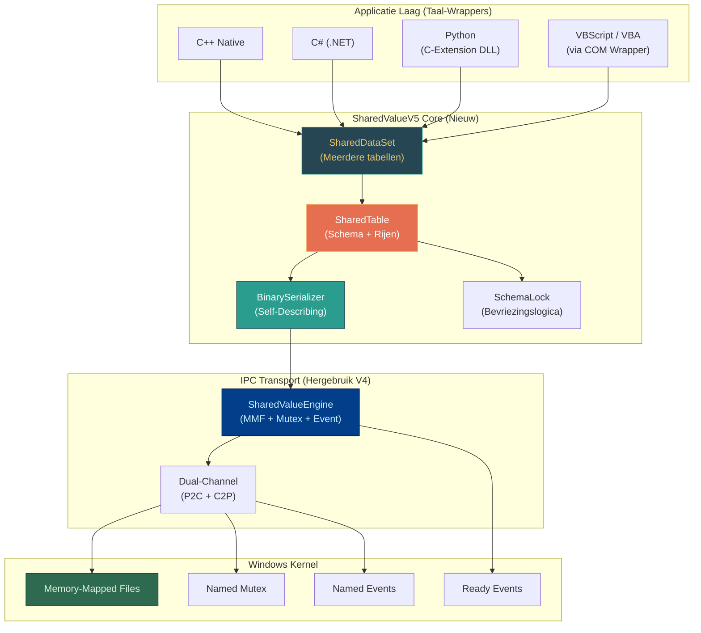
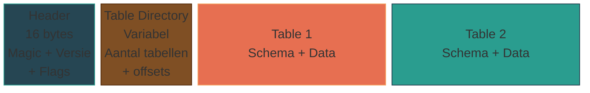
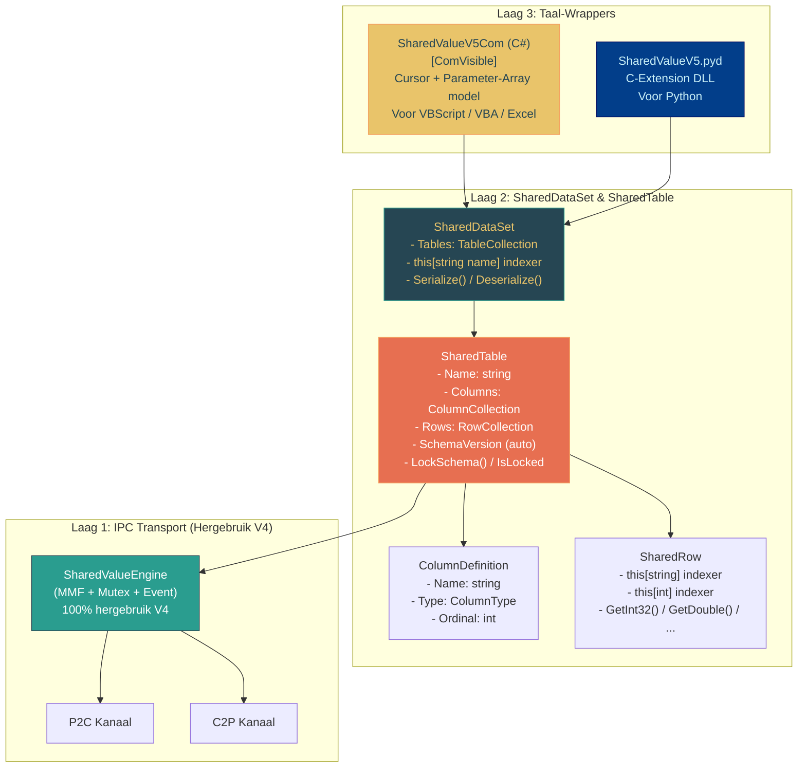
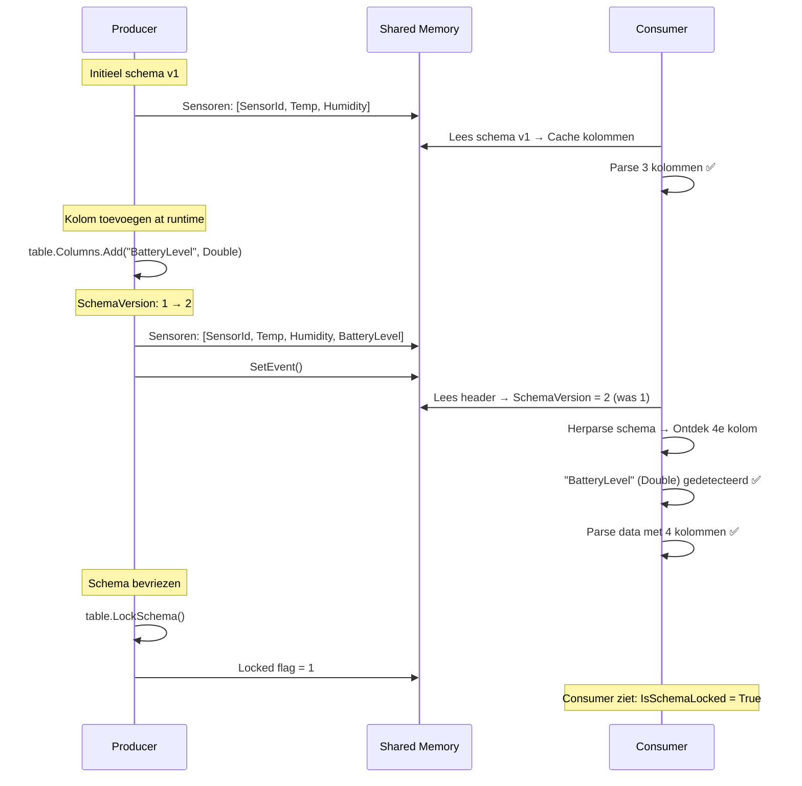

# SharedValueV5 — Architectuur & Ontwerp

**SharedValueV5** is de volgende generatie van de SharedValue IPC-engine. Waar V4 leunt op compile-time FlatBuffers schema's, introduceert V5 **dynamische, programmatische schema-definitie at runtime** — net als `System.Data.DataSet` / `DataTable`.

Elke taal (C++, C#, Python, VBScript/VBA) kan de structuur van de dataset **zelf bepalen via method calls**, zonder vooraf schema's te compileren of code te genereren.

---

## 1. Het Probleem dat V5 Oplost

| Eigenschap | V4 (FlatBuffers) | V5 (Dynamisch Schema) |
| :--- | :--- | :--- |
| Schema definitie | `.fbs` bestand + `flatc` codegen | Method calls at runtime |
| Schema wijziging | Hercompilatie vereist | Live, zonder herstart |
| VBScript/VBA toegang | Alleen via vaste COM wrapper | Volledige dynamische controle |
| Codegeneratie nodig | ✅ Ja (`flatc --cpp --csharp`) | ❌ Nee |
| Serialisatie | Google FlatBuffers (zero-copy) | Eigen binair formaat (self-describing) |
| Snelheid per operatie | ~10-100 ns | ~50-500 ns |
| Multi-table support | ❌ Nee (1 schema per kanaal) | ✅ Ja (DataSet model) |
| Bidirectioneel | ✅ (Dual-Channel) | ✅ (Dual-Channel + per table) |
| Schema bevriezing | N.v.t. (altijd bevroren) | ✅ Optioneel (`LockSchema()`) |

> **V5 vervangt V4 niet.** V4 blijft bestaan voor ultra-HFT scenario's (>100K updates/sec). V5 is ontworpen voor flexibiliteit, cross-language toegankelijkheid, en legacy integratie.

---

## 2. De 5 Pilaren van V5

### Pilaar 1: Programmatisch Schema (DataTable API)

In plaats van een `.fbs` bestand definieer je het schema in code — vanuit elke taal:

```csharp
// C#: Net als System.Data.DataTable
var table = new SharedTable("Sensoren");
table.Columns.Add("SensorId",    ColumnType.String);
table.Columns.Add("Temperature", ColumnType.Double);
table.Columns.Add("IsActive",    ColumnType.Bool);
```

```vbscript
' VBScript: Dezelfde structuur, zelfde kracht
engine.DefineColumn "SensorId",    "String"
engine.DefineColumn "Temperature", "Double"
engine.DefineColumn "IsActive",    "Bool"
```

### Pilaar 2: Self-Describing Gedeeld Geheugen

Het schema wordt **meegestuurd in het gedeelde geheugen**. Een Consumer hoeft het schema niet vooraf te kennen — hij ontdekt de kolommen, types en namen automatisch bij het lezen.

### Pilaar 3: Bidirectioneel op Elk Niveau

Symmetrische Dual-Channel communicatie (zoals V4), maar nu ook per individuele `SharedTable`. Elke tabel kan zowel gelezen als geschreven worden van beide kanten.

### Pilaar 4: Multi-Table Support (DataSet Model)

Eén engine beheert meerdere `SharedTable`-instanties tegelijk — net als een `DataSet` met meerdere `DataTable`s. Elke tabel heeft zijn eigen schema, rijen en versienummer.

### Pilaar 5: Schema Lock-Out

Het schema van een tabel kan worden "bevroren" met `LockSchema()`. Na bevriezing kunnen er geen kolommen meer worden toegevoegd of verwijderd. Dit voorkomt dat consumers per ongeluk de structuur wijzigen.

### Domeinvoorbeeld: Industrieel Sensornetwerk
Doorheen dit architectuurdocument—en in de onderliggende sequence- en API-voorbeeld diagrammen—hanteren we een consistent domeinvoorbeeld om de functionaliteit van V5 te illustreren: een **Industrieel Sensornetwerk**.
In dit scenario sluist een reeks hardware-sensoren zijn status door naar het gedeelde geheugen. We slaan data op zoals de `SensorId` (String), `Temperature` (Double) en `Humidity` (Double). Dankzij V5 kunnen we at-runtime een nieuwe generatie sensoren uitrollen die ook een `BatteryLevel` (Double) introduceert. Het dynamische schema wordt automatisch live bijgewerkt in de backend, waardoor applicatie-consumenten direct de extra datakolommen ontdekken, zonder compilatiewerk of herstarts.

---

## 3. Systeemoverzicht



---

## 4. Type-Systeem

Het V5 type-systeem is bewust simpel gehouden voor maximale cross-language compatibiliteit:

| V5 Type Enum | Bytes | C++ | C# | Python | VBScript/COM |
| :--- | :--- | :--- | :--- | :--- | :--- |
| `Int32` | 4 | `int32_t` | `int` | `int` | `Long` |
| `Int64` | 8 | `int64_t` | `long` | `int` | *(via Variant)* |
| `Float` | 4 | `float` | `float` | `float` | `Single` |
| `Double` | 8 | `double` | `double` | `float` | `Double` |
| `Bool` | 1 | `bool` | `bool` | `bool` | `Boolean` |
| `String` | variabel | `std::string` | `string` | `str` | `String` |
| `Blob` | variabel | `vector<uint8_t>` | `byte[]` | `bytes` | `Variant(Byte())` |
| `DateTime` | 8 | `int64_t` (ticks) | `DateTime` | `datetime` | `Date` |

---

## 5. Binair Geheugenlayout (Self-Describing)

### Overzicht Structuur



### Gedetailleerde Byte Layout

```
┌──────────────────────────────────────────────────────────────────┐
│ GLOBAL HEADER (16 bytes)                                         │
│  [0..3]    Magic Bytes: 0x53 0x56 0x35 0x44 ("SV5D")            │
│  [4..5]    Format Versie (uint16): 1                             │
│  [6..7]    Flags (uint16): bitflags                              │
│  [8..9]    Table Count (uint16): N tabellen                      │
│  [10..15]  Gereserveerd                                          │
├──────────────────────────────────────────────────────────────────┤
│ TABLE DIRECTORY (N × 12 bytes)                                   │
│  Per tabel:                                                      │
│    [0..3]   Naam Lengte (uint32)                                 │
│    [4..7]   Data Offset (uint32): positie in MMF                 │
│    [8..11]  Data Grootte (uint32): omvang van dit tabelblok      │
│  Gevolgd door: tabel naam strings (UTF-8)                        │
├──────────────────────────────────────────────────────────────────┤
│ TABLE BLOCK (per tabel, herhaal voor elke SharedTable)           │
│                                                                  │
│  ┌── TABLE HEADER (8 bytes) ────────────────────────────────┐    │
│  │  [0..1]  Schema Versie (uint16): auto-increment          │    │
│  │  [2]     Schema Locked (uint8): 0=open, 1=bevroren       │    │
│  │  [3]     Kolom Count (uint8): max 255 kolommen           │    │
│  │  [4..7]  Row Count (uint32)                              │    │
│  └──────────────────────────────────────────────────────────┘    │
│                                                                  │
│  ┌── SCHEMA DEFINITIE (variabel) ───────────────────────────┐    │
│  │  Per kolom:                                              │    │
│  │    [0]       Type (uint8 enum: Int32=1, Double=4, ...)   │    │
│  │    [1]       Naam Lengte (uint8): max 255 chars          │    │
│  │    [2..2+N]  Naam (UTF-8, N bytes)                       │    │
│  └──────────────────────────────────────────────────────────┘    │
│                                                                  │
│  ┌── DATA HEADER (8 bytes) ─────────────────────────────────┐    │
│  │  [0..3]  Row Stride (uint32): bytes per fixed-size rij   │    │
│  │  [4..7]  String Pool Offset (uint32): relatief           │    │
│  └──────────────────────────────────────────────────────────┘    │
│                                                                  │
│  ┌── FIXED-SIZE ROW DATA (R × stride bytes) ────────────────┐    │
│  │  Elke rij: [col1][col2]...[colN]                         │    │
│  │  Fixed types: waarde direct inline                       │    │
│  │  String/Blob: (offset:uint32, length:uint32) verwijzing  │    │
│  └──────────────────────────────────────────────────────────┘    │
│                                                                  │
│  ┌── STRING POOL (variabel) ────────────────────────────────┐    │
│  │  Alle variabel-grootte data aaneengesloten               │    │
│  │  Rij-cellen verwijzen via (offset, length)               │    │
│  └──────────────────────────────────────────────────────────┘    │
│                                                                  │
└──────────────────────────────────────────────────────────────────┘
```

---

## 6. Componentenarchitectuur



### Laag 1: SharedValueEngine (100% hergebruik V4)

De bestaande `SharedValueEngine` blijft **volledig ongewijzigd**:
- `WriteData(byte[])` — schrijf bytes naar MMF
- `OnDataReady` — callback bij nieuwe data
- Ready Event handshake — synchronisatie bij opstart
- Named Mutex — cross-process locking
- Dual-Channel (P2C + C2P)

### Laag 2: SharedDataSet & SharedTable (Nieuw)

#### SharedDataSet (Multi-Table Container)

```csharp
public class SharedDataSet
{
    public string Name { get; }
    public TableCollection Tables { get; }
    
    // Indexer: dataset["Sensoren"] → SharedTable
    public SharedTable this[string tableName] { get; }
    
    // Serialiseer ALLE tabellen + schema's naar één byte[]
    public byte[] Serialize();
    public static SharedDataSet Deserialize(byte[] data);
}

public class TableCollection : IEnumerable<SharedTable>
{
    public SharedTable Add(string name);
    public SharedTable this[string name] { get; }
    public SharedTable this[int index] { get; }
    public int Count { get; }
    public bool Contains(string name);
    public void Remove(string name);
}
```

#### SharedTable (Data + Schema)

```csharp
public class SharedTable
{
    public string Name { get; }
    public ColumnCollection Columns { get; }
    public RowCollection Rows { get; }
    public ushort SchemaVersion { get; }      // Auto-increment
    public bool IsSchemaLocked { get; }
    
    public SharedRow NewRow();
    public void LockSchema();                  // Bevriest het schema permanent
    
    // Intern
    internal byte[] SerializeTable();
    internal static SharedTable DeserializeTable(byte[] block);
}
```

#### ColumnCollection & ColumnDefinition

```csharp
public enum ColumnType : byte
{
    Int32    = 1,
    Int64    = 2,
    Float    = 3,
    Double   = 4,
    Bool     = 5,
    String   = 6,
    Blob     = 7,
    DateTime = 8
}

public class ColumnDefinition
{
    public string Name { get; }
    public ColumnType Type { get; }
    public int Ordinal { get; }                // 0-based positie
    public int FixedByteSize { get; }          // Vaste grootte, of 8 voor string/blob ref
}

public class ColumnCollection : IEnumerable<ColumnDefinition>
{
    /// <exception cref="SchemaLockedException">Schema is bevroren</exception>
    public ColumnDefinition Add(string name, ColumnType type);
    public ColumnDefinition this[string name] { get; }
    public ColumnDefinition this[int ordinal] { get; }
    public int Count { get; }
    public bool Contains(string name);
}
```

#### SharedRow

```csharp
public class SharedRow
{
    // Dynamische accessors
    public object this[string columnName] { get; set; }
    public object this[int ordinal] { get; set; }
    
    // Getypte accessors (vermijden boxing)
    public int GetInt32(string col);
    public int GetInt32(int ordinal);
    public long GetInt64(string col);
    public float GetFloat(string col);
    public double GetDouble(string col);
    public bool GetBool(string col);
    public string GetString(string col);
    public byte[] GetBlob(string col);
    public DateTime GetDateTime(string col);
    
    // Getypte setters
    public void SetInt32(string col, int value);
    public void SetDouble(string col, double value);
    public void SetString(string col, string value);
    // ... etc.
}

public class RowCollection : IEnumerable<SharedRow>
{
    public void Add(SharedRow row);
    public void RemoveAt(int index);
    public void Clear();
    public SharedRow this[int index] { get; }
    public int Count { get; }
}
```

### Laag 3: COM Wrapper (Dual Model)

De COM wrapper biedt **twee methoden** voor rij-toevoeging:

```csharp
[ComVisible(true)]
[Guid("A1B2C3D4-E5F6-7890-ABCD-EF1234567890")]
[ProgId("SharedValueV5.Engine")]
[ClassInterface(ClassInterfaceType.AutoDual)]
public class SharedValueV5Com : IDisposable
{
    private SharedDataSet _dataSet;
    private SharedValueEngine _engineP2C;
    private SharedValueEngine _engineC2P;
    private string _currentTable;
    private int _cursorRowIndex = -1;

    // =========== SCHEMA DEFINITIE ===========
    
    /// <summary>Maak een nieuwe tabel aan binnen de dataset</summary>
    public void CreateTable(string tableName);
    
    /// <summary>Selecteer de actieve tabel voor alle volgende operaties</summary>
    public void SelectTable(string tableName);
    
    /// <summary>Voeg een kolom toe aan de actieve tabel</summary>
    public void DefineColumn(string name, string typeName);
    
    /// <summary>Bevries het schema — geen kolommen meer toevoegen/verwijderen</summary>
    public void LockSchema();
    
    /// <summary>Geeft True als het schema bevroren is</summary>
    public bool IsSchemaLocked { get; }
    
    public int ColumnCount { get; }
    public string ColumnName(int index);
    public string ColumnTypeName(int index);
    public int TableCount { get; }
    public string TableName(int index);

    // =========== VERBINDING ===========
    
    /// <summary>Verbind met een kanaal (bidirectioneel)</summary>
    public bool Connect(string channelName, bool isHost);
    public void Disconnect();

    // =========== DATA SCHRIJVEN: MODEL 1 — Cursor ===========
    
    /// <summary>Start een nieuwe rij (cursor zet op de nieuwe rij)</summary>
    public void AddRow();
    
    /// <summary>Zet een waarde in de cursor-rij</summary>
    public void SetValue(string column, object value);

    // =========== DATA SCHRIJVEN: MODEL 2 — Parameter Array ===========
    
    /// <summary>Voeg een complete rij toe in één call (volgorde = kolom-ordinals)</summary>
    /// <example>engine.AddRowDirect "Sensor01", 22.5, 65.0, True, 200</example>
    public void AddRowDirect(
        object val1, 
        [Optional] object val2, 
        [Optional] object val3,
        [Optional] object val4,
        [Optional] object val5,
        [Optional] object val6,
        [Optional] object val7,
        [Optional] object val8,
        [Optional] object val9,
        [Optional] object val10
    );

    // =========== PUBLICEREN ===========
    
    /// <summary>Publiceer alle tabellen naar gedeeld geheugen (P2C)</summary>
    public void Publish();
    
    /// <summary>Stuur data via het C2P kanaal (bidirectioneel)</summary>
    public void PublishReverse();

    // =========== DATA LEZEN ===========
    
    public int RowCount { get; }
    public object GetValue(int rowIndex, string column);
    public object GetValueByIndex(int rowIndex, int colIndex);
    public string GetAllAsCsv();
    public string GetTableAsCsv(string tableName);
    public bool HasNewData();

    // =========== EVENTS / LISTENING ===========
    
    public void StartListening();
    public void StopListening();
    public bool IsConnected { get; }
    public string GetLastError();
}
```

### Laag 3: Python C-Extension (`.pyd`)

```python
# SharedValueV5.pyd — C-Extension module
import sharedvalue5 as sv5

# --- Als Producer ---
ds = sv5.SharedDataSet("SensorNet", is_host=True)

# Schema (programmatisch)
sensoren = ds.create_table("Sensoren")
sensoren.add_column("sensor_id", sv5.STRING)
sensoren.add_column("temperature", sv5.DOUBLE)
sensoren.add_column("humidity", sv5.DOUBLE)
sensoren.add_column("is_active", sv5.BOOL)

# Data
row = sensoren.new_row()
row["sensor_id"] = "PySensor_01"
row["temperature"] = 22.5
row["humidity"] = 65.0
row["is_active"] = True
sensoren.add_row(row)

ds.publish()

# --- Als Consumer ---
reader = sv5.SharedDataSet("SensorNet", is_host=False)
reader.start_listening()

# Schema ontdekken — automatisch!
for tabel in reader.tables:
    print(f"Tabel: {tabel.name}, Kolommen: {tabel.column_count}")
    for row in tabel.rows:
        print(f"  {row['sensor_id']}: {row['temperature']}°C")

# Bidirectioneel terugsturen
commando_tabel = reader.create_table("Commands")
commando_tabel.add_column("action", sv5.STRING)
commando_tabel.add_column("target", sv5.STRING)
row = commando_tabel.new_row()
row["action"] = "RECALIBRATE"
row["target"] = "PySensor_01"
commando_tabel.add_row(row)
reader.publish_reverse()  # Via C2P kanaal
```

---

## 7. API Volledige Voorbeelden per Taal

### 7.1 C# — Producer & Consumer

```csharp
// ===== PRODUCER =====
var ds = new SharedDataSet("Fabriek");

// Tabel 1: Sensoren
var sensoren = ds.Tables.Add("Sensoren");
sensoren.Columns.Add("SensorId",    ColumnType.String);
sensoren.Columns.Add("Temperature", ColumnType.Double);
sensoren.Columns.Add("Humidity",    ColumnType.Double);
sensoren.Columns.Add("IsActive",    ColumnType.Bool);
sensoren.Columns.Add("LastSeen",    ColumnType.DateTime);

// Tabel 2: Alarmen
var alarmen = ds.Tables.Add("Alarmen");
alarmen.Columns.Add("AlarmId",     ColumnType.Int32);
alarmen.Columns.Add("Bericht",     ColumnType.String);
alarmen.Columns.Add("Severity",    ColumnType.Int32);

// Schema bevriezen
sensoren.LockSchema();
alarmen.LockSchema();

// Engine starten
var engine = new SharedValueV5Engine("Fabriek", isHost: true);

// Data vullen
var row = sensoren.NewRow();
row["SensorId"]    = "TempSensor_01";
row["Temperature"] = 22.5;
row["Humidity"]    = 65.0;
row["IsActive"]    = true;
row["LastSeen"]    = DateTime.UtcNow;
sensoren.Rows.Add(row);

var alarm = alarmen.NewRow();
alarm["AlarmId"]  = 1001;
alarm["Bericht"]  = "Temperatuur hoog in zone A";
alarm["Severity"] = 3;
alarmen.Rows.Add(alarm);

// Publiceer ALLE tabellen in één keer
engine.Publish(ds);

// ===== CONSUMER =====
var reader = new SharedValueV5Engine("Fabriek", isHost: false);
reader.OnDataReady += (dataSet) => {
    // Schema autodiscovery!
    foreach(var table in dataSet.Tables) {
        Console.WriteLine($"=== Tabel: {table.Name} ({table.Rows.Count} rijen) ===");
        foreach(var col in table.Columns) {
            Console.Write($"{col.Name} ({col.Type})\t");
        }
        Console.WriteLine();
        foreach(var r in table.Rows) {
            foreach(var col in table.Columns) {
                Console.Write($"{r[col.Name]}\t");
            }
            Console.WriteLine();
        }
    }
};
reader.StartListening();
```

### 7.2 C++ — Producer

```cpp
#include "SharedDataSet.hpp"
#include "SharedValueV5Engine.hpp"

int main() {
    SharedDataSet ds("Fabriek");
    
    // Multi-table
    auto& sensoren = ds.AddTable("Sensoren");
    sensoren.AddColumn("SensorId",    ColumnType::String);
    sensoren.AddColumn("Temperature", ColumnType::Double);
    sensoren.AddColumn("Humidity",    ColumnType::Double);
    sensoren.AddColumn("IsActive",    ColumnType::Bool);
    
    auto& alarmen = ds.AddTable("Alarmen");
    alarmen.AddColumn("AlarmId",  ColumnType::Int32);
    alarmen.AddColumn("Bericht",  ColumnType::String);
    alarmen.AddColumn("Severity", ColumnType::Int32);
    
    // Lock schemas
    sensoren.LockSchema();
    alarmen.LockSchema();
    
    // Engine
    SharedValueV5Engine engine(L"Fabriek", true);
    
    // Data
    auto row = sensoren.NewRow();
    row.Set("SensorId",    std::string("CppSensor_01"));
    row.Set("Temperature", 22.5);
    row.Set("Humidity",    65.0);
    row.Set("IsActive",    true);
    sensoren.AddRow(std::move(row));
    
    engine.Publish(ds);
    
    // Bidirectioneel: luister op C2P
    engine.OnReverseData([](const SharedDataSet& incoming) {
        if (incoming.HasTable("Commands")) {
            auto& cmds = incoming.GetTable("Commands");
            for (int i = 0; i < cmds.RowCount(); i++) {
                std::cout << "Commando: " << cmds.Row(i).GetString("action") << "\n";
            }
        }
    });
    engine.StartListeningReverse();
}
```

### 7.3 VBScript — Producer (Cursor Model)

```vbscript
' vbs_producer_cursor.vbs
' Cursor-model: AddRow → SetValue → SetValue → Publish
Option Explicit

Set engine = CreateObject("SharedValueV5.Engine")

' Tabel aanmaken
engine.CreateTable "Sensoren"
engine.SelectTable "Sensoren"

' Schema definiëren
engine.DefineColumn "SensorId",    "String"
engine.DefineColumn "Temperature", "Double"
engine.DefineColumn "Humidity",    "Double"
engine.DefineColumn "IsActive",    "Bool"
engine.DefineColumn "StatusCode",  "Int32"

' Schema bevriezen
engine.LockSchema

' Tweede tabel
engine.CreateTable "Alarmen"
engine.SelectTable "Alarmen"
engine.DefineColumn "AlarmId",  "Int32"
engine.DefineColumn "Bericht",  "String"
engine.DefineColumn "Severity", "Int32"
engine.LockSchema

' Verbind als host
engine.Connect "FabrieksData", True

' === Data toevoegen: Cursor Model ===
engine.SelectTable "Sensoren"

engine.AddRow
engine.SetValue "SensorId",    "VBS_Sensor_01"
engine.SetValue "Temperature", 22.5
engine.SetValue "Humidity",    65.0
engine.SetValue "IsActive",    True
engine.SetValue "StatusCode",  200

engine.AddRow
engine.SetValue "SensorId",    "VBS_Sensor_02"
engine.SetValue "Temperature", 18.3
engine.SetValue "Humidity",    72.1
engine.SetValue "IsActive",    False
engine.SetValue "StatusCode",  503

' Alarm toevoegen
engine.SelectTable "Alarmen"
engine.AddRow
engine.SetValue "AlarmId",  1001
engine.SetValue "Bericht",  "Temperatuur hoog in zone A"
engine.SetValue "Severity", 3

' Stuur alles naar gedeeld geheugen
engine.Publish

WScript.Echo "Data gepubliceerd!"
```

### 7.4 VBScript — Producer (Parameter-Array Model)

```vbscript
' vbs_producer_array.vbs
' Parameter-Array model: één call per rij
Option Explicit

Set engine = CreateObject("SharedValueV5.Engine")

engine.CreateTable "Sensoren"
engine.SelectTable "Sensoren"
engine.DefineColumn "SensorId",    "String"
engine.DefineColumn "Temperature", "Double"
engine.DefineColumn "Humidity",    "Double"
engine.DefineColumn "IsActive",    "Bool"
engine.DefineColumn "StatusCode",  "Int32"

engine.Connect "FabrieksData", True

' === Rijen in één call: waarden op volgorde van kolom-ordinals ===
engine.AddRowDirect "VBS_Sensor_01", 22.5, 65.0, True, 200
engine.AddRowDirect "VBS_Sensor_02", 18.3, 72.1, False, 503
engine.AddRowDirect "VBS_Sensor_03", 30.1, 44.0, True, 200

engine.Publish
WScript.Echo "3 rijen gepubliceerd in 3 calls!"
```

### 7.5 VBScript — Consumer (Schema Autodiscovery)

```vbscript
' vbs_consumer.vbs
' Leest data zonder het schema vooraf te kennen!
Option Explicit

Set engine = CreateObject("SharedValueV5.Engine")
engine.Connect "FabrieksData", False

WScript.Echo "Verbonden! Schema ontdekken..."
WScript.Echo "Aantal tabellen: " & engine.TableCount

Dim t, r, c
For t = 0 To engine.TableCount - 1
    Dim strTableName
    strTableName = engine.TableName(t)
    engine.SelectTable strTableName
    
    WScript.Echo ""
    WScript.Echo "=== Tabel: " & strTableName & " ==="
    WScript.Echo "  Kolommen: " & engine.ColumnCount
    WScript.Echo "  Rijen:    " & engine.RowCount
    WScript.Echo "  Locked:   " & engine.IsSchemaLocked
    
    ' Kolom-headers tonen
    Dim strHeader
    strHeader = ""
    For c = 0 To engine.ColumnCount - 1
        strHeader = strHeader & engine.ColumnName(c) & " (" & _
                    engine.ColumnTypeName(c) & ")" & vbTab
    Next
    WScript.Echo "  " & strHeader
    
    ' Data tonen
    For r = 0 To engine.RowCount - 1
        Dim strRow
        strRow = "  "
        For c = 0 To engine.ColumnCount - 1
            strRow = strRow & engine.GetValueByIndex(r, c) & vbTab
        Next
        WScript.Echo strRow
    Next
Next
```

### 7.6 VBScript — Bidirectioneel (Commando's Terugsturen)

```vbscript
' vbs_bidirectional.vbs
' Leest sensordata en stuurt commando's terug via C2P
Option Explicit

Const TEMP_DREMPEL = 80.0

Set engine = CreateObject("SharedValueV5.Engine")
engine.Connect "FabrieksData", False
engine.StartListening

' Maak een commando-tabel aan voor het reverse kanaal
engine.CreateTable "Commands"
engine.SelectTable "Commands"
engine.DefineColumn "Action", "String"
engine.DefineColumn "Target", "String"
engine.DefineColumn "Value",  "Double"

Do While True
    If engine.HasNewData() Then
        engine.SelectTable "Sensoren"
        
        Dim r
        For r = 0 To engine.RowCount - 1
            Dim dblTemp
            dblTemp = CDbl(engine.GetValue(r, "Temperature"))
            
            If dblTemp > TEMP_DREMPEL Then
                WScript.Echo "[ALARM] " & engine.GetValue(r, "SensorId") & _
                             ": " & dblTemp & "°C!"
                
                ' Stuur commando terug naar C++ via C2P
                engine.SelectTable "Commands"
                engine.AddRow
                engine.SetValue "Action", "EMERGENCY_SHUTDOWN"
                engine.SetValue "Target", engine.GetValue(r, "SensorId")
                engine.SetValue "Value",  dblTemp
                
                engine.PublishReverse  ' Via C2P kanaal!
            End If
        Next
    End If
    
    WScript.Sleep 500
Loop
```

### 7.7 Excel VBA — Multi-Table Dashboard

```vb
' === Excel VBA Module ===
Option Explicit
Private engine As Object
Private bRunning As Boolean

Sub ConnectAndDiscover()
    Set engine = CreateObject("SharedValueV5.Engine")
    
    If engine.Connect("FabrieksData", False) Then
        bRunning = True
        
        ' Maak een werkblad per tabel
        Dim t As Integer
        For t = 0 To engine.TableCount - 1
            Dim tabNaam As String
            tabNaam = engine.TableName(t)
            engine.SelectTable tabNaam
            
            ' Maak sheet aan als die niet bestaat
            On Error Resume Next
            Dim ws As Worksheet
            Set ws = ThisWorkbook.Sheets(tabNaam)
            If ws Is Nothing Then
                Set ws = ThisWorkbook.Sheets.Add
                ws.Name = tabNaam
            End If
            On Error GoTo 0
            
            ' Kolom-headers
            Dim c As Integer
            For c = 0 To engine.ColumnCount - 1
                ws.Cells(1, c + 1).Value = engine.ColumnName(c)
                ws.Cells(1, c + 1).Font.Bold = True
                ws.Cells(1, c + 1).Interior.Color = RGB(41, 128, 185)
                ws.Cells(1, c + 1).Font.Color = vbWhite
            Next c
        Next t
        
        MsgBox engine.TableCount & " tabellen ontdekt!", vbInformation
        Application.OnTime Now + TimeValue("00:00:02"), "RefreshAll"
    End If
End Sub

Sub RefreshAll()
    If Not bRunning Then Exit Sub
    
    Dim t As Integer
    For t = 0 To engine.TableCount - 1
        Dim tabNaam As String
        tabNaam = engine.TableName(t)
        engine.SelectTable tabNaam
        
        Dim ws As Worksheet
        Set ws = ThisWorkbook.Sheets(tabNaam)
        
        ' Data vullen
        Dim r As Integer, c As Integer
        For r = 0 To engine.RowCount - 1
            For c = 0 To engine.ColumnCount - 1
                ws.Cells(r + 2, c + 1).Value = engine.GetValueByIndex(r, c)
            Next c
        Next r
    Next t
    
    Application.OnTime Now + TimeValue("00:00:02"), "RefreshAll"
End Sub
```

---

## 8. Schema Evolutie & Detectie



### Gedrag bij Schema Lock-Out

| Actie | Schema Open | Schema Locked |
| :--- | :--- | :--- |
| `Columns.Add()` | ✅ Voegt kolom toe, SchemaVersion++ | ❌ `SchemaLockedException` |
| `Rows.Add()` | ✅ Normaal | ✅ Normaal |
| `Rows[i]["col"] = val` | ✅ Normaal | ✅ Normaal |
| `LockSchema()` | ✅ Bevriest permanent | ⚠️ Geen effect (al bevroren) |

---

## 9. Performance Analyse

| Operatie | V4 (FlatBuffers) | V5 (Self-Describing) | Notities |
| :--- | :--- | :--- | :--- |
| Schema ontdekken | N.v.t. | ~2 μs (eenmalig) | Gecached na eerste parse |
| Schrijf 1 rij (5 cols, fixed) | ~15 ns | ~80 ns | Direct memcpy |
| Schrijf 1 rij (met strings) | ~25 ns | ~120 ns | String pool overhead |
| Lees 1 cel (double) | ~10 ns | ~30 ns | Ordinal lookup |
| Lees 1 cel (string) | ~15 ns | ~50 ns | Pool dereference |
| 1000 rijen round-trip | ~30 μs | ~120 μs | **Nog steeds 100× sneller dan COM RPC** |
| Multi-table overhead | N.v.t. | ~5 μs per tabel | Table directory lookup |

---

## 10. Projectstructuur

```
SharedValueV5/
├── cpp_core/
│   ├── SharedValueEngine.hpp       # Hergebruik V4 (ongewijzigd)
│   ├── SharedValueException.hpp    # Hergebruik V4 (ongewijzigd)
│   ├── SharedDataSet.hpp           # NIEUW: Multi-table container
│   ├── SharedTable.hpp             # NIEUW: Tabel met schema + rijen
│   ├── SharedRow.hpp               # NIEUW: Rij-abstractie
│   ├── ColumnDefinition.hpp        # NIEUW: Type-definities
│   ├── BinarySerializer.hpp        # NIEUW: Self-describing formaat
│   ├── SharedValueV5Engine.hpp     # NIEUW: High-level Publish/Listen API
│   ├── main.cpp                    # Producer voorbeeld
│   └── CMakeLists.txt
├── csharp_core/
│   ├── SharedValueEngine.cs        # Hergebruik V4 (ongewijzigd)
│   ├── SharedDataSet.cs            # NIEUW
│   ├── SharedTable.cs              # NIEUW
│   ├── SharedRow.cs                # NIEUW
│   ├── ColumnDefinition.cs         # NIEUW
│   ├── BinarySerializer.cs         # NIEUW
│   ├── SharedValueV5Engine.cs      # NIEUW: High-level API
│   ├── Program.cs                  # Consumer voorbeeld
│   └── csharp_core.csproj
├── com_wrapper/
│   ├── SharedValueV5Com.cs         # NIEUW: COM-Visible wrapper
│   └── com_wrapper.csproj
├── python_ext/
│   ├── sharedvalue5_module.c       # NIEUW: Python C-Extension
│   ├── setup.py                    # NIEUW: Build script
│   └── sharedvalue5.pyi            # NIEUW: Type stubs
├── tests/
│   ├── Run-V5Tests.ps1             # End-to-end test suite
│   ├── Test-SchemaEvolution.ps1    # Schema wijziging tests
│   ├── Test-MultiTable.ps1         # Multi-table tests
│   ├── Test-VBScript.vbs           # VBScript integratie test
│   └── Test-Bidirectional.ps1      # P2C + C2P tests
├── examples/
│   ├── vbs_producer_cursor.vbs
│   ├── vbs_producer_array.vbs
│   ├── vbs_consumer.vbs
│   ├── vbs_bidirectional.vbs
│   ├── vba_dashboard.vbs
│   └── python_reader.py
├── ARCHITECTURE_NL.md              # Dit document
├── USAGE_NL.md
├── INSTALL.md
└── README.md
```

---

## 11. Gerelateerde Documentatie

- [SharedValueV4/ARCHITECTURE_NL.md](../SharedValueV4/ARCHITECTURE_NL.md) — V4 architectuur (FlatBuffers, compile-time schema)
- [SharedValueV4/SCHEMA_HANDLEIDING_NL.md](../SharedValueV4/SCHEMA_HANDLEIDING_NL.md) — V4 FlatBuffers schema handleiding
- [SharedValueV4/USAGE_NL.md](../SharedValueV4/USAGE_NL.md) — V4 praktijkvoorbeelden
- [SharedValueV2/README.md](../SharedValueV2/README.md) — V2 COM-gebaseerde engine
