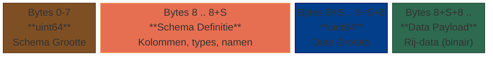
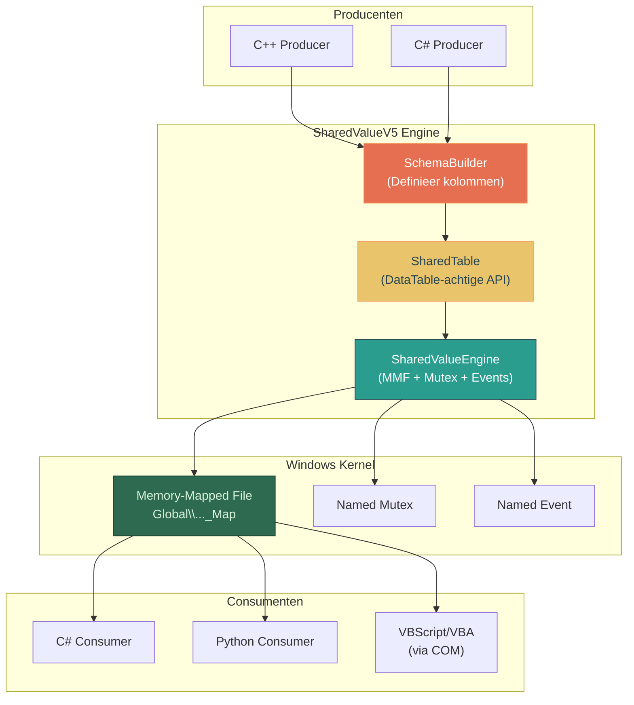
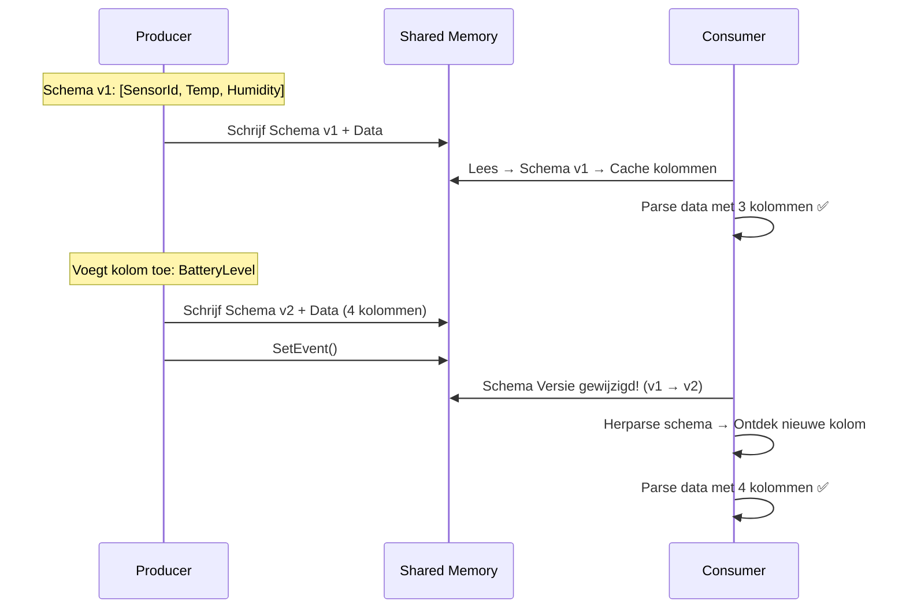
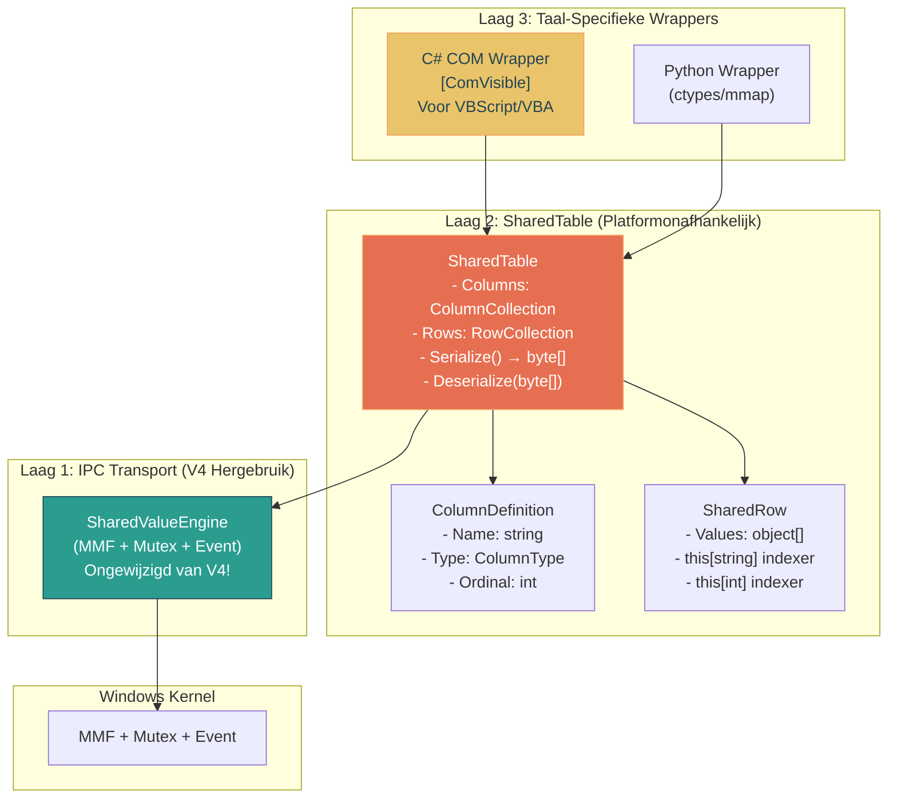
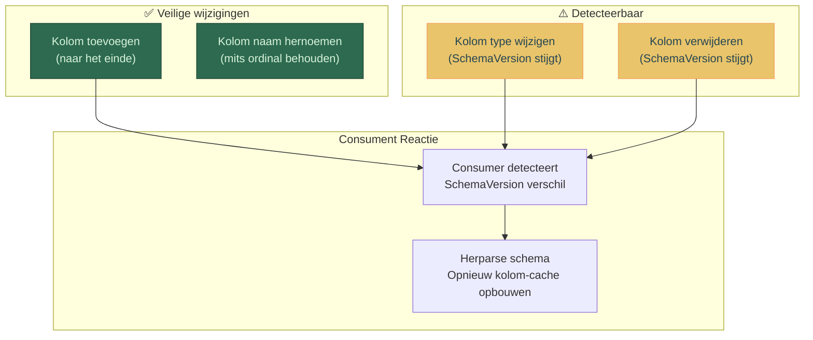
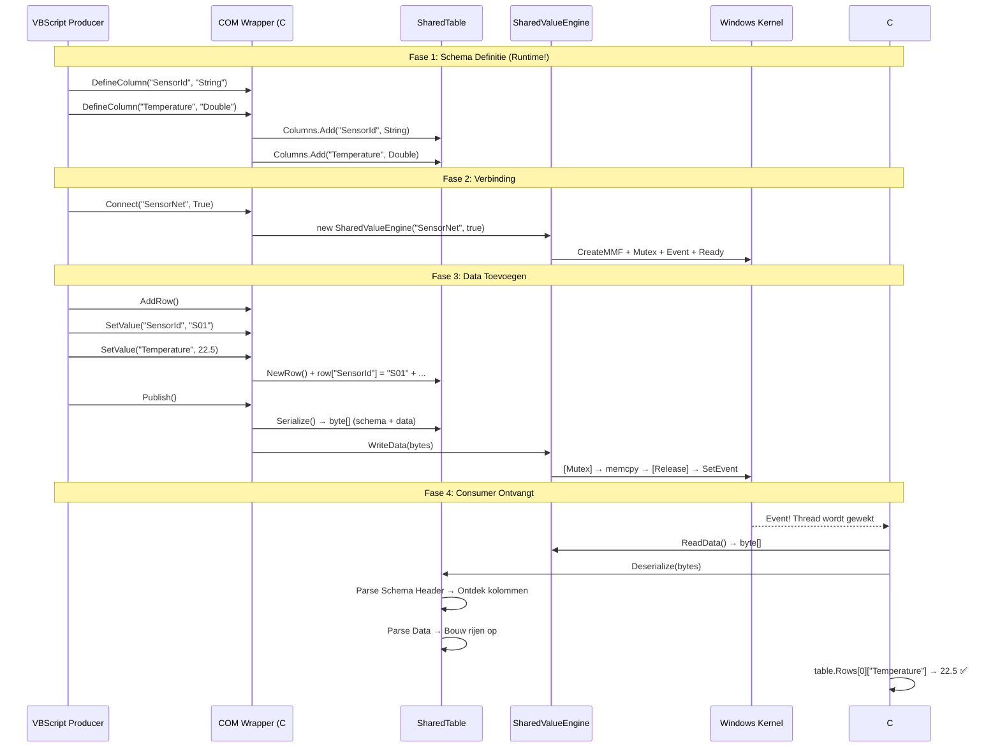

# SharedValueV5 — Dynamisch Schema Ontwerp

## Probleemstelling

In **SharedValueV4** is de dataset-structuur vastgelegd in een `.fbs` schema-bestand dat **compile-time** wordt gecompileerd met `flatc`. Dit betekent:
- Elke structuurwijziging vereist het bewerken van het `.fbs` bestand + codegeneratie + hercompilatie
- VBScript/VBA-gebruikers kunnen de structuur nooit zelf bepalen
- De structuur staat vast op het moment dat de applicatie gecompileerd wordt

**SharedValueV5** lost dit op door de dataset-structuur **programmatisch, at runtime** te laten definiëren — net als een `System.Data.DataSet` / `DataTable` — vanuit *elke* taal (C++, C#, Python, VBScript/COM).

## Ontwerp Filosofie

> **"De gebruiker definieert de structuur van de data op exact dezelfde manier als dat hij rijen toevoegt — programmatisch, via method calls."**

| Eigenschap | V4 (huidige) | V5 (nieuw ontwerp) |
| :--- | :--- | :--- |
| Schema definitie | `.fbs` tekstbestand + `flatc` compiler | Method calls at runtime |
| Schema wijziging | Hercompilatie vereist | Live, zonder herstart |
| VBScript/VBA toegang | Alleen via vaste COM wrapper | Volledige dynamische controle |
| Codegeneratie nodig | ✅ Ja (`flatc --cpp --csharp`) | ❌ Nee |
| Serialisatie | Google FlatBuffers (zero-copy) | Eigen binair formaat (self-describing) |
| Snelheid | ~10-100 ns | ~50-500 ns (iets trager door dynamische lookup) |

---

## Kernarchitectuur

### Het "Self-Describing" Principe

Het gedeelde geheugen bevat niet alleen de data, maar ook de **schema-definitie** zelf. Wanneer een Consumer verbindt, leest hij eerst het schema-blok en weet dan precies hoe de data-bytes geïnterpreteerd moeten worden — zonder dat hij vooraf code hoeft te compileren.



### Systeemoverzicht



---

## API Ontwerp (De DataTable Beleving)

### Ondersteunde Kolomtypes

Het V5 type-systeem is bewust simpel gehouden voor maximale cross-language compatibiliteit:

| V5 Type Enum | Grootte (bytes) | C++ | C# | Python | VBScript/COM |
| :--- | :--- | :--- | :--- | :--- | :--- |
| `Int32` | 4 | `int32_t` | `int` | `int` | `Long` |
| `Int64` | 8 | `int64_t` | `long` | `int` | *niet direct* |
| `Float` | 4 | `float` | `float` | `float` | `Single` |
| `Double` | 8 | `double` | `double` | `float` | `Double` |
| `Bool` | 1 | `bool` | `bool` | `bool` | `Boolean` |
| `String` | variabel | `std::string` | `string` | `str` | `String` |
| `Blob` | variabel | `std::vector<uint8_t>` | `byte[]` | `bytes` | `Variant(Byte())` |
| `DateTime` | 8 | `int64_t` (ticks) | `DateTime` | `datetime` | `Date` |

### C# API (Primaire Referentie-implementatie)

```csharp
// ========================================================
// SCHEMA DEFINITIE — Programmatisch, at runtime
// ========================================================
var table = new SharedTable("SensorData");

// Voeg kolommen toe — net als System.Data.DataTable
table.Columns.Add("SensorId",    ColumnType.String);
table.Columns.Add("Temperature", ColumnType.Double);
table.Columns.Add("Humidity",    ColumnType.Double);
table.Columns.Add("IsActive",    ColumnType.Bool);
table.Columns.Add("StatusCode",  ColumnType.Int32);
table.Columns.Add("LastSeen",    ColumnType.DateTime);

// ========================================================
// VERBINDING — Host bouwt de kanalen op
// ========================================================
var engine = new SharedValueEngine("SensorNet", isHost: true);
engine.Publish(table);  // Schema + data → gedeeld geheugen

// ========================================================
// DATA MANIPULATIE — Rijen toevoegen, net als DataTable
// ========================================================
var row = table.NewRow();
row["SensorId"]    = "TempSensor_01";
row["Temperature"] = 22.5;
row["Humidity"]    = 65.0;
row["IsActive"]    = true;
row["StatusCode"]  = 200;
row["LastSeen"]    = DateTime.UtcNow;
table.Rows.Add(row);

// Tweede rij
var row2 = table.NewRow();
row2["SensorId"]    = "TempSensor_02";
row2["Temperature"] = 18.3;
row2["Humidity"]    = 72.1;
row2["IsActive"]    = false;
row2["StatusCode"]  = 503;
row2["LastSeen"]    = DateTime.UtcNow;
table.Rows.Add(row2);

// Publiceer veranderingen naar gedeeld geheugen
engine.Publish(table);

// ========================================================
// DATA BEWERKEN — Bestaande waarden wijzigen
// ========================================================
table.Rows[0]["Temperature"] = 23.1;   // Update cel
table.Rows.RemoveAt(1);                // Verwijder rij
engine.Publish(table);

// ========================================================
// SCHEMA EVOLUTIE — Kolommen toevoegen at runtime
// ========================================================
table.Columns.Add("BatteryLevel", ColumnType.Float);
// Bestaande rijen krijgen automatisch standaardwaarde (0.0)
engine.Publish(table);  // Schema-wijziging wordt automatisch meegestuurd
```

### C++ API

```cpp
// Schema definiëren
SharedTable table("SensorData");
table.AddColumn("SensorId",    ColumnType::String);
table.AddColumn("Temperature", ColumnType::Double);
table.AddColumn("Humidity",    ColumnType::Double);
table.AddColumn("IsActive",    ColumnType::Bool);
table.AddColumn("StatusCode",  ColumnType::Int32);

// Engine starten als host
SharedValueEngine engine(L"SensorNet", true);

// Rijen vullen
auto row = table.NewRow();
row.Set("SensorId",    std::string("TempSensor_01"));
row.Set("Temperature", 22.5);
row.Set("Humidity",    65.0);
row.Set("IsActive",    true);
row.Set("StatusCode",  200);
table.AddRow(std::move(row));

engine.Publish(table);
```

### VBScript API (via COM Wrapper)

```vbscript
' ========================================================
' VBScript: Volledige controle over schema EN data
' ========================================================
Set engine = CreateObject("SharedValueV5.Engine")

' Schema definiëren — net als met een ADODB.Recordset!
engine.DefineColumn "SensorId",    "String"
engine.DefineColumn "Temperature", "Double"
engine.DefineColumn "Humidity",    "Double"
engine.DefineColumn "IsActive",    "Bool"
engine.DefineColumn "StatusCode",  "Int32"

' Verbind als host
engine.Connect "SensorNet", True

' Rij toevoegen
engine.AddRow
engine.SetValue "SensorId",    "VBS_Sensor_01"
engine.SetValue "Temperature", 19.7
engine.SetValue "Humidity",    55.2
engine.SetValue "IsActive",    True
engine.SetValue "StatusCode",  200

' Tweede rij
engine.AddRow
engine.SetValue "SensorId",    "VBS_Sensor_02"
engine.SetValue "Temperature", 25.0
engine.SetValue "Humidity",    40.0
engine.SetValue "IsActive",    False
engine.SetValue "StatusCode",  404

' Publiceer naar gedeeld geheugen
engine.Publish

' ========================================================
' Lezen vanuit een ander kanaal
' ========================================================
Set reader = CreateObject("SharedValueV5.Engine")
reader.Connect "SensorNet", False   ' Consumer mode

WScript.Echo "Kolommen: " & reader.ColumnCount
WScript.Echo "Rijen:    " & reader.RowCount

For i = 0 To reader.RowCount - 1
    WScript.Echo reader.GetValue(i, "SensorId") & ": " & _
                 reader.GetValue(i, "Temperature") & "°C"
Next
```

### Python API

```python
import ctypes, mmap, struct

# Python wrapper leest het schema uit het gedeeld geheugen
class SharedTableReader:
    def __init__(self, channel_name: str):
        # Open MMF, lees schema-header, ontdek kolommen dynamisch
        self._mmf = mmap.mmap(-1, 10*1024*1024, 
                              tagname=f"Global\\{channel_name}_Map")
        self._parse_schema()
    
    def _parse_schema(self):
        """Lees het ingebedde schema uit de MMF header"""
        schema_size = struct.unpack_from('<Q', self._mmf, 0)[0]
        schema_bytes = self._mmf[8:8+schema_size]
        # Parse kolom-definities (naam, type, offset)
        self.columns = self._decode_columns(schema_bytes)
    
    # Gebruik: reader.get(0, "Temperature") → 22.5
    def get(self, row_index: int, column_name: str) -> any:
        col = self.columns[column_name]
        offset = self._row_offset(row_index) + col.offset
        return self._read_typed(offset, col.type)
```

### Excel VBA API

```vb
Sub LoadSensorData()
    Set engine = CreateObject("SharedValueV5.Engine")
    engine.Connect "SensorNet", False
    
    ' Schema ontdekken — VBA hoeft het schema niet te kennen!
    Dim ws As Worksheet
    Set ws = ThisWorkbook.Sheets("Data")
    
    ' Kolom-headers automatisch vullen
    For c = 0 To engine.ColumnCount - 1
        ws.Cells(1, c + 1).Value = engine.ColumnName(c)
    Next c
    
    ' Data vullen
    For r = 0 To engine.RowCount - 1
        For c = 0 To engine.ColumnCount - 1
            ws.Cells(r + 2, c + 1).Value = _
                engine.GetValueByIndex(r, c)
        Next c
    Next r
End Sub
```

---

## Binair Geheugenlayout (Self-Describing Format)

### Overzicht


### Gedetailleerde Byte Layout

```
┌─────────────────────────────────────────────────────────────┐
│ HEADER (16 bytes)                                           │
│  [0..3]   Magic Bytes: 0x53 0x56 0x35 0x00 ("SV5\0")       │
│  [4..5]   Schema Versie (uint16): huidige schema revisie    │
│  [6..7]   Flags (uint16): bitflags voor opties              │
│  [8..15]  Schema Grootte (uint64): S bytes                  │
├─────────────────────────────────────────────────────────────┤
│ SCHEMA DEFINITIE (S bytes)                                  │
│  [16]         Kolom Count (uint16)                           │
│  [17]         Kolom 1: Type (uint8 enum)                    │
│  [18]         Kolom 1: Naam Lengte (uint8)                  │
│  [19..19+N]   Kolom 1: Naam (UTF-8 string, N bytes)        │
│  [..]         Kolom 2: Type + Naam Lengte + Naam            │
│  [..]         ... herhaal voor alle kolommen ...             │
├─────────────────────────────────────────────────────────────┤
│ DATA HEADER (12 bytes)                                      │
│  [S+16..S+19] Row Count (uint32): R rijen                  │
│  [S+20..S+23] Row Stride (uint32): bytes per fixed-rij     │
│  [S+24..S+27] String Pool Offset (uint32): locatie strings │
├─────────────────────────────────────────────────────────────┤
│ FIXED-SIZE ROW DATA (R × stride bytes)                     │
│  Elke rij: [col1_value][col2_value]...[colN_value]         │
│  Strings/Blobs: opgeslagen als (offset, lengte) verwijzing │
├─────────────────────────────────────────────────────────────┤
│ STRING POOL (variabel)                                      │
│  Alle variabel-grootte data (strings, blobs) aaneengesloten│
│  Rij-cellen verwijzen via (offset, length) naar deze pool  │
└─────────────────────────────────────────────────────────────┘
```

### Schema Evolutie Detectie

Elke keer dat de Producer een nieuw schema definieert (kolommen toevoegt/wijzigt), wordt de `Schema Versie` in de header opgehoogd. De Consumer detecteert dit:



---

## Componentenarchitectuur



### Laag 1: SharedValueEngine (Hergebruik V4)

De bestaande `SharedValueEngine` van V4 blijft **volledig ongewijzigd**. Het is en blijft een generieke byte-transportlaag:

- `WriteData(byte[] data)` — Schrijf bytes naar MMF onder mutex lock
- `OnDataReady` event — Callback bij nieuwe data
- Ready Event handshake — Synchronisatie bij opstart

V5 bouwt hier bovenop als een **hogere abstractielaag**.

### Laag 2: SharedTable (Nieuw)

Dit is het hart van V5. De `SharedTable` klasse combineert schema + data en serialiseert alles naar een self-describing byte-array.

#### Kernklassen (C#)

```csharp
// --- Column Definitie ---
public enum ColumnType : byte
{
    Int32    = 1,
    Int64    = 2,
    Float    = 3,
    Double   = 4,
    Bool     = 5,
    String   = 6,
    Blob     = 7,
    DateTime = 8
}

public class ColumnDefinition
{
    public string Name { get; }
    public ColumnType Type { get; }
    public int Ordinal { get; }        // Positie-index (0-based)
    public int FixedSize { get; }      // Bytes voor fixed types, of 8 voor string/blob ref
}

// --- Column Collection ---
public class ColumnCollection : IEnumerable<ColumnDefinition>
{
    public ColumnDefinition Add(string name, ColumnType type);
    public ColumnDefinition this[string name] { get; }
    public ColumnDefinition this[int ordinal] { get; }
    public int Count { get; }
}

// --- Rij ---
public class SharedRow
{
    public object this[string columnName] { get; set; }
    public object this[int ordinal] { get; set; }
    
    // Getypte accessors
    public int GetInt32(string col);
    public double GetDouble(string col);
    public string GetString(string col);
    public bool GetBool(string col);
    public DateTime GetDateTime(string col);
}

// --- De DataTable ---
public class SharedTable
{
    public string Name { get; }
    public ColumnCollection Columns { get; }
    public RowCollection Rows { get; }
    public ushort SchemaVersion { get; }    // Auto-increment bij schema wijziging
    
    public SharedRow NewRow();              // Maak lege rij aan
    
    // Serialisatie (intern)
    internal byte[] Serialize();
    internal static SharedTable Deserialize(byte[] data);
}
```

### Laag 3: COM Wrapper

De COM-laag exposeert een vereenvoudigde API die VBScript/VBA begrijpt. Alle complexe types worden vertaald naar COM-primitieven:

```csharp
[ComVisible(true)]
[Guid("...")]
[ProgId("SharedValueV5.Engine")]
[ClassInterface(ClassInterfaceType.AutoDual)]
public class SharedValueV5Com : IDisposable
{
    private SharedTable _table;
    private SharedValueEngine _engine;
    private int _currentRowIndex = -1;

    // --- Schema Definitie ---
    public void DefineColumn(string name, string typeName);
    public int ColumnCount { get; }
    public string ColumnName(int index);
    public string ColumnTypeName(int index);

    // --- Verbinding ---
    public bool Connect(string channelName, bool isHost);
    public void Disconnect();

    // --- Data Schrijven (Producer) ---
    public void AddRow();                           // Start nieuwe rij
    public void SetValue(string column, object val); // Zet cel in huidige rij
    public void Publish();                          // Stuur naar gedeeld geheugen

    // --- Data Lezen (Consumer) ---
    public int RowCount { get; }
    public object GetValue(int row, string column);
    public object GetValueByIndex(int row, int colIndex);
    public string GetAllAsCsv();
    public bool HasNewData();

    // --- Events ---
    public void StartListening();
    public void StopListening();
}
```

---

## Serialisatie: Snelheid vs Eenvoud

> [!IMPORTANT]
> **Waarom geen FlatBuffers meer?**
> FlatBuffers vereist een vooraf gecompileerd schema. Dat staat haaks op het doel van V5 (dynamische schema's). We vervangen het door een eigen, simpel binair formaat dat self-describing is.

### Performance Impact Analyse

| Operatie | V4 (FlatBuffers) | V5 (Self-Describing) | Verschil |
| :--- | :--- | :--- | :--- |
| Schrijf 1000 rijen × 5 kolommen | ~15 ns/rij | ~80 ns/rij | ~5× trager |
| Lees 1 cel (double) | ~10 ns | ~30 ns | ~3× trager |
| Lees 1 cel (string) | ~15 ns | ~50 ns | ~3× trager |
| Schema ontdekken | N.v.t. (compile-time) | ~2 μs (eenmalig) | Nieuw |
| Totaal 1000 rijen round-trip | ~30 μs | ~120 μs | Verwaarloosbaar |

> [!NOTE]
> Hoewel V5 technisch trager is dan V4, zijn de absolute cijfers nog steeds **honderden keren sneller** dan COM RPC (~1-10 ms), Named Pipes, of TCP sockets. Voor 99% van de use-cases (sensoren, dashboards, legacy integratie) is dit ruimschoots voldoende.

### Optimalisaties in het Binaire Formaat

1. **Fixed-size velden staan aaneengesloten**: `Int32`, `Double`, `Bool` waarden hebben een vaste positie per rij. Dit maakt directe pointer-arithmetic mogelijk (net als FlatBuffers).

2. **String Pool**: Variabele-grootte data (strings, blobs) worden los opgeslagen in een apart blok. Rij-cellen bevatten alleen een `(offset, length)` verwijzing (8 bytes). Dit voorkomt fragmentatie.

3. **Schema Caching**: De Consumer leest het schema slechts eenmalig (of bij versie-wijziging). Daarna zijn alle kolom-offsets gecached voor directe toegang.

4. **Column Ordinal Lookup**: Intern adresseert de engine kolommen op ordinal (index), niet op naam. String → index mapping wordt eenmalig opgebouwd bij schema-parse.

---

## Schema Evolutie: Backward-Compatible Uitbreidingen



**Mechanisme:** Bij elke `Publish()` wordt het schema meegestuurd. De Consumer vergelijkt `SchemaVersion` met zijn cache. Bij een mismatch herparset hij het schema-blok volledig.

---

## Projectstructuur (Voorgesteld)

```
SharedValueV5/
├── schema/                       # LEEG — geen .fbs meer nodig!
├── cpp_core/
│   ├── SharedValueEngine.hpp     # Hergebruik: ongewijzigd van V4
│   ├── SharedTable.hpp           # NIEUW: C++ SharedTable implementatie
│   ├── SharedRow.hpp             # NIEUW: C++ rij-abstractie
│   ├── ColumnDefinition.hpp      # NIEUW: Kolom type definities
│   ├── BinarySerializer.hpp      # NIEUW: Self-describing serialisatie
│   ├── main.cpp                  # Voorbeeld producer
│   └── CMakeLists.txt
├── csharp_core/
│   ├── SharedValueEngine.cs      # Hergebruik: ongewijzigd van V4
│   ├── SharedTable.cs            # NIEUW: C# SharedTable
│   ├── SharedRow.cs              # NIEUW: C# rij-abstractie
│   ├── ColumnDefinition.cs       # NIEUW: Kolom type definities
│   ├── BinarySerializer.cs       # NIEUW: Serialisatie/deserialisatie
│   ├── Program.cs                # Voorbeeld consumer
│   └── csharp_core.csproj
├── com_wrapper/
│   ├── SharedValueV5Com.cs       # NIEUW: COM-Visible wrapper
│   └── com_wrapper.csproj        # NIEUW: Class Library + COM registratie
├── tests/
│   ├── Run-V5Tests.ps1
│   ├── Test-SchemaEvolution.ps1
│   └── Test-VBScript.vbs
├── examples/
│   ├── vbs_producer.vbs          # VBScript voorbeeld: schema + data aanmaken
│   ├── vbs_consumer.vbs          # VBScript voorbeeld: dynamsich lezen
│   ├── vba_dashboard.vbs         # Excel VBA live dashboard
│   └── python_reader.py          # Python voorbeeld
├── README.md
├── ARCHITECTURE_NL.md
└── USAGE_NL.md
```

---

## Sequentiediagram: Volledige Levenscyclus



---

## User Review Required

> [!IMPORTANT]
> **Belangrijke ontwerpbeslissing: FlatBuffers loslaten**
> 
> V5 vervangt FlatBuffers door een eigen binair formaat. Dit maakt dynamische schema's mogelijk, maar kost ~3-5× snelheid per operatie. Voor de meeste use-cases (sensoren, dashboards, legacy) is dit verwaarloosbaar. Maar voor ultra-HFT scenarios (>100K updates/sec) blijft V4 de betere keuze.
> 
> **Vraag:** Is deze trade-off acceptabel?

> [!IMPORTANT]
> **COM Wrapper structuur**
> 
> De COM wrapper gebruikt een "cursor"-model voor VBScript (`AddRow()` → `SetValue()` → `Publish()`). Dit is gekozen omdat VBScript geen geneste objecten of dictionaries ondersteunt. Een alternatief is een "parameter-array" model (`AddRow "S01", 22.5, 65.0, True, 200`).
> 
> **Vraag:** Voorkeur voor cursor-model of parameter-array model? Of beide?

> [!WARNING]
> **Scope afbakening**
> 
> Dit ontwerp beschrijft V5 als een **nieuw project naast V4**, niet als vervanging. V4 blijft bestaan voor scenario's die FlatBuffers en compile-time schema's vereisen.

## Open Questions

1. **Moet V5 ook bidirectioneel zijn?** V4 heeft P2C en C2P kanalen. Moet V5 dit overnemen (dus VBScript kan ook `SendCommand` doen)?

2. **Multi-table support?** Moet een enkele Engine meerdere SharedTables tegelijk ondersteunen (zoals een `DataSet` met meerdere `DataTable`s)?

3. **Schema lock-out?** Moet het mogelijk zijn om het schema te "bevriezen" zodat consumers niet per ongeluk kolommen toevoegen?

4. **Python wrapper:** Moet de Python wrapper een pure `ctypes/mmap` implementatie zijn (geen C# dependency), of mag het een C-extension DLL zijn?

## Verification Plan

### Automated Tests
- Unit tests voor `SharedTable` serialisatie/deserialisatie round-trips
- Schema evolutie tests (kolom toevoegen, type klopt nog)
- Cross-language test: C++ producer → C# consumer → VBScript reader
- Stress test: 10.000 rijen × 10 kolommen serialisatie
- `Run-V5Tests.ps1` end-to-end test suite

### Manual Verification
- VBScript voorbeeld draaien via `cscript`
- Excel VBA dashboard aansturen vanuit C++ producer
- Performance benchmark: V4 vs V5 vergelijking
